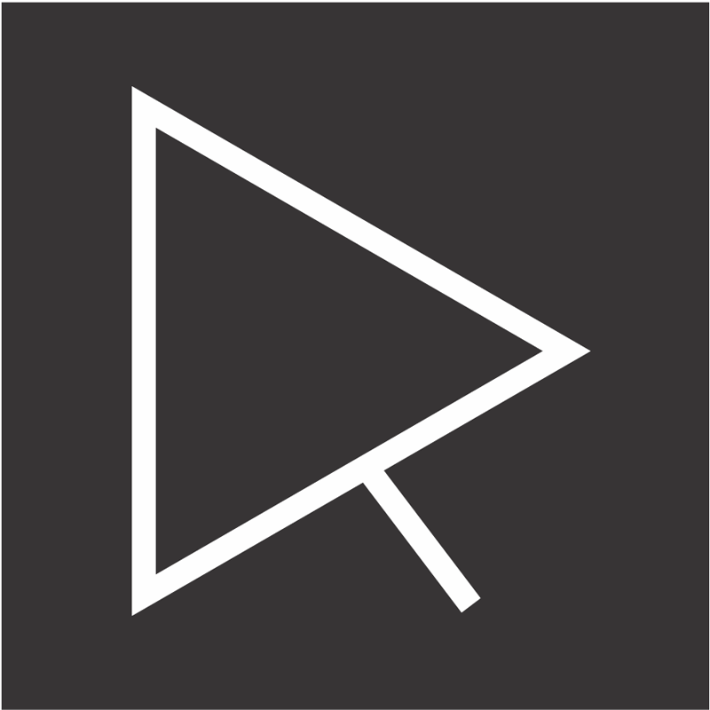

<p align="center">
  <a href="https://ravan.me">
    
  </a>
</p>
<h1 align="center">
  Ravan Scafi's personal website.
</h1>

<p align="center">
  <a href="https://app.netlify.com/sites/ravan-me/deploys">
    
  </a>
  <a href="https://travis-ci.org/ravanscafi/ravan.me">
    
  </a>
  <a href="https://ravan.me">
    
  </a>
  <a href="LICENSE">
    
  </a>
</p>

This website is built with Node.js, JavaScript, React.js and Gatsby.
It uses a static generator, so you can build it and deploy only the static files.
It is currently hosted at [https://ravan.me](https://ravan.me).

## Contributing

First, fork the repository and clone it.

Next, you will need [Node.js](https://nodejs.org/) and [Yarn](https://yarnpkg.com/).
Run the command below to fetch the dependencies and spin up a local web-server.

```bash
yarn start
```

Now, go ahead, edit some files and you will see the magic happening 🎉.

Don't forget to run the tests to make sure that everything is working:

```bash
yarn test
```

Commit your changes and submit a Pull Request 😉.

## License

MIT
