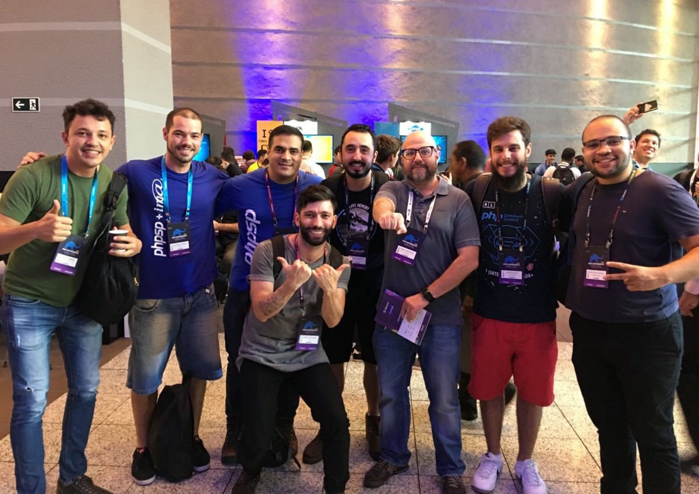
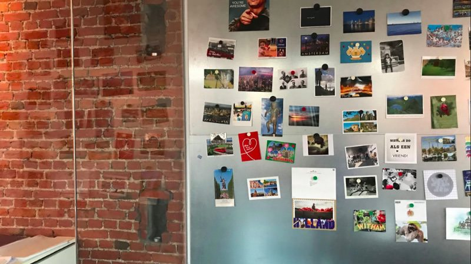
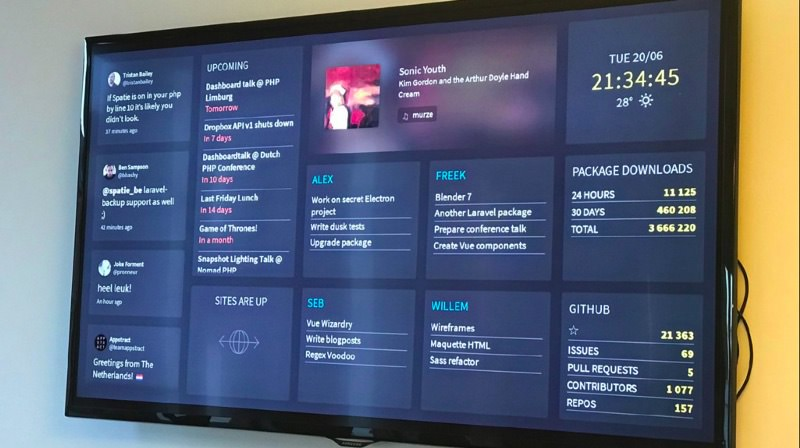

Fala galera! Este ano, como representante da comunidade
[Laravel SP](https://twitter.com/laravelsp), fui convidado a participar do
[PHP Experience](https://eventos.imasters.com.br/phpexperience/).
[Na edição do ano passado](https://phpexperience2017.imasters.com.br/), pude
contribuir com a comunidade
[palestrando sobre APIs](https://www.youtube.com/watch?v=pYI-xievuOo). Foi uma
experiência incrível participar de um evento dessa magnitude e relevância e,
para este ano, queria poder contribuir de alguma forma também.

Ano passado, após a [Laraconf Brasil 2017](https://laraconfbrasil.com.br/),
rolou algo muito legal. O
[@eltonantunes_85873](http://twitter.com/eltonantunes_85873 "Twitter profile for @eltonantunes_85873")
publicou o seguinte artigo falando sobre as impressões dele a respeito do
evento:

[**Laraconf Brasil 2017 — Dia 1/2** medium.com](https://medium.com/@eltonantunes_85873/laraconf-brasil-2017-dia-1-2-f88078655bf7 "https://medium.com/@eltonantunes_85873/laraconf-brasil-2017-dia-1-2-f88078655bf7")[](https://medium.com/@eltonantunes_85873/laraconf-brasil-2017-dia-1-2-f88078655bf7)

É um tipo de engajamento que vejo muito nas comunidades de frontend aqui no
Brasil, mas que, por algum motivo, não acontece tanto nas comunidades PHP.
Portanto, foi algo que me surpreendeu.

> Atitudes como essa fazem a diferença, existem **várias** formas de contribuir
> com a comunidade que vão além de código ;)

Assim, percebi a chance de contribuir dessa forma e, durante todo o evento, tive
um trabalho árduo: fiz uma cobertura de todas as palestras que assisti, tentando
entrar em detalhes mesmo, na esperança de que mais pessoas possam se beneficiar
do conteúdo e perceber a qualidade do evento, dos palestrantes e da comunidade
como um todo.

### Primeiro dia — Segunda-feira

O evento começou pontualmente as 17:30 com a abertura do
[João Batista Neto](https://twitter.com/netojoaobatista), com ênfase para o fato
de o evento ser feito para a comunidade e pela comunidade. A curadoria do evento
foi feita pelo [PHPSP](https://phpsp.org.br/) contando com os evangelistas
[Diana](https://twitter.com/dianaarnos),
[Leonam](https://twitter.com/leonampdias),
[Gustavo](https://twitter.com/gustavosteam),
[Hussani](https://twitter.com/hussanii),
[Pokemão](https://twitter.com/pokemaobr),
[Marcel](https://twitter.com/marcelgsantos),
[Ivan](https://twitter.com/ivanrosolen) e
[Rogério](https://twitter.com/rogeriopradoj) que se dedicaram muito para trazer
conteúdo relevante para todos os participantes. O
[iMasters](https://imasters.com.br/) sabe como organizar um bom evento e podemos
facilmente notar isso. É muita gente envolvida e engajada em todos os aspectos
do evento — não é a toa que é a maior conferência de PHP do mundo. Vai Brasil!
🇧🇷

O João também comentou sobre uma coisa legal rolou esse ano: _Code Review_ pelos
palestrantes do PHPx (abreviação para PHP Experience), ou seja, uma análise de
código dos participantes que quiseram receber insights relevantes.

Logo em seguida começamos com os keynotes, que contaram com palestrantes
nacionais e internacionais, sendo o primeiro deles o Freek.

### Building a Dashboard with PHP and WebSockets — [Freek Van der Herten](https://twitter.com/freekmurze)

O Freek, com uma ótima presença de palco, começou se apresentando e também sua
empresa. Ele trabalha na [Spatie](https://spatie.be/en), onde basicamente
desenvolvem websites e são especializados em [Laravel](https://laravel.com/) ❤

Um ponto muito interessante foi ele ressaltar que **a companhia só existe graças
ao open-source**, então eles devolvem contribuições para a comunidade
[publicando vários pacotes relevantes](https://spatie.be/en/opensource). Um
desses pacotes, inclusive, é o tema da palestra. Um fato curioso é que embora os
projetos sejam open-source, uma “cláusula” para utilizar os projetos deles é a
de enviar um cartão postal da cidade onde moramos, que vai ser adequadamente
pendurada no escritório da Spatie
depois —[ bem legal!](https://spatie.be/en/opensource/postcards)


Cartões Postais na parede do escritório da Spatie :)

Indo para a palestra em si, Freek mostra um dashboard numa TV do escritório da
Spatie, com métricas do GitHub, quais tarefas cada membro do time estão
trabalhando, saúde dos sites que eles monitoram e até uma previsão do tempo.

Esse dashboard, como dito anteriormente, é mais um
[projeto open-source deles](https://github.com/spatie/dashboard.spatie.be). O
legal é que o dashboard consiste em uma simples página HTML, com cada seção
sendo atualizada independentemente com JavaScript, sem a necessidade de
recarregar a página completa.

As tecnologias envolvidas são: [Laravel](https://laravel.com/),
[Pusher](https://pusher.com/) e [Vue.js](https://vuejs.org/). O Laravel é
responsável por servir a página e também por recuperar os dados das APIs
externas que eles utilizam, como Google Calendar e etc. O Pusher é responsável
pela “mágica”, transportando eventos em tempo real do servidor para o cliente.
Por sua vez, o Vue.js escuta os eventos disparados pelo
[Laravel Echo](https://laravel.com/docs/5.6/broadcasting) e monta a interface no
cliente.

Como quem sabe faz ao vivo, o Freek fez uma demonstração mostrando quão fácil é
de começar um dashboard do zero. Adicionar uma “seção” pré-programada é algo
trivial, com uma configuração bem fácil. Não parando por aí, o Freek deu uma
aula básica de Vue e foi explicando como muitos aspectos do dashboard funcionam.
É legal notar que existe um componente Vue pra uma dessas “seções” — muito bem
organizado! (e deu uma ponta de orgulho ver uma pasta `__tests__` ali também)
Detalhes também foram mostrados sobre a organização dos componentes do Laravel,
além de outras coisas legais como a atualização em tempo real do dashboard
quando um dos comandos do [`artisan`](https://laravel.com/docs/5.6/artisan)
específicos para um componente são rodados. Essa flexibilidade é muito legal, dá
pra agendar os comandos pra rodar no tempo que for considerado relevante -
simples e funcional. Outro aspecto legal é que muitos dados são salvos no _Local
Storage_ do navegador, permitindo métricas temporais, por exemplo, exibindo
dados consolidados dos últimos 30 dias.

 Dashboard conectado à TV.

Por fim, o Freek revelou a mágica para mostrar o dashboard na TV, utilizando um
Raspberry PI 2 conectado à mesma.

Visualizar KPIs e outros dados relevantes em um dashboard é uma ótima forma
ajudar a manter o time alinhado e buscando os mesmos objetivos. Este projeto é
uma mão na roda para isso ;)

Para mais detalhes,
[confira o projeto no GitHub](https://github.com/spatie/dashboard.spatie.be) e
veja
[os slides da apresentação](https://speakerdeck.com/freekmurze/dashboard-phpexperience).

### Blockchain e PHP — Criando uma Criptomoeda — [Gabriel “Bob” Rodrigues Couto](https://twitter.com/gabrielrcouto)

O Gabriel, ou melhor dizendo, o _Bob_ começou sua talk visivelmente feliz com a
quantidade de pessoas no evento e dizendo para quem quer começar a palestrar que
sua dica é falar sobre temas que gosta, que é o que ele faz. E, entrando logo no
tema palestra, comentou que ganhou um crédito de processamento de 1000 dólares
em cloud e resolveu usar para minerar bitcoins, convertendo em aproximadamente
100 dólares (na época). Depois disso, resolveu se aprofundar no tema e montar
uma máquina para minerar bitcoins. Tudo isso em 2014! (Para quem ficou curioso,
infelizmente ele vendeu todos seus bitcoins antes de ficar rico com isso.)

Agora, resolveu implementar sua própria criptomoeda em PHP, a
[PHPlata](https://github.com/gabrielrcouto/phplata).

, uma criptomoeda feita com PHP](./phplata-criptomoeda.jpg)
[PHPlata](https://github.com/gabrielrcouto/phplata), uma criptomoeda feita
com PHP

Intercalando entre slides e demo, foi explicando desde o conceito mais básico
sobre como funciona um blockchain e uma criptomoeda, começando com uma mensagem
simples sendo trocada entre dois usuários, criptografada com
[Sodium](https://download.libsodium.org/doc/). Inclusive, como ele ressaltou, o
[PHP 7.2](http://php.net/manual/pt_BR/migration72.php) foi a primeira linguagem
de todas a dar suporte para o Sodium! A partir daí, ele seguiu mostrando alguns
conceitos de **transações**, inclusive da própria implementação do bitcoin,
mostrando como o dinheiro sai de uma conta e entra em outra, de forma
distribuída através de scripts. Outro ponto mostrado foi o de **Contratos**,
permitindo diversas formas de operações como _loteria descentralizada_, _pagar
para provar que existe_ (como algumas empresas descontam do seu cartão para
validar o cartão), _depósito calção_, etc. Utilizando o projeto
[PHP Sandbox](https://phpsandbox.org/), ele consegue rodar o script de transação
dos usuários de forma isolada, sem esses scripts terem acesso ao código fonte do
projeto.

Em seguida, o Bob começou a explicar sobre os blocos, da blockchain, que são uma
forma de guardar dados de transações, evitando fraudes no sistema. Cada bloco
contém uma quantidade específica de transações e possuem uma certa dificuldade
de serem resolvidos computacionalmente. Cada minerador da rede tenta resolver
esses blocos e, ao conseguir, são recompensados de alguma forma. Na rede
bitcoin, uma determinada quantia em bitcoins é oferecida ao
minerador que resolve um bloco. A forma de resolução é um pouco complexa, sendo
melhor ver a talk dele (ou outra no assunto) para entender melhor. O Bob
comentou que a geração de novos bitcoins vai acabar um dia, ficando na rede
somente o que foi minerado, passando os mineradores a ganharem seus bitcoins
pela cobrança de pequenas taxas para processarem outras transações na rede. Com
isso, ele cobriu apenas o “básico” de criptomoedas, apontando para outros
tópicos importantes no assunto.

Conclusões da talk do Bob:

- Blockchain é uma forma atômica de guardar dados, há quem diga que estamos indo
  para uma Web 3.0, de aplicações descentralizadas baseadas em blockchain.
- PHP é usado em 83.2% de todos os sites da web, portanto, temos a capacidade de
  ser a maior rede distribuída do mundo.

Para mais detalhes,
[confira o projeto no GitHub](https://github.com/gabrielrcouto/phplata).

### Stand-UP — Integrando Go com PHP — [Rodrigo “Pokemaobr” Cardoso](https://twitter.com/pokemaobr)

Nesse stand-up incrível, o pokemao ensinou, em apenas 10 minutos, como integrar
o PHP com Go, mas não exatamente a Golang, aquela linguagem promissora do
Google, mas o Go que ele tem mais afinidade, o Go Horse. É uma oportunidade de
dar boas gargalhadas e recomendo vocês a assistirem quando o vídeo sair 😉

### PHP Under the Hood — [Marcelo Camargo](https://github.com/haskellcamargo)

Você deve conhecer o Marcelo Camargo, mesmo que indiretamente. Foi ele quem
criou a ligação com o
[Gemidão do Whatsapp ](https://github.com/haskellcamargo/gemidao-do-zap)— se
você já recebeu, “agradeça” a ele. Além deste projeto, Marcelo é um assíduo
contribuidor do open-source, tendo contribuído inclusive com
[alguns RFCs para o core do PHP](https://wiki.php.net/rfc/pipe-operator).
Conhecedor de diversas linguagens e
[designer de algumas](https://github.com/quack/quack), inclusive, ele
compartilhou conosco como funciona o PHP por baixo do capô. No geral, quando
desenvolvemos em PHP, estamos acostumados a desenvolver para a Web, com grande
chances de utilizar juntamente o Apache, por exemplo. Porém, o PHP vai muito
além da Web.

No interpretador PHP, tudo começa com um _Lexer_, que recebe uma lista de
caracteres (nosso código) e quebra em palavras que são analisadas e convertidas
em _tokens_. Por exemplo, a frase `"Hello, how are you?"` seria quebrada com os
seguintes tokens: `[HELLO][,][HOW][ARE][YOU][?]`. Nesse sentido, o PHP até tem
uma função chamada
[`token_get_all()`](http://php.net/manual/pt_BR/function.token-get-all.php) que
nos ajuda com esse trabalho de "tokenização" de uma lista de caracteres.

Após essa primeira fase léxica, vamos para o _Parser_, que define um conjunto de
regras de que vão definir a interação com o _Lexer_. Uma mudança legal do PHP 7
é que o resultado do _Parser_ é uma AST (uma
[Árvore de Sintaxe Abstrata](https://pt.wikipedia.org/wiki/%C3%81rvore_sint%C3%A1tica_abstrata)),
ao invés de opcodes, que era o resultado até o PHP 5.6. Basicamente o _Parser_
vai pegar os tokens e validar se os mesmos estão corretos — *o código digitado
gera um programa válido?* — e transformar esses tokens em uma árvore que
ultimamente virará instruções de máquina. Sabe aquelas mensagens de `UNEXPECTED`
e etc. que a gente procura no StackOverflow como resolver? Então, é o _Parser_
que verifica seu código e vê se ele é válido, possivelmente jogando esses
problemas pra gente. É nessa fase também que o escopo das variáveis, etc. é
verificado e a precedência de operações também.

Em seguida, pasmém, chega a parte mais complexa! _VM e opcodes_. O PHP utiliza
uma máquina virtual (VM) baseada em registradores, a _Zend Virtual Machine_.
Parecido com como o _Assembly_ moderno trabalha, a VM tem várias instruções para
facilitar (as opcodes!). De forma simplificada, o PHP compila para opcodes
independentes de máquina, que então podem rodar em qualquer sistema operacional.

Uma das vantagens de se conhecer como a máquina virtual funciona é poder
escrever código mais otimizado, ou seja, que pode rodar mais rápido. Por
exemplo, atribuindo valor a uma variável em PHP pode ser minimamente mais lento
que utilizar o valor diretamente, sem atribuição. O Marcelo ressalta que isso é
uma micro-otimização e que não deve ser levada ao extremo, apenas é interessante
para se conhecer o funcionamento da VM.

Em uma demo, o Marcelo “Haskell” Camargo conseguiu mostrar mais ou menos como as
opcodes são interpretadas pela VM — e de quebra, explica que o `opcache` deixa
operações já computadas salvas para performance do servidor.

)](./opcodes-php.jpg)
Parte da demo feita pelo Marcelo. (confira
[os slides](http://slides.com/marcelocamargo/php-under-the-hood))

O Marcelo consegue de forma bem didática explicar esses conceitos, com exemplos
de códigos que ajudam no processo — uma talk bem interessante para se assistir e
entender essa linguagem que utilizamos todos os dias ;)

[Clique aqui para ver os slides da apresentação.](http://slides.com/marcelocamargo/php-under-the-hood)

### Good Project From Scratch — [Pawel Lewtak](https://twitter.com/pawel_lewtak)

#### Análise

O Pawel já começa direto ao ponto, falando sobre a primeira etapa de um projeto:
a análise. “Qual problema eu quero resolver?”. Precisamos conversar com o
consumidor/usuário do possível sistema e reunir o máximo possível de
informações. Também, deixa duas reflexões:

> “A raiz de todo o mal em programação é entender o problema de forma errônea.
> Faça as perguntas corretas para as pessoas corretas antes da primeira linha de
> código”
>
> _Mariusz Gil — tradução livre_

> “Pessoas técnicas devem falar a linguagem de pessoas de negócio, não vice
> versa.”
>
> _Stefan Priebsch — tradução livre_

#### Arquitetura

O Pawel cita rapidamente _Domain Driven Design_ e _Event Storming_ como forma de
utilizar linguagem de negócio nos nossos sistemas.

Em seguida, entra no tema polêmico de Waterfall vs Agile, apenas para deixar a
citação de que:

> “A única coisa que é constante é a mudança.”
>
> _Heraclitus — tradução livre_

Assim, o importante é lembrar disso, independente de como for o projeto. Já como
gancho, entra em outra polêmica, a de microserviços, citando o grande Martin
Fowler:

> “Você não deveria começar um novo projeto com microserviços”
>
> _Martin Fowler — tradução livre_

Tendo a lógica da sua aplicação seguindo uma “Clean Architecture”, separando a
lógica de negócio da lógica da aplicação e adaptadores, é fácil trocar de
frameworks, tecnologias ou até mesmo paradigma, refatorando para microserviços
quando necessário. Ainda no tema, ele comenta para não utilizar um framework
próprio, para deixar o mesmo para projetos pessoais e não reinventar a roda,
utilizar o que já existe no mercado.

#### Testes

Pessoas de negócio, infelizmente não se importam tanto com testes, então deve
ser uma preocupação dos desenvolvedores. Ele cita que fazer testes é diferente
de _Design Orientado a Testes (TDD)_. Talvez faça sentido fazer _Desenvolvimento
Orientado a Comportamentos (BDD)_. Para finalizar o tema, deixa a seguinte
reflexão:

> “Se é difícil de escrever um teste, é um sinal de que você tem um problema de
> design, não um problema de testes.”
>
> _Kent Beck, TDD by example — tradução livre_

#### Code Review

_Code Review_, ou Revisão de Código, é uma oportunidade de melhorar o código da
aplicação e uma oportunidade de aprendizado para ambas as partes.

Tendo testes e Code Review, o próximo passo é a Integração Contínua, _CI_, onde
seus testes são rodados automaticamente e você tem um feedback se seu código
está saudável ou não. Posteriormente, o Deploy Contínuo, _CD_, onde após a
aprovação do Review e os testes rodarem, esse código vai automaticamente para
produção.

#### Monitoria

Tendo código em produção, é necessário monitorar e saber se o mesmo está
funcionando como esperado, sendo possível verificar os erros dos mesmo, logs e
etc. Tão importante como é a saúde dos servidores. É necessário monitorar a
aplicação.

#### Métricas

Métricas de Negócio são importantes não só para o pessoal de negócio, mas podem
servir como grandes incentivadores para os desenvolvedores.

#### Automação

Automação elimina tempo perdido com tarefas repetitivas e permite focar no que é
importante.

> “Se se move, automatize isso!”

#### Documentação

Talvez uma parte não tão amada, mas muito importante caso você trabalhe em
projetos grandes. É possível esquecer como algo foi feito ou porque alguma
decisão foi tomada, então a documentação é imprescindível. Para novos membros na
equipe, ler a documentação é uma forma de ambientá-los facilmente.

> Comece com um Readme.

#### Comunicação

Segundo o Pawel, Comunicação não só é um Soft-Skill, é um Core-Skill, ou seja,
uma habilidade imprescindível. Se você levar algo dessa talk, diz Pawel, é que a
comunicação é o skill mais importante.

[Confira aqui os slides da apresentação](https://www.slideshare.net/PaweLewtak/good-project-from-scratch-from-developers-point-of-view).

Com esse keynote do Pawel com várias e várias dicas, fechamos o primeiro dia de
[#PHPx2018](https://twitter.com/hashtag/PHPx2018).

### Segundo Dia — Terça Feira

### Abertura do Palco Assembly

Para dar início ao segundo dia do
[#PHPx2018](https://twitter.com/hashtag/PHPx2018), a
[Diana Arnos](https://twitter.com/dianaarnos) abriu o palco _Assembly_, um dos
três palcos que rolam aqui no segundo dia do evento. Como não dá pra assistir as
talks das três trilhas ao mesmo tempo, resolvi seguir por essa trilha a
princípio, portanto cobrirei as talks que eu for assistindo :)

### Programação Reativa Funcional e extensões para PHP — [Juliana Chahoud](https://twitter.com/jchahoud)

Começando no palco Assembly, a Juliana Chahoud, especialista mobile na
[ThoughtWorks](https://www.thoughtworks.com/pt), que trabalhou nos apps do
[Twitter](https://twitter.com/) e [99](https://99app.com/). Fazendo uma
comparação, ambos utilizam [Scala](https://www.scala-lang.org/) e utilizaram ou
[RxSwift](https://github.com/ReactiveX/RxSwift) ou
[RxJava](https://github.com/ReactiveX/RxJava). Mas, o que é Rx (e funcional)?
Uma arquitetura? Um padrão (design pattern)? Na verdade, não. Trata-se de um
paradigma de programação.

O paradigma funcional, segundo a Juliana, é importante por ser mais fácil de
fazer concorrência, testar e evitar problemas e erros no código. Ela cita
empresas como Netflix, Microsoft, Slack, GitHub e Airbnb que utilizam
programação reativa e funcional como cases para sustentar seus pontos de vista
sobre o paradigma. O Netflix, por exemplo, é responsável por 34% de todo o
tráfego na América do Norte. Lá, tudo deve ser assíncrono para atender a essa
demanda. Utilizando programação imperativa (o paradigma que já estamos mais
acostumados), diversos problemas aconteciam com frequência, incluindo _memory
leaks_ e _callback-hells_. Uma comparação de código real do Netflix com os dois
paradigmas mostra a simplicidade e poder do paradigma reativo.

Na programação reativa, temos um fluxo de dado assíncrono, como por exemplo,
vários cliques em um botão em qualquer período de tempo gera um fluxo de dados.
Três coisas podem ser emitidas nesse fluxo, `um evento com algum valor`,
`um erro` ou `o fim do stream`.

Ao fazermos `subscribe` em um fluxo de eventos, podemos ler esses valores e
fazermos algo com isso. Precisamos de um callback para tratar cada um dos três
tipos citados no parágrafo anterior.

Para mostrar na prática como funciona isso, entra o
[ReactiveX](http://reactivex.io/), também chamado de Rx, que é uma interpretação
do _Observer Pattern_, _Iterator Pattern_ e programação funcional. O Rx é
agnóstico de linguagem e tem uma implementação em PHP, o
[RxPHP](https://github.com/ReactiveX/RxPHP). No exemplo abaixo, ela mostrou como
se inscrever para obter informações de um fluxo de eventos.

```php
$stream = \Rx\Observable::fromArray([1, 2, 3, 4]);
$stream->subscribe(
    function ($x) {
        echo 'Next: ', $x, PHP_EOL;
    },
    function (Exception $ex) {
        echo 'Error: ', $ex->getMessage(), PHP_EOL;
    },
    function () {
        echo 'Completed', PHP_EOL;
    },
);
```

Além disso, o RxPHP também fornece um conjunto de ferramentas para se trabalhar
com esses dados, como por exemplo o conceito de `map` que percorre seu _stream_
transformando cada elemento e retorna um novo _stream_.

É importante ressaltar que esses _streams_ são imutáveis, portanto o `map` não
altera o _stream_ de entrada, apenas retorna um novo.

Além do `map`, temos também o `reduce`, basicamente outra ferramenta poderosa da
programação funcional, que recebe todos os elementos do _stream_ e acumula em um
único resultado.

A Juliana cita o grande mantra do Rx:

> (quase) tudo pode ser um stream

Como por exemplo, uma `request` HTTP pode ser um stream, onde damos `subscribe`
e vamos recebendo os dados dessa `request`.

Outra coisa possível, embora pareça confusa, é um _stream_ de _streams_, como
por exemplo várias `requests` ao mesmo tempo em um _stream_. É possível utilizar
outro conceito da programação funcional, o `flatMap`, para transformar tudo em
apenas um único _stream_, que por sua vez pode ser observável (você pode dar
`subscribe`).

Um ponto muito legal que a Juliana cita para concluir a talk é que não
precisamos de uma linguagem funcional, como Lisp, Scala, Haskell, Clojure, etc.
para utilizarmos o Rx ou conceitos do paradigma funcional.

> Podemos aplicar conceitos da programação funcional no PHP!

### Refactoring: Importância e Técnica em Sistemas Legados — [Davi Marcondes Moreira](https://twitter.com/devdrops)

Seguindo na trilha _Assembly_, temos o Davi, da [pagar.me](https://pagar.me),
falando de um tema que ele gosta muito, que é de “consertar” código, ao invés de
criar um novo, do zero.

> “Refatoração é uma técnica controlada para melhorar o design de uma base de
> código que já existe”

> _Martin Fowler — tradução livre_

Basicamente, é “aplicar mudanças em código sem comprometer suas funcionalidades
finais”.

> “Software é um recurso, e como todo recurso nós queremos que ele continue
> entregando valor em um fluxo contínuo.”
>
> _David Scott Bernstein_

Porém, refatorar código pode não ser um trabalho tão fácil, então o Davi traz 10
dicas para a gente:

#### 10 Dicas para refatorar seu código

1.  **Renomear métodos obscuros.** Encontrar um método que queremos refatorar e
    que não temos visibilidade de onde está sendo chamado, criando um novo
    método que vai “encapsular” o método antigo. Assim, vamos chamar somente o
    método novo sem mudar nada da lógica e podemos controlar os efeitos
    colaterais do método que queremos refatorar.
1.  **Extrair responsabilidades.** Encontrar trechos com a mesma
    responsabilidade (ou parecida o suficiente) em mais de um local e extrair
    para uma nova classe.
1.  **Remover código morto.** Simplesmente identificar trechos de código que não
    são mais usados em sua aplicação e removê-los em seguida. Podemos utilizar o
    [PHP Mess Detector](https://phpmd.org/) com as regras `unusedcode` para
    encontrar esse tipo de código. (confira também as outras regras do Mess
    Detector, é uma ferramenta bem completa).
1.  **Corrente de Chamadas.** Ao identificar que estamos passando coisas demais
    entre métodos, devemos considerar o refactoring. Por exemplo, só precisamos
    de um atributo email para de fato enviar um email, mas passamos uma classe
    de venda, que tem um cliente dentro, só pra pegar o email dele, dando muita
    responsabilidade a uma classe de envio de email.
1.  **Lentidão nos Testes.** Substituir chamadas desnecessárias para bancos de
    dados ou serviços externos nos testes e substituí-los por _mocks_ e _stubs_,
    fazendo os testes rodarem mais rápido.
1.  **Classes de dados.** Identificar classes cujo único propósito é de manter
    dados através da aplicação e questionar se são válidas, movendo métodos para
    as classes apropriadas e deixando a responsabilidade correta.
1.  **Código Duplicado.** Identificar duplicação (evidente ou não) de código e
    movê-lo para dentro de uma única estrutura. As vezes os códigos não são
    parecidos, mas têm o mesmo intuito. Por exemplo, uma lógica de criar _slugs_
    de URLs.
1.  **Violação de estilos.** Seguir as convenções de estilo (_Code Style_) da
    linguagem ou da empresa ([PSRs](https://www.php-fig.org/psr/psr-2/), etc.).
    Podemos utilizar o
    [PHP Code Sniffer](https://github.com/squizlabs/PHP_CodeSniffer) para
    identificar esses problemas.
1.  **Mudar o código antes de mudar os testes.** Fazer um health-check nos
    testes, que devem falhar caso houver alteração no código.
1.  **Reduzir a quantidade de condicionais.** Cada condicional representa uma
    “decisão” no código e é importante não ter muitas decisões para cada método,
    diminuindo a complexidade ciclomática. É possível novamente utilizar o
    [PHP Mess Detector](https://phpmd.org/) para encontrar esses casos.

#### Conclusões

Refatorar é um meio para um fim, que é a melhoria do código. Peça ajuda para
seus colegas, conheça sua aplicação e saiba:

> A única certeza sobre software é que ele muda.

Para entender melhor as dicas do Davi, vejam a gravação da talk assim que a
mesma for liberada :) Nos slides e no repositório que ele compartilhou também
existem várias referências.

Confira
[os slides da apresentação](https://speakerdeck.com/devdrops/refactoring-importancia-e-tecnica-em-sistemas-legados-php-experience-2018)
e
[o repositório com as práticas aplicadas](https://github.com/devdrops/refactoring).

### Domain-Driven Design: uma visão geral para desenvolvedores, artistas, responsáveis ou degustadores de café com leite — [Eriksen Costa](https://twitter.com/eriksencosta)

Ainda na trilha _Assembly_ (gostei dessa trilha, rapaz!), depois de um justo
intervalo, o Eriksen, desenvolvedor na [Easy](http://www.easytaxi.com/), veio
trazer uma introdução de um tema que é buscado por muitos: o _Domain-Driven
Design_, o famoso `DDD`.

> “Software está comendo o mundo”
>
> _Marc Andreessen_

Assim começou o Eriksen, mostrando a importância do software em todo o mundo,
apontando em seguida como o fato de não se fazer um bom design do seu código
pode resultar em um péssimo design, ao contrário de um software “sem design”.
Portanto, utilizar DDD pode ser uma solução.

No DDD, nosso design é feito em colaboração com os especialistas de domínio — o
“pessoal de negócio” — que nos ensinam os princípios do domínio, que vai além de
fazer um software que “funciona por funcionar”.

Entrando em termos comumente utilizados no DDD, o Eriksen explica: — O
**domínio**, nada mais é que o assunto/problema/projeto que a equipe está
inserida. Um **especialista** é um papel (e não um cargo) de alguém que entende
muito sobre esse assunto. — O **Core Domain** é o que realmente representa o
diferencial estratégico do software e deve ser focado pelo negócio. — Um
**modelo** abstrai um domínio, uma simplificação que pode representar o
problema, por exemplo, uma maquete que represente uma construção.

Seguindo no raciocínio, vemos que ferramentas de design estratégico ajudam a
fazer um rascunho antes da implementação, dividindo em problemas menores que são
mais fáceis de atacar. O DDD é primariamente sobre modelar os dados em um
**contexto delimitado** e utilizar uma **linguagem ubíqua**, uma linguagem
“única” que é falada por todos, sejam desenvolvedores ou pessoas de negócio. Um
**contexto** deve ser transformado em um time + banco de dados + repositório.
Esse time é responsável por desenvolver e se tornar proficiente neste contexto.

Utilizando o exemplo de uma transportadora, o principal contexto (core domain) é
o transporte de cargas. Porém, existem outros contextos, como por exemplo, a
roteirização dos veículos vs cargas; o controle de acesso dos usuários; o
monitoramento de remessas, veículos e motoristas. Com a ajuda de um **mapa de
contexto** é possível visualizar todos os contextos e fica fácil verificar, por
exemplo, que um veículo aparece no contexto de transporte de cargas e também no
de roteirização. **Dependendo do contexto, preocupações diferentes aparecem.**
Na roteirização, talvez seja importante saber a capacidade do veículo. No
transporte, talvez seja importante conhecer dados sobre o motorista, etc.

 **Mapa de
contextos** de uma transportadora.

É uma relação corriqueira a **parceria** entre times de contextos com pontos em
comum, como por exemplo para desenvolver a lógica do veículo entre o times de
roteirização e o time transporte. Outra relação é a de **Cliente-Fornecedor**,
onde o time de um contexto pede, como cliente, determinada funcionalidade para
outro time, que é o fornecedor das funcionalidades daquele contexto. Uma
**camada anti-corrupção** garante que a linguagem de um contexto não seja
contaminada pela linguagem de outro contexto. O conceito de **conformista**
estabelece que a linguagem pode ser definida por outro contexto, facilitando a
comunicação entre eles.

Para o sucesso do _Core-Domain_, é necessário que outros contextos existam,
sejam esses contextos de _suporte_ ou _genérico_. Quando refletimos sobre esses
outros contextos, os de suporte podem ser terceirizados, visto que não são tão
importantes para o negócio. E os genéricos, geralmente são _commodities_ e podem
ser assim comprados/consumidos. Por isso é importante para o DDD definir o
domínio principal, pois **saberemos exatamente onde focar recursos e esforços**
e o que podemos externar, dando uma vantagem estratégica para a equipe e o
produto.

Seguindo para uma leve introdução para os padrões táticos do DDD, é
importantíssimo utilizar a **linguagem ubíqua** e **livre de dependências**
(seja de framework, libraries etc) para o core-domain.

Fazendo uma ponte com microserviços, o Eriksen diz que seguir o DDD pode ser uma
boa forma de entender os limites de cada serviço ligados ao contexto e
consequentemente trabalhar bem com essa arquitetura.

#### Como começar?

O DDD é um framework de design, não de processos, o que deixa a forma de pensar
sobre isso um pouco diferente. É necessário **desenvolvimento iterativo** e
**colaboração próxima** de desenvolvedores e pessoas de domínio. Nós podemos
refinar algo eternamente, como nosso domínio, porém o desenvolvimento iterativo
vai garantir que isso não aconteça pois vamos mudando de plano conforme nosso
aprendizado, testando hipóteses com software funcionando, em produção. Além
disso, especialistas de domínio podem não saber sobre uma parte ou outra do
contexto e o desenvolvimento iterativo permite aprender sobre isso e mudar
estratégias ao longo do prazo.

Algumas técnicas podem auxiliar na concepção dos domínios:

- **Event Storming** é uma forma interativa e visual entre o time de saber todos
  os eventos de um domínio, partindo para uma eventual definição dos contextos.
- **User Story Mapping** também é uma forma interativa e visual de ter histórias
  do ponto de vista dos usuários, procurando resolver problemas e anseios
  específicos que eles terão.

O Eriksen recomenda começar com User Story Mapping e depois seguir para o Event
Storming para saber quebrar em domínios menores.

Comunicação, e essas técnicas inclusas, são cruciais para que os modelos mentais
que podem ser diferentes entre cada membro do time possam convergir em um ponto
comum, o domínio.

Para fechar, Eriksen relembra que o software está comendo o mundo e faz um
apelo: “por favor, vamos fazer design!”.

[Confira aqui os slides.](https://speakerdeck.com/eriksencosta/domain-driven-design-uma-introducao-para-desenvolvedores-artistas-responsaveis-ou-degustadores-de-cafe-com-leite)

### Construindo estruturas complexas com serialização de objetos — [Alef Araujo Castelo](https://twitter.com/alefcastelo)

De volta do almoço, agora em uma trilha diferente, a trilha _Smalltalk_,
apresentada pelo [João Batista Neto](https://twitter.com/netojoaobatista), vim
conferir a talk do Alef, que trabalha na [Oowlish](http://www.oowlish.com/) e é
um dos organizadores do [PHP com Rapadura](http://phpcomrapadura.org/).

A ideia da talk dele é falar sobre serialização de objetos e como evoluir para
objetos mais complexos. Ele iniciou explicando como funciona a serialização,
utilizando a função
[`serialize()`](http://php.net/manual/pt_BR/function.serialize.php) do PHP, que
consegue pegar um objeto e retornar uma `string` que o representa, incluindo
atributos `private` e `protected`.

O uso de serialização se faz necessário quando precisamos guardar o estado do
objeto e reconstruí-lo novamente. Nem sempre essa serialização é o suficiente,
quando, por exemplo, precisamos serializar objetos para `JSON`. Utilizando
[`json_encode`](http://php.net/manual/pt_BR/function.json-encode.php) é possível
serializar objetos, porém só temos acesso aos atributos públicos dessa classe.
Utilizando a interface
[`JsonSerializable`](http://php.net/manual/pt_BR/class.jsonserializable.php),
podemos definir o método `jsonSerializable`que definirá como seu objeto será
serializado quando passar pelo `json_encode`, permitindo apresentar qualquer
dado.

Ainda assim, pode ser que em certos momentos vamos querer mais propriedades de
um objeto e em outra hora queremos só alguns poucos. Para resolver esse
problema, podemos utilizar o conceito de
[`Transformers`](https://fractal.thephpleague.com/transformers/), utilizando por
exemplo a biblioteca [Fractal](https://fractal.thephpleague.com/). Com o
Fractal, conseguimos definir uma classe que transformará os objetos da forma que
acharmos melhor. É uma técnica simples, mas que pode se mostrar custosa se
tivermos muitas formas de exibirmos diversos objetos.

Para não termos o problema de manter diversos transformers, podemos utilizar o
[`jms/serializer`](https://jmsyst.com/libs/serializer), onde podemos utilizar,
de forma bem simples,
[`annotations`](https://jmsyst.com/libs/serializer/master/reference/annotations)
para definirmos quais atributos serão mostrados ou ocultados durante o processo
de serialização. É uma ferramenta poderosa que permite, por exemplo, a criação
de grupos de serialização, para informarmos quais grupos queremos que estejam
presentes na saída da serialização. É possível mudar o nome dos campos na
serialização, entre outras coisas.

O Alef ressalta que a serialização de objetos pode se tornar algo bem complexo,
com diferentes combinações de saída. Existem 31 classes na biblioteca
`jms/serializer` com possibilidade de alterar uma saída. Vale a pena conferir a
documentação.

O [SuperClosure](https://github.com/jeremeamia/super_closure) também foi citado,
projeto que foi muito utilizado em projetos como o
[Laravel](https://laravel.com/).

A talk terminou relativamente rápido, mas foi interessante porque sobrou um
espaço pra perguntas e foi muito produtivo — com dúvidas sobre performance,
responsabilidade das classes e mais.

[Confira os slides da apresentação.](https://speakerdeck.com/alefcastelo/construindo-estruturas-complexas-com-serializacao-de-objetos)

### Orquestradores de contêineres: Docker Swarm ou Kubernetes — [Wellington Silva](https://twitter.com/_wsilva)

Em seguida, resolvi ver uma talk que foge um pouco do tema PHP mas que ainda é
muito relevante para mim, e provavelmente pra quem trabalha ou quer trabalhar
com [Docker](https://www.docker.com/) também.

O Wellington já é um velho conhecido da comunidade (inclusive organizador de
algumas comunidades e eventos) e suas talks sempre trazem conteúdo atualizado
pra temas relativamente novos.

#### O que é Docker?

Ele define o docker como uma “ferramenta para virtualização de sistemas
operacionais”, explicando que existem vários tipos de virtualização, sendo o
docker uma virtualização a nível de sistema operacional. Ele pede para gravarmos
o seguinte:

> Docker não é VM! (máquina virtual)

#### Docker em produção?

Quando pensamos em docker em produção, surgem algumas dúvidas, incluindo:

- Como gerenciar o ciclo vida dos contêineres?
- Como escalar os contêineres?
- Como recriar contêineres que morrem?
- Como atualizar a aplicação sem downtime?
- Onde colocar os contêineres? (S.O., tipo de máquina, de cloud, etc)
- Como os contêineres vão se comunicar entre eles?
- Como gerenciar informações sensíveis, como segredos?

#### Orquestração

Assim, surge o conceito de orquestração, que, em tradução livre do dicionário
Oxford, é “o planejamento ou a coordenação dos elementos de uma situação para
produzir um efeito desejado, especialmente evitando chamar atenção.”

Para sanar as preocupações relativas ao docker em produção, espera-se os
seguintes efeitos: aplicação rodando, escalável, com tolerância a falhas, melhor
utilizando recursos e com intervenções manuais mínimas.

Outros conceitos importantes quando falamos de orquestração são:

- **Cluster**: máquinas que vão rodar juntas servindo a um propósito específico.
- **Service Discovery**: descobrir automaticamente outros serviços na rede.
- **Load Balance**: distribuir carga de trabalho entre o cluster.
- **High Availability**: alta disponibilidade dos serviços.
- **Auto Scaling**: escalar vertical ou horizontalmente as máquinas para atender
  a demanda de trabalho.

#### Docker Swarm

Uma ferramenta de orquestração é
[Docker Swarm](https://docs.docker.com/engine/swarm/), criado pela própria
Docker. Antigamente, dependia de _service discovery_ externo e hoje em dia já é
incorporado ao próprio docker e pronto para produção. O swarm possui os
componentes **Nodes**, **Tasks**, **Services**, entre outros. Ele faz a
orquestração de dividir os contêineres dentro dos nodes disponíveis e enviar as
tasks para os contêineres, seguindo a disponibilidade dos nodes e contêineres.

Existem dois tipos de nodes: **managers** e **workers**, onde os workers são o
que de fato vão rodar as tarefas e os managers gerenciam esses workers. Esses
nodes são todos distribuídos para alta disponibilidade e um “líder” manager é
eleito para rodar comandos administrativos e etc. O processo de eleição é
baseado em uma votação, que o Wellington mostrou nos slides e em uma
[demo interativa também](http://demo.consensus.group). Ele se aprofundou ainda
mais no tema mostrando em detalhes como o Swarm realiza alguma das atividades.

#### Kubernetes

Outra ferramenta para orquestração apresentada foi o
[Kubernetes](https://kubernetes.io/), concebida pelo Google (com auxílio da Red
Hat), que em 2014 já criava cerca de 2 bilhões de contêineres em uma semana.

O K8s (abreviação para Kubernetes) também tem o conceito de **nodes**, onde
temos os **Kubelets** que fazem o trabalho e os **proxys** que fazem a
distribuição do serviço pela internet. Além dos nodes, temos **services**,
**load balancers** e **redes**; **controllers** (que aparentemente gerenciam
estados); **pods** e **containers**.

O Wellington aproveitou o restinho do seu tempo mostrando uma demo com o Swarm e
outra demo com o Kubernetes :)

Foi uma talk densa com muitos conceitos novos para mim. Caso você esteja no
mesmo barco, recomendo assistir o vídeo (quando for publicado) mesmo que seja
somente para conhecer esses conceitos e entender melhor sobre orquestração.

Acesse os slides da apresentação
[clicando aqui](https://speakerdeck.com/wsilva/orquestradores-de-conteineres-swarm-ou-kubernetes-php-experience-2018).

### Projetando uma arquitetura expressiva — [Bruno Neves Menezes](https://twitter.com/brunodasneves)

Sendo justo, vim para a trilha _Fortran_ para as duas últimas talks do dia. O
Bruno veio lá de Brasília trazer conteúdo relevante de arquitetura para o
público que encheu a sala :)

Um problema que todos já passamos em algum momento é tentar encaixar todos os
fluxos de uma aplicação em algum tipo de `CRUD`. Outro problema é o dos _Models_
Anêmicos, consistindo em somente `getters` e `setters`, por exemplo. É
basicamente utilizar a parte "chata" dos _models_ sem os benefícios que os
mesmos podem ter.

#### Conceitos

Para ilustrar sua talk, o Bruno definiu um case de uma plataforma simples de
troca de livros. Para os conceitos citados abaixo, foram exibidos slides de
código desse case.

1.  Começando a falar sobre **Domínio** (lembram da talk do Eriksen sobre DDD?),
    foram mostrados os conceitos de **Comportamento** e **Linguagem Ubíqua**.
    Como uma forma de atingir essa separação de comportamento, o princípio
    **Tell, don’t ask** foi rapidamente mostrado, onde, ao invés de verificarmos
    o estado para realizar uma ação, estruturamos nossa lógica de forma que a
    própria ação faça a verificação internamente e quem chama somente se
    preocupe em disparar a ação, não verificar o estado antes.
1.  **Serviços**: Foram citados os termos _Service Layer_ e _Command Bus_,
    pattern esse que mostra ações imperativas do usuário, com um recurso que
    carrega as mensagens dos comandos para as entidades que irão processar essas
    mensagens, os `Handlers`. Um exemplo de Command Bus é o de
    [Middlewares](https://github.com/php-fig/fig-standards/blob/master/accepted/PSR-15-request-handlers.md).
    Foi citado o padrão [CQRS](https://martinfowler.com/bliki/CQRS.html),
    separando a aplicação em dois modelos: **leitura** e **escrita**. O lado de
    leitura não tem efeito colateral e pode ser seguramente chamado a qualquer
    momento, sendo somente a escrita responsável por realizar alterações no
    sistema. Segundo o Bruno, Command Bus "casa" bem com CRQS.
1.  **Eventos** são acontecimentos registrados no passado que carregam
    informações do ocorrido. Com isso, surgem os conceitos de **Listeners** e
    **Subscribers**, que escutam esses eventos e tomam ações secundárias
    baseadas neles. Outro conceito é o de **Recorder**, que grava os eventos
    ocorridos e só posteriormente dispara esses eventos, caso tudo tenha
    ocorrido bem (como se fosse uma _transaction_).
1.  **Filas** podem dar super-poderes para nossa aplicação. Por exemplo, para
    ações assíncronas, que serão executadas em processos isolados, sem impacto
    para os usuários. Evite cron-jobs quando possível, aproveitando-se de filas
    para resolver esses problemas. Existem várias _engines_ de fila como
    [RabbitMQ](https://www.rabbitmq.com/),
    [Amazon SQS](https://aws.amazon.com/pt/sqs/), etc.
1.  O quinto conceito foi de APIs, mostrando o [GraphQL](http://graphql.org/),
    uma especificação criada pelo Facebook para construção de APIs. As operações
    precisam atender ao _schema_, que é definido por nós, trazendo alguns
    paralelos em relação ao REST, como já foi mostrado por ele em outra talk.
    Algumas ferramentas foram citadas, como o
    [GraphQL Bundle](https://github.com/overblog/GraphQLBundle).

#### Aplicação de exemplo

Utilizando-se desses conceitos, o Bruno fez uma demo, mostrando uma aplicação
que fez especialmente para a talk e que, inclusive,
[está disponível no GitHub](https://github.com/brunonm/expressive-architecture).
Foi interessante ver na prática o que ele mostrou antes, bem como o
[GraphiQL](https://github.com/graphql/graphiql) para interagir com a sua API.

O Bruno utilizou-se de experiências que ele e a equipe viveram nos últimos
projetos e pôde colocar tudo em prática nessa talk e aplicação.

[Confira os slides da apresentação.](https://www.slideshare.net/brunonm/projetando-uma-arquitetura-expressiva)

### Comunicação entre sistemas — você está fazendo isso errado! — [Anderson Casimiro](https://twitter.com/duodraco)

Infelizmente o evento vai chegando ao fim e, nessa trilha, temos a talk do
Anderson, também conhecido como _Duodraco_, para fechar com chave de ouro. Ele é
um velho conhecido das comunidades PHP também, então poder ter ele como
palestrante pela primeira vez nesse evento é muito legal.

O Duodraco já começou com uma reflexão: “por que sistemas precisam se
comunicar?”, apontando como o próprio Unix já permitia uma comunicação através
de algo simples como um _pipe_.

Logo em seguida, lembrou como os sistemas bancários brasileiros eram os mais
avançados do mundo lá pela década de 90. E as aplicações bancárias, naquela
época, se comunicavam **transferindo o estado através do banco de dados**, ou
seja, todas utilizavam um mesmo banco para trocar mensagens. Puxando para outras
formas de comunicação utilizadas antigamente, foi citada a **transferência de
dados via arquivos**, sendo desencorajada por termos opções melhores hoje em
dia.

_Remote Procedure Call_, ou **RPC**, é uma forma mais atual de comunicação entre
sistemas. Outra forma citada é o de **Gerenciamento de Filas**, assunto que foi
citado também pelo Bruno na talk anterior.

Respondendo a reflexão do começo da talk, o Duodraco explicou:

> Aplicações se comunicam por três principais motivos: **Distribuição de
> Dados**, **Distribuição de Ações** e **Distribuição de Processamento**.

Chegamos aos anos 2000, com a era da Internet e do HTTP. Uma das formas de
comunicação consolidadas é o [**SOAP**](https://pt.wikipedia.org/wiki/SOAP), que
o Duodraco explicou com um pouco mais de detalhes dos aspectos de clientes e
servidores. Um bom lugar para entender sobre SOAP com PHP é
[justamente na documentação](http://php.net/soap).

Logo, ele nos mostra o **REST**, REpresentional State Transfer, que fala sobre
cabeçalhos, verbos HTTP, negociação de conteúdo. Ele ressalta que REST é
diferente de JSON e cita o RMM,
[o modelo de maturidade de Richardson](https://martinfowler.com/articles/richardsonMaturityModel.html),
que indica quão madura a sua API RESTful está, variando do nível 0 ao 3, de
acordo com a padronização que sua API segue, utilizando os protocolos HTTP e,
ultimamente, hipermídia. O Duodraco, citando o Martin Fowler, afirma que você
chega a glória de uma API REST se estiver no nível 3. O PHP não tem nada
“pronto” para se trabalhar com REST, mas pacotes como o
[Guzzle](http://docs.guzzlephp.org/) auxiliam bastante. Algo que também pode ser
utilizado é o [JSON-LD](https://json-ld.org/), que ajuda a descrever seus dados.

Citando o Bruno com sua talk anterior, o Duodraco explicou bem rapidamente sobre
[GraphQL](http://graphql.org/), comentando inclusive que
[muitos pacotes no packagist](https://packagist.org/?q=graphql&p=0) podem ajudar
com isso.

Uma ferramenta muito interessante para fazer o design de APIs é a
[API Platform](https://api-platform.com/) que, a partir de uma definição que
fizermos, entrega sua API pronta, REST e GraphQL, com documentação inclusa.

Outro questionamento deixado pelo Duodraco, foi: “E se não usarmos HTTP?” e nos
direcionou a dar uma olhada em **MQTT**, _Message Queuing Telemetry Transport_ e
também nos projetos [Mosquitto-PHP](https://github.com/mgdm/Mosquitto-PHP) e no
[gRPC](https://grpc.io/).

#### Reflexões

Para finalizar, o Duodraco deixa algumas conclusões interessantes:

> “Não faça uma API por fazer”

Uma API é para outra aplicação utilizar, então faça de forma fácil de ser
entendida.

> “Avalie as opções — Planeje — Meça — Decida”

Pense em tráfego, tamanho das mensagens, performance, suporte das linguagens à
sua escolha, infraestrutura, etc.

### Conclusões sobre o PHP Experience 2018

Assim, fechamos o evento, com temática diversificada e a possibilidade de
assistir às palestras que mais fizessem sentido para nós, alternando entre
trilhas. Foi uma das maiores conferências que participei, certamente a maior de
PHP. Fico contente com isso, visto que até algum tempo atrás, muitos
consideravam que eventos não traziam tantos benefícios.

Eventos são mais uma forma de mostrar que
[#ComunidadeFunciona](https://twitter.com/hashtag/ComunidadeFunciona). Embora eu
tenha coberto somente as talks aqui nesse texto, o evento vai muito além disso:
networking, papo com os palestrantes fora do palco,
[encontro de comunidades](https://twitter.com/phpsp/status/970778808864399360),
descoberta de novas ferramentas e empresas, vagas de emprego, sorteio de cursos,
code review, livros e cursos com descontos, benchmarking com outras equipes,
descontração e possibilidade de evolução — até mesmo deu pra treinar o inglês
falando com os palestrantes internacionais após o evento, no pub. Daria pra
fazer um post somente sobre isso, mas, acho que já falei demais, né? ;)

#### E aí, vejo vocês em 2019?
