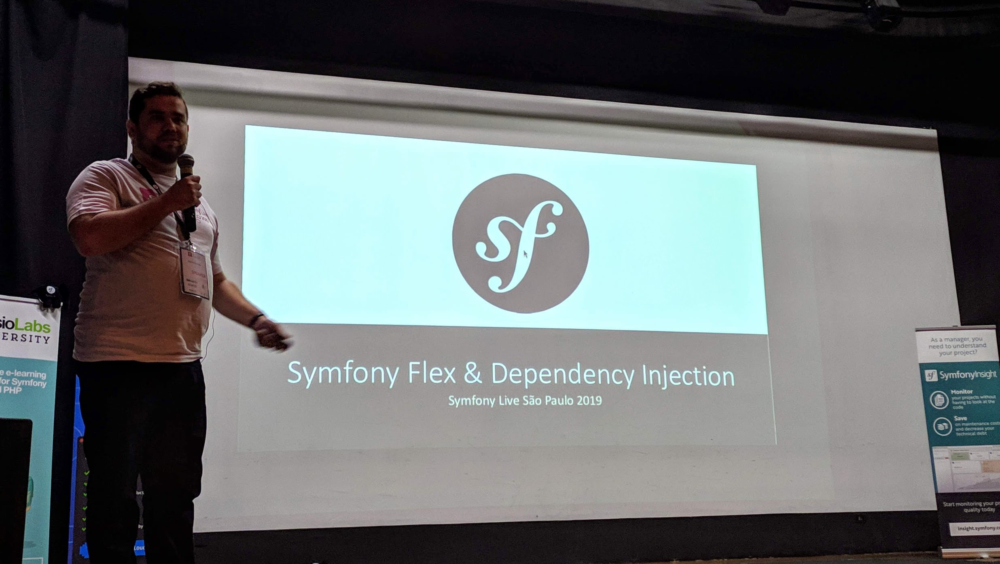
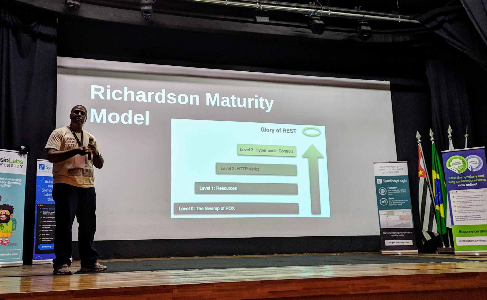
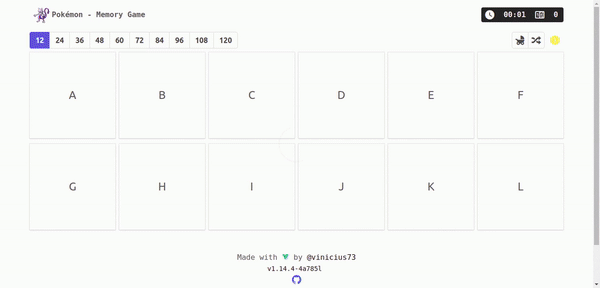
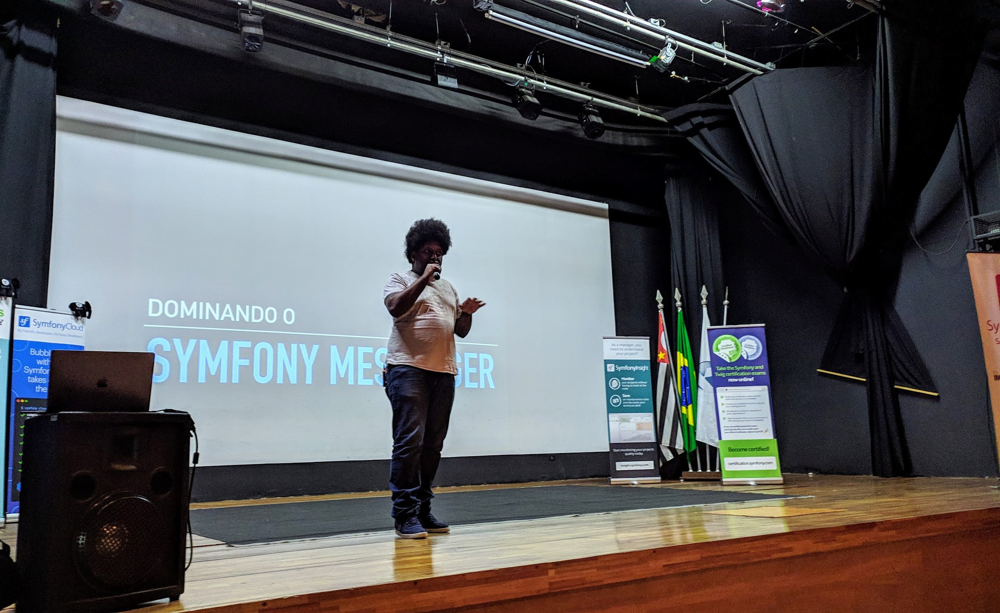
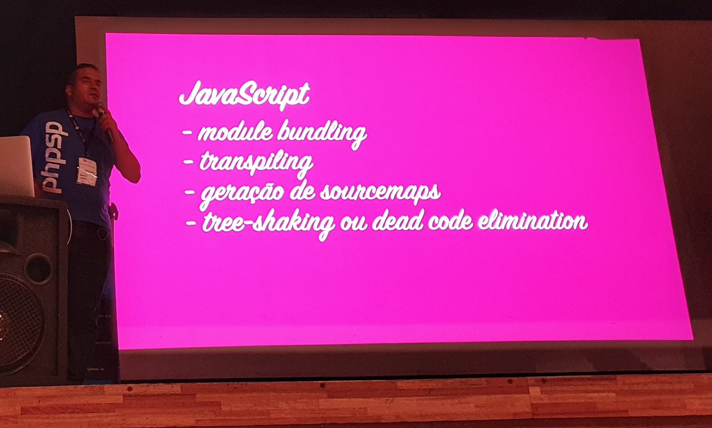
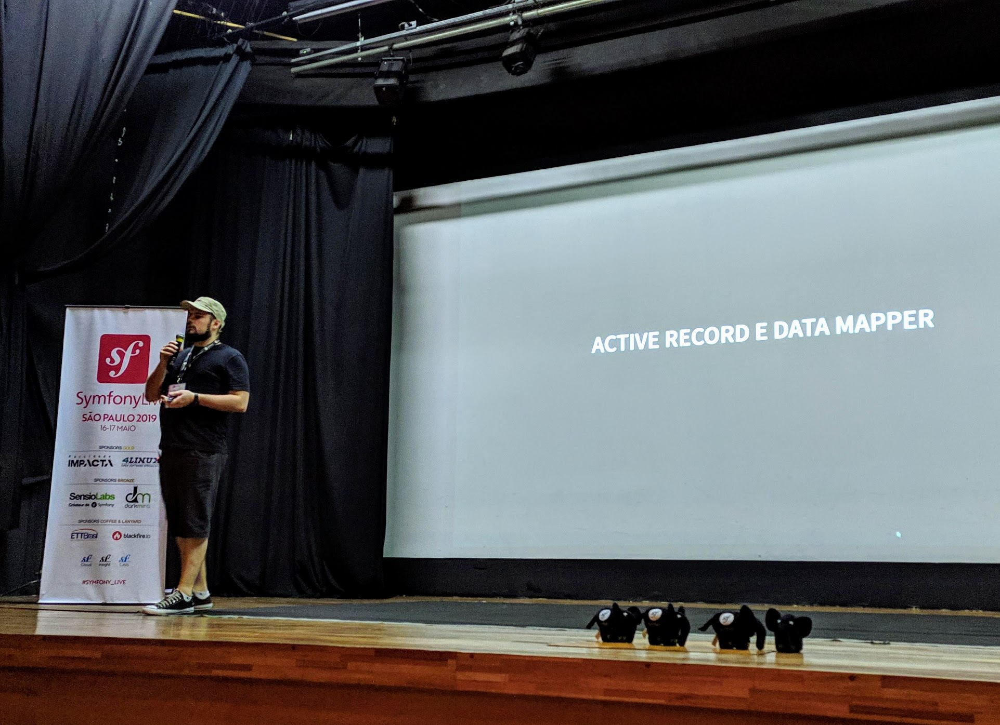
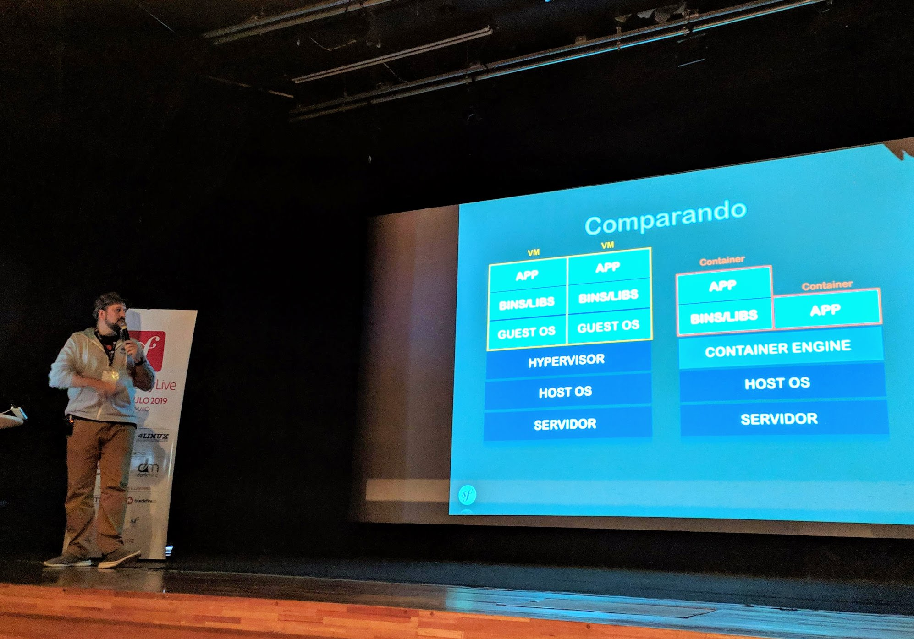
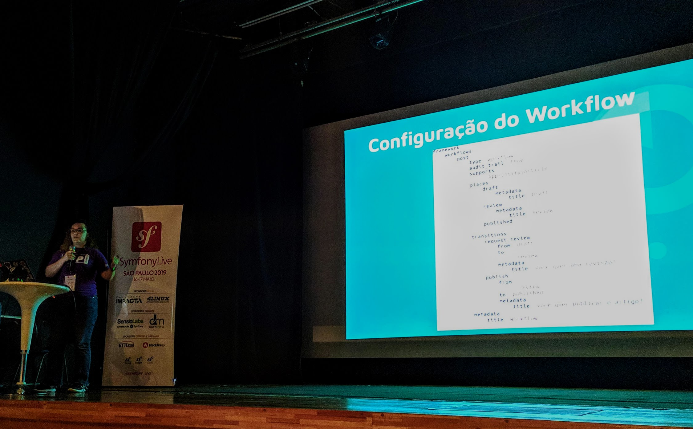
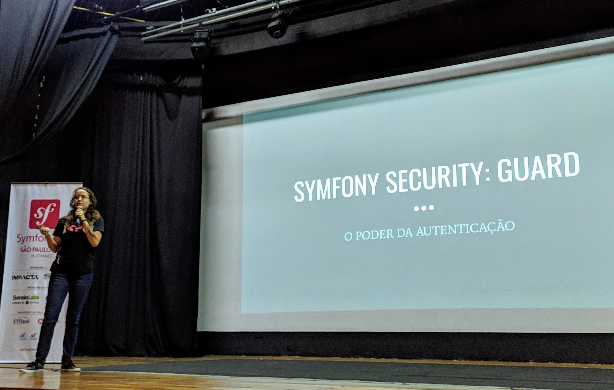
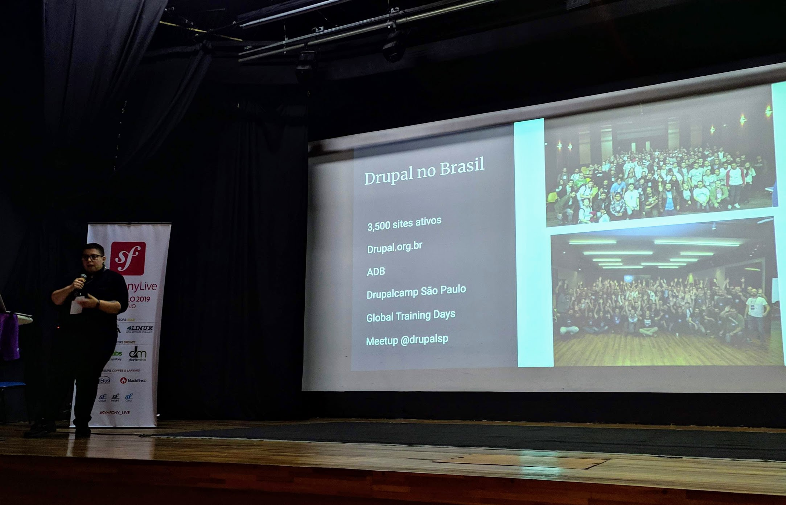

[Veja a programação do evento](https://brasil2019.live.symfony.com/speakers).


# Dia 1 - Quinta-feira 16/maio

## Abertura  - Cyrille
O Cyrille deu início à primeira #Symfony_Live da América Latina, é uma honra pra mim estar participando desse evento <3


## Symphony MIME - [Nicolas Grekas](https://connect.symfony.com/profile/nicolas-grekas)

Keynote
Symfony MIME, já mergeado no Symfony 4.3, é "tudo que você precisa para criar emails bonitos".

### Como escrever os emails?

De uma forma simples, assim:

```php
use Symfony\Component\Mime\Email;

$email = (new Email())
	->from('fabien@symfony.com')
	->to('fabien@sensiolabs.com')
	->subject('Some subject')
	->text('Some text')
	->html('<b>Some HTML message</b>')
	->attach('doc.txt')
```

Uma maneira moderna de mandar emails, sem precisar de Swiftmailer, ou o email nativo do php, algo do tipo.
Em uma comparação de serialização de objetos contendo o email, o serializado pelo Symfony tem apenas 2 mil caracteres, contra 16 mil do [Swiftmailer](https://swiftmailer.symfony.com/). Isso mostra a simplicidade das classes do Symfony Mailer e MIME, consistindo apenas de _Data Objects_. Há uma diferença nos cabeçalhos, que são dinâmicos e não fixos. Um simples `sleep(2)` no código mostra que ao transformar um email novamente em string, o cabeçalho de envio muda em 2 segundos também.
Caso o usuário do componente sinta a necessidade de customizar ainda mais os cabeçalhos e etc, é possível utilizar a classe `Message`, que a classe `Email` se utiliza, dando mais flexibilidade por ser mais "baixo nível".


Há uma integração nativa com o [`Twig`](https://twig.symfony.com/), o mecanismo de templates do Symfony. É possível até anexar emails utilizando algo como ``

Sabemos que escrever emails em HTML são difíceis, temos questões como compatibilidade de diferentes clientes, CSS,
Com um filtro para CSS dessa integração com o Twig, conseguimos aplicar CSS inline e até mesmo incluir arquivos, facilitando a organização da estrutura dos emails. Temos também um filtro para Markdown, que pode facilitar tarefas como escrever tabelas e etc. Também é possível combinar com a extensão [Inky](https://github.com/twigphp/inky-extension).
Os emails, no ato de envio, são convertidos para strings e não classes do PHP ou algo do tipo, aumentando a previsibilidade do que vai ser enviado - nenhuma surpresa sobre isso :)

### Como enviar esses emails?
O Nicolas esclarece para nós que esse componente foi feito precisamente para emails transacionais. Não foi pensado em email marketing ou algo do tipo, para envio de emails em massa.
Existem atalhos para alguns providers STMP, como Gmail, Mailgun, Sendgrid, etc. É possível utilizar as APIs para envio ao invés de SMTP, bem como DSN, que permite estratégias de transporte como `Failover` ou `RoundRobin`.

Um detalhe importante é que os emails podem ser enviados de forma assíncrona, não necessitando aguardar uma resposta do provedor de email para continuar o processamento subsequente. Caso o `Bus` esteja configurado, que pode ser feito com uma única linha de código, ao enviar um email com o método `send` de um objeto que implementa a `MailerInterface`. o envio será assíncrono. Caso a configuração não seja feita, o email é enviado de forma síncrona normalmente.

Há uma integração com o `Dispatcher` de eventos, com um `MessageEvent` após o envio do email. Podemos colocar `listeners`: `EnvelopeListener` e `MessageListener` para modificar o email como julgarmos necessário.
Esse componente também tem capacidades como `throttling` e `SMTP keep-alive` para não enviar mais emails do que o servidor permite em um dado tempo e deixar a conexão SMTP aberta para enviar emails mais rapidamente, respectivamente.

O componente MIME ainda é experimental, o que não significa que o mesmo não seja estável - ele é - apenas que o mesmo pode evoluir mais rapidamente por ser novo e portanto usuários do mesmo possam ter que atualizar seus códigos mais vezes para manter as atualizações funcionando. Você pode ler mais sobre componentes experimentais do Symfony [aqui](https://symfony.com/doc/current/contributing/code/experimental.html).
Após o componente [`Mailer`](https://github.com/symfony/mailer) sair do modo experimental, provavelmente o [Swiftmailer](https://swiftmailer.symfony.com/) será descontinuado.

Essa talk nos permitiu ter uma visão legal desse novo componente, obrigado ao [Nicolas Grekas](https://twitter.com/nicolasgrekas) por ter vindo ao Brasil para ajudar na organização do evento e dar essa keynote!

@TODO slides

## Symfony Flex e Dependency Injection - [Gabriel Machado](https://connect.symfony.com/profile/gmsantos)



O Gabriel começa a palestra falando sobre a Evolução dos Frameworks, desde o PHP 4 em 2001, com Wordpress, Symfony 1, Zend Framework 1, Code Igniter. Eles eram inovadores para a época porém eram muito acoplados.

Já no período de 2009 a 2013, começamos a ver uma evolução do PHP, a criação do PHP-FIG, o [Composer](https://getcomposer.org/), permitindo uma melhor modularização dos frameworks. Nessa época vemos o Symfony 2, Zend Framework 2 e o surgimento do Laravel 4.

De 2013 a 2017 surge a PHP League, mais PSRs e o lançamento dos microframeworks Slim, Silex (RIP).

Em uma comparação, o Gabriel explicou que micro frameworks são leves, altamente customizáveis, ideal para microserviços e "rápidos", pelo propósito de uso dos mesmos. Já um framework full stack é mais completo em funcionalidades, mais integrado, padronizado e fácil de enviar para produção.

Em seguida, ele faz um questionamento: "E se pudéssemos ter ambos?". Assim surgiu a ideia do [Symfony Flex](https://github.com/symfony/flex). Ele basicamente é um plugin do Composer, com foco na automação de tarefas e permite começar com um microframework e configurar automaticamente novos componentes sob demanda, crescendo conforme a necessidade.

### Criando um projeto

Para utilizar o Flex, podemos usar dois comandos, de acordo com a necessidade.

Utilizando o comando abaixo, conseguimos criar um projeto com todos os componentes, se assemelhando a um projeto fullstack.

```bash
composer create-project symfony/website-skeleton app
```

No entanto, se a ideia é utilizar um microframework, com menos componentes, utilizamos o esqueleto mais básico do projeto, rodando o comando:

```bash
composer create-project symfony/skeleton app
```

É muito legal notar que o [`skeleton`](https://github.com/symfony/skeleton) só tem um único arquivo `composer.json` e os componentes são escolhidos por você, no momento da configuração.

### Demo time!
Logo em seguida, vimos uma Demo utilizando o `skeleton`, mostrando como configurar o projeto, seguir os primeiros passos, instalar novos componentes que julgamos necessários e até mesmo criar novos controllers e configurar rotas, tudo de forma intuitiva e prática.

Por baixo dos panos, o Symfony Flex faz _prefetch_ e download em paralelo de dependências, tem pacotes de componentes que instalam vários pacotes mais facilmente. Há também bastante automação e receitas que facilitam instalações e configurações, sem precisar editar vários arquivos para ter componentes novos funcionando. Podemos utilizar _aliases_, rodando por exemplo apenas `composer require log` e obteremos o [Monolog Bundle](https://github.com/symfony/monolog-bundle). Existem ainda alguns comandos extras para o composer, como por exemplo `composer symfony:unpack` que pode desfazer esses pacotes de componentes.
Para encontrar todas as receitas, basta acessar [o site do projeto](https://flex.symfony.com/).

### _Dependency Injection_ (Injeção de Dependências)

O Gabriel mostrou como o Symfony 4 facilitou bastante o uso de injeção de dependências, simplificando o arquivo de configuração. Com funcionalidades como _auto wiring_ e _auto configure_, a vida do desenvolvedor fica mais fácil, se assemelhando em conceitos que víamos em frameworks como o Laravel. Somente colocando _typehints_, já temos a funcionalidade de injeção de dependências no construtor, graças ao _auto wiring_. Estendendo uma classe ou implementando uma interface já funciona também, graças ao _auto configure_.

Os slides da talk, com as referências, [podem ser encontrados aqui](https://www.slideshare.net/gmsantos/symfony-flex-dependency-injection/gmsantos/symfony-flex-dependency-injection).

## Web scraping com Symfony Panther - [Raphael de Almeida](https://connect.symfony.com/profile/raphaeldealmeida)

O Raphael, da comunidade PHPRio, veio do RJ trazer essa palestra para a comunidade.

Ele começou refletindo que, no mundo ideal, todas as aplicações compartilham dados via API, retornando dados estruturados (não apenas em JSON!). Ele citou um exemplo de retornos de APIs RESTful, citando o Richardson Maturity Model (se quiser saber mais, está disponível nas referências dos slides) como dados bem estruturados. Citou também GraphQL.



Mas, a realidade nem sempre é essa, né?


### Web Scraping (ou o menos conhecido termo, raspagem de dados)
Web Scraping pode ser utilizado para inúmeras coisas, incluindo:

- Web Indexing
- Data Mining
- Automatizações
- Comparação de preços
- Detecção de alterações

Para isso, podemos, de uma maneira mais "ingênua", utilizar `cURL`. Mas e se quisermos simular um usuário, lendo HTML, manipulando formulários, utilizando cookies?
Temos como alguns exemplos melhores algumas bibliotecas como o [Guzzle](http://docs.guzzlephp.org/en/stable/) e o [DomCrawler](https://symfony.com/doc/current/components/dom_crawler.html). Porém a web continua evoluindo, com SPAs (Single Page Applications) sendo criadas, necessitando de muita interação com  JavaScript - por exemplo.

Eis que surge o [Symfony Panther](https://github.com/symfony/panther), que utiliza o protocolo WebDriver da W3C, que é o mesmo protocolo utilizado pelo Selenium, por exemplo. Podemos utilizar o Google Chrome "Headless" para interagir com o Panther, sendo nosso browser.

Utilizando o comando abaixo, instalamos o componente:

```bash
composer require symfony/panther
```

E assim já podemos utilizar, como no exemplo:

```php
<?php

require __DIR__.'/vendor/autoload.php'; // Composer's autoloader

$client = \Symfony\Component\Panther\Client::createChromeClient();
$crawler = $client->request('GET', 'https://api-platform.com'); // Yes, this website is 100% in JavaScript

$link = $crawler->selectLink('Support')->link();
$crawler = $client->click($link);

// Wait for an element to be rendered
$client->waitFor('.support');

echo $crawler->filter('.support')->text();
$client->takeScreenshot('screen.png'); // Yeah, screenshot!
```

O Raphael fez uma demo pra gente, demonstrando como jogar o jogo  [Pokémon - Memory Game](https://vue-pokemon-memory-game.vinicius73.dev/), feito pelo grande [Vinicius Reis](https://twitter.com/luizvinicius73), utilizando o Symfony Panther. Ele foi mostrando passo a passo como interagir com o jogo,
Vale a pena conferir no vídeo, quando estiver disponível. Olha só o gif da aplicação dele jogando a memória:



Fiquei pensando aqui, será que ele pode fazer um bot pro [meu campo minado](https://ravanscafi.github.io/minesweeper/)? hahaha :)

### Dicas

- Trabalhe com [Page Object](https://martinfowler.com/bliki/PageObject.html).
- Crie logs para todas as ações importantes. A ferramenta pode não estar executando algum passo definido, pois o site que você está fazendo scrap mudou e você precisa saber disso.
- Monitore a execução do seu serviço, pois ele pode cair por inúmeros motivos.
- Trate casos de timeout, pois serviços como pinterest podem negar o serviço para você.

Os slides da palestra estão disponíveis no [SpeakerDeck](https://speakerdeck.com/raphaeldealmeida/web-scraping-com-symfony-panther).


## Dominando o Symfony Messenger - [Hussani Oliveira](https://connect.symfony.com/profile/hussani)



O Hussani, que trabalha na Cabify e é evangelista de longa data do [PHPSP](https://phpsp.org.br/), começou a apresentação mostrando um código de um controller problemático, que tinha um problema onde o envio de uma notificação de pagamento demorava muito.
Ele apontou os problemas: processamento lento e lógica de negócio no controller. Em seguida, explicou que o [Symfony Messenger](https://symfony.com/doc/current/messenger.html) tem o propósito de trafegar mensagens. Ele mostrou que você pode trabalhar com mensageria dentro da própria aplicação, não necessariamente se comunicando com outras aplicações. É um tipo de arquitetura baseada em troca de mensagens.

### Mensagens
Uma mensagem no `Messenger`, nada mais é que um simples objeto que vai trafegar pela aplicação, como por exemplo a mensagem abaixo:

```php
namespace App\Message;

class PaymentNotification
{
    private $content;

    public function __construct(string $content)
    {
        $this->content = $content;
    }

    // ...getters
}
```

Tendo o Symfony Messenger, uma mudança no controller fica simples, podendo despachar essa mensagem no `Bus`, como por exemplo, com `$bus->dispatch(new PaymentNotification('Payment was successful'));`.

O `Bus` serve para trafegar as mensagens pela aplicação. Ela recebe essa mensagem e entrega para quem está "escutando" por essas mensagens, que são os `Handlers`.

Os `Handlers` recebem as mensagens e fazem "o que quiser" com elas.
Nos arquivos de configuração, você pode configurar quais handlers escutam quais mensagens e, somente com isso, o `Bus` saberá para quem entregar as mensagens.

### Transportes
Bundles para trabalhar com AMQP, Kafka, Redis, etc.
Configuramos no `config/packages/messenger.yaml` quais meios de transporte queremos utilizar e essas mensagens podem ser enviadas através dessas camadas para outras aplicações e serviços.


## Mercure - atualização em tempo real para sua aplicação - [Anderson Casimiro](https://connect.symfony.com/profile/duodraco)

Nessa talk temos outro evangelista de longa data do [PHPSP](https://phpsp.org.br/), o Anderson, também conhecido como Duodraco. E ele começou a apresentação com nostalgia, lembrando que muuuuuito antigamente (na era da tecnologia pelo menos), aplicativos que respondiam em tempo real, como o [Chat UOL](https://www.tecmundo.com.br/brasil/118052-entramos-bate-papo-uol-2017-saber-ainda-acontece.htm), Chat Terra, etc, pareciam mágica, pois atualizavam constantemente a página com novas informações. Mas a mágica no fim era uma atualização constante de páginas, meros refresh's do navegador.
Até que surge o GMail, que revolucionou a maneira como víamos e consumíamos aplicações do tipo. Podíamos navegar "sem sair da página", "sem recarregar". Naquela época, surgiu com uma mecânica de `iframe`s para atualizar os dados, até que depois o `XMLHttpRequest` surgiu e o `AJAX` foi se concebendo.

> **Interfaces ricas são assíncronas**
> (insira um ícone de `loading...` aqui)

Então, muitos estudos sobre o HTTP foram feitos para otimizar a comunicação. Eis que surgem os `WebSockets`, que começam em cima do protocolo HTTP e abrem uma conexão persistente entre cliente-servidor, mudando depois o protocolo (por exemplo `xmpp://`, `ws://` etc.).

### Mercure
O Mercure é um protocolo que permite enviar atualizações de dados para navegadores e outros clientes HTTP. O legal é que ele funciona com padrões que já existem, então não é necessário mudar os navegadores ou as aplicações. Caso não existam conexões persistentes, ele funciona com HTTP, por exemplo. Ele tem alguns recursos interessantes, como reestabelecimento de conexão, reconciliação de estado. Funciona com HTTP/2, tem autenticação baseada em JWT. Suporta HATEOAS e GraphQL. Encripta mensagens e com um _polyfill_ pode funcionar até no IE 7.

1. Cliente assina um tópico no `Mercure Hub`.
2. Servidor publica em um tópico no `Hub`.
3. `Hub` avisa assinantes dos tópicos.


A tabela abaixo mostra um comparativo que o Duodraco mostrou em seus slides:

|Mercure|WebSocket|
|----|---|
|API de alto nivel|API de Baixo Nível|
|Autorização|Você deve implementar por si mesmo|
|Reconexão|Você deve implementar por si mesmo|
||Você deve implementar por si mesmo|
|HTTP/2|Sem suporte|
|Draft de Standard|RFC6455|

### Mercure Hub
Possui implementação em Kubernetes, tem uma imagem do docker, tem um binário e estão trabalhando em um serviço gerenciado por eles mesmo.
Para conectar ao mesmo, é só colocar endereço, chave JWT e mais algumas outras configurações. Existem bibliotecas para JavaScript por exemplo, para se conectar ao Hub.

### E onde entra o Symfony?
O Mercure possui um bundle do Symfony, que você inclui na sua aplicação e configura.

### Demo!
Após mostrar todos os conceitos, o Duodraco fez uma demo pra gente, mostrando uma aplicação dos Vingadores que ele construiu na [API Platform](https://api-platform.com/), colocou o Mercure e que atualiza em tempo real outra aplicação, em Vue.js, que ele também fez.

### Considerações
O Mercure ainda não é um padrão estabelecido, então ainda pode existir certa instabilidade ou virem muitas mudanças na forma como funciona. De qualquer forma, já é utilizável e pode funcionar para comunicação entre múltiplas aplicações ou entre cliente-servidores.

## Aumente o reconhecimento da sua carreira através da certificação Symfony - [Hallison Boaventura](https://connect.symfony.com/profile/hallisonboaventura)


Nessa talk, o Hallison, veio de Brasília até aqui para palestrar no primeiro Symfony Live. Ele trabalha no Ministério das Relações Exteriores, o Itamaraty e nessa talk veio falar sobre a certificação Symfony, os benefícios, algumas informações e dicas. Ele é o único brasileiro que tem a certificação do Symfony 4.

Ele começou falando do porquê de usar Symfony, trazendo informações impressionantes como 2,5 bilhões de downloads (somando todos os componentes) e que tem referências de projetos como o Drupal, Composer e Laravel, que utilizam o Symfony.
Ele é Open Source, com a licença MIT. Ele traz bastante inovações, como alguns componentes que vimos em outras talks do evento.
Ele também tem uma promessa de compatibilidade com versões anteriores, usa versionamento semântico e tem ciclos de lançamentos com versões `major` suportadas por 2 anos.

O Hallison também contou a história dele com o Symfony, que tem mais ou menos quatro anos. Ele fez um gerador de relatórios de um firewall de mercado; uma aplicação em Silex 2, chamada [Silex JWT Security Service Provider](https://github.com/hallboav/silex-jwt-security); um backend de app para consulta de saldo do cartão de alimentação e um lançador de registros de pontos. Dá pra ver que nesses 4 anos ele teve bastante contato com o Symfony.

### Técnicas utilizadas para alcançar a certificação

- Prática
- Análise de código
- Xdebug
- Documentação
- Lista de estudo com os tópicos e subtópicos exigidos pela Symfony


### Recomendações
- SymfonyCasts
- Use uma lista
- Contribua para a documentação
- Faça pequenos sistemas com os componentes standalones para estudá-los
- Leia (constantemente) livros e blogs
- Use a ferramenta Certificationy
- Baixar a documentação offline em formato PDF
- Veja a apresentação do Tobias Nyholm: "Deep dive into Symfony 4 internas"


O Hallison também falou sobre alguns componentes como o Symfony HttpKernel e EventDispatcher. Vale a pena conferir a aula que ele deu quando sair o vídeo da talk dele :)


### Processo de Certificação
- Conta no SymfonyConnect
- [Badge & PDF](https://connect.symfony.com/profile/hallisonboaventura)
- Investimento de 250 euros
- 40% de desconto na black friday.
- Symfony 3.0 e 4.0
- Níveis Advanced e Expert - com base na quantidade de acertos
- A porcentagem de acertos para passar como Advanced é secreta (e o Hallison é Advanced, hein! 😉)
- SensioLabs University é um workshop de três meses, porém muito cara para a realidade brasileira.

- 75 questões, 15 tópicos, 90 minutos
- Pearson VUE ou exame online
- Tipos de perguntas
	- true/false, única resposta, respostas múltiplas
- Validade de 1 ano
- Retake
- Não há questões sobre Bundle de terceiros ou sobre o Doctrine.

Os tópicos do exame estão na [página da certificação](https://certification.symfony.com/).

### Benefícios

Os benefícios incluem promoção de cargo e aumento de salário; viabilidade mundial e possibilidade de trabalhar no exterior; maior legitimidade em todo o ecossistema, não só Symfony; critério de desempate em processo de contratação; realização pessoal.

Nos slides, tem uma certificação falsa que o Hallison fez como exemplo para você entender mais ou menos como é a prova :)


### Mantenha-se Atualizado
@TODO


## Gerenciando Assets com Symfony Encore - [Marcel Gonçalves dos Santos](https://connect.symfony.com/profile/marcelgsantos)

Fechando as palestras oficiais do primeiro dia, o Marcel, outro evangelista do [PHPSP](https://phpsp.org.br/), começou animando a galera com um sorteio de livro da [Casa do Código](https://www.casadocodigo.com.br/). Ele vai nos nos falar sobre gerenciamento de assets. E começa definindo o que é isso:

**Assets** são elementos estáticos que compõem uma página web.
O processo de **gerenciamento de assets** é um procedimento que torna os assets prontos para serem utilizados pela aplicação. Para quem tem mais afinidade com frontend, sabe como é necessário fazer várias transformações nesses assets.


_[Foto por duodraco](https://twitter.com/duodraco/status/1129107284402089985)_

No JavaScript que escrevemos para deixá-los prontos para produção. Coisas como `module bundling`, `transpiling`, geração de `sourcemaps`, `tree-shaking` ou `dead code elimination`, minificação, `cache busting`.

Já no CSS, precisamos de pré/pós-processamento (`SASS`, `LESS`, `Stylus`, `vendor-prefixes`), geração de `sourcemaps`, ajustar caminho de imagens e fonte, minificação, cache busting...

Em imagens e fontes, podemos fazer a otimização de imagens, conversão para base64, cache busting

De forma geral, copiar e remover arquivos, notificar sobre o processo de compilação, visualizar as alterações no navegador... isso tudo faz parte do ciclo de desenvolvimento frontend moderno.

O frontend evoluiu muito nesses últimos anos e o Marcel deu bastante detalhes de como isso aconteceu. Porém, com a evolução, também vieram alguns problemas, como por exemplo a dificuldade de conhecer todas as ferramentas e termos.

Uma das ferramentas que busca resolver esses problemas do desenvolvimento frontend moderno é o [Webpack](https://webpack.js.org/), um module bundler poderoso.
Ele pode ser instalado através do npm (ou yarn), gerenciador(es) de dependências do [Nodejs](https://nodejs.org/). Embora seja robusto, a configuração do mesmo pode ser um pouco difícil.

### Symfony Encore

O [Symfony Encore](https://symfony.com/doc/current/frontend/encore/installation.html) é um gerador de configuração para o Webpack. Ele envolve o Webpack em uma API simples e poderosa para o gerenciamento de assets. Inspirado pelo [Webpacker](https://github.com/rails/webpacker) e [Mix](https://laravel.com/docs/5.8/mix). É feito pela Symfony e é um módulo JavaScript, porém a recomendação é instalá-lo pelo Composer:

```bash
composer require encore
```

E depois disso, rodar um `npm install` ou `yarn install`.

Uma vantagem do arquivo Webpack gerado pelo Encore é que ele é muito bem documentado. Para se ter uma ideia, veja exemplo do encore:

```js
var Encore = require('@symfony/webpack-encore');

Encore
    .setOutputPath('public/build/')
    .setPublicPath('/build')
    .addEntry('app', './assets/js/app.js');

module.exports = Encore.getWebpackConfig();
```

O Marcel também deu algumas dicas de configuração, explicando por exemplo sobre a divisão de bundles. É legal ver que ele passou por muitos dos conceitos citados e como configurar, dá pra ter uma ideia de como funciona esse universo hoje em dia.

O Encore tem alguns helpers do Twig para incluir os assets no template, como `encore_entry_js_files()`, que por baixo dos panos usa o arquivo `entrypoints.json`, gerado pelo Webpack, para saber quais arquivos incluir.

### Conclusões
1. utilize um workflow moderno
2. @TODO

[Confira aqui os slides da apresentação do Marcel.](https://speakerdeck.com/marcelgsantos/gerenciando-assets-com-symfony-encore)


## Lightning talk - Lucas
O Lucas, que trabalha na ETTBrasil, na equipe Enterprise PHP nos mostrou uma demo de como utilizar o [blackfire.io](https://blackfire.io/) para profiling, testes e mais algumas coisas. É uma ferramenta muito poderosa e que o Lucas claramente domina. Vale a pena conferir :)

## Lightning talk - Hallison
O Hallison mostrou uma aplicação que ele fez usando o componente HttpClient do Symfony para descobrir quais usuários do [Symfony Connect](https://connect.symfony.com) que possuem a certificação, tema de sua palestra principal. Foi legal que ele também fez uma comparação com o Guzzle.

## Lightning Talk - Duodraco

O Duodraco fez outra demo pra gente, tentando criar uma API em 4:28 minutos (por causa do Symfony 4.28, haha). Nesse pouquíssimo tempo, explicando cada passo, conseguiu refazer a API que utilizou na sua apresentação principal e até mesmo testar no último minuto. Quem sabe faz ao vivo!

## PHPSP Symfony Live + Pub
Com o fim do primeiro dia, foi a hora de deixar o notebook de lado e ir para a [confraternização](https://www.meetup.com/pt-BR/php-sp/events/261486182/).

---

# Dia 2 - Sexta-feira 17/maio

## Keynote  - [Cyrille Grandval](https://connect.symfony.com/profile/cgrandval)

Perdi :(

## Empodere suas entidades com Doctrine e DDD - [Tobias Sette](https://connect.symfony.com/profile/gnumoksha)

O Tobias veio trazer para a gente uma talk sobre _Domain Driven Design_, o DDD. É um tema que ganha cada vez mais relevância e é  ótimo poder saber

### Visão Geral sobre DDD

> DDD é primariamente sobre modelar uma Linguagem Ubíqua e um Contexto Limitado explícito
> (tradução livre do Domain-Driven Design Distilled)

Uma coisa legal sobre essa frase, segundo o Tobias, além da definição em si é que ela não fala de uma linguagem de programação, um framework ou algo do tipo. Os contextos do DDD são definidos pelos desenvolvedores juntamente com o time de negócio, o que é interessante e diferente de algumas práticas que vemos por aí para por exemplo "quebrar" microserviços, que normalmente não envolve o negócio.

### Entidades
Falando sobre Entidades, um termo já conhecido para usuários do [Doctrine](https://www.doctrine-project.org/), vemos o tema de Active Record vs Data Mapper, explicitando como Data Mapper é o padrão utilizado pelo Doctrine.



O Tobias fala sobre **Entidades anêmicas**, mostrando um exemplo de uma classe `Customer` com apenas `getter`s e `setter`s para campos `nome`, `email`, `status`...
Em seguida, realiza uma mudança nessa classe, adicionando **comportamento** para uma lógica de troca de email, disparando um evento para a aplicação informando sobre essa troca. Segundo ele, esse comportamento é inerente a essa classe e por isso deve estar junto a ela: Dados + Comportamentos da entidade.

### Objetos de Valor
Objetos que não carregam comportamento, apenas valores. Cita o exemplo da biblioteca [Money](https://github.com/moneyphp/money), para manipular valores de dinheiro. Um exemplo no caso do contexto de `Customer` citado pelo Tobias, é um Objeto de Valor para email, que no próprio construtor já valida o email para garantir que estamos trabalhando com dados corretos.
Voltando para a classe `Customer`, melhoramos nossa lógica de troca de email, utilizando esse objeto de valor. Ele também cria um outro objeto de valor para lidar com o `status` do Customer, utilizando a biblioteca [myclabs/php-enum](https://github.com/myclabs/php-enum) para facilitar a criação e utilização desse objeto. Continuando o refactor, ele utiliza também esse objeto na nossa classe `Customer`.

### Entidades Filhas vs Relacionadas
Um conceito importante para modelar nossos dados, onde por exemplo um `Customer` seja relacionado a uma `Order`, que por sua vez tem como entidade filha um `OrderItem`, que é relacionado ao `Product`. Assim, chegamos no conceito de **Agregados**.
Utilizando Agregados, conseguimos saber quais entidades devem ter objetos de valor e começamos a criar limites mais bem definidos no nosso sistema.

@TODO

O Tobias dá algumas dicas ao criar agregados, como:
1. **Proteja as invariantes do negócio dentro do agregado.** Uma `Order` tem o seu `OrderId`, seu `Value` e seu `OrderItem`. Eles têm **invariantes**, que são regras que precisa sempre ser verdadeira. Por exemplo, o valor de todos os `OrderItem`s deve ser igual ao valor total do `Order` - isso é uma invariante e deve estar dentro do agregado `Order`.
2. @TODO
3. **Referencie outros agregados apenas pela Identidade `(id`)**. Não se deve consultar relacionamentos diretamente, mas sim pelos ids.
4. **Atualize outros agregados utilizando consistência eventual**. Trabalhando com eventos assíncronos, temos mais flexibilidade no sistema.

Utilizando as dicas e conceitos apresentados, o Tobias mostrou como melhorar o código de exemplo.

O Tobias citou ainda [Repositórios](https://martinfowler.com/eaaCatalog/repository.html), que faz o meio de campo para as camadas de data mapping e provê uma interface de coleção para os Objetos de Domínio. Ele mostrou como persistir e recuperar `Customer`s com o uso de repositórios.


Algumas das referências utilizadas na apresentação podem ser encontradas nos slides.


## Rodando Symfony em Docker containers. Dicas e melhores práticas - [Wellington Figueira da Silva](https://connect.symfony.com/profile/wsilva)

O Wellington começa sua talk com a pergunta que não quer calar: **O que é Docker?** - pergunta essa que ele responde com uma definição própria:

> "Ferramenta para **virtualização** no nível do Sistema Operacional." - Wellington F. Silva

E em seguida já explica pra gente quais são os tipos de **virtualização**:
- **Full virtualization**: instalar a iso e rodar na máquina
- **Partial virtualization**: virtual box, algumas coisas não funcionam tipo ler pendrive, etc...
- **Paravirtualization**: alterar algumas coisas no guest para funcionar melhor no host
- **OS Level Virtualization**: virtualização de ambiente, onde entra o Docker

E ressalta que é muito importante lembrar que:

> Docker não é VM (máquina virtual)

Em seguida vemos a timeline de **virtualização a nível de SO**, que começou lá em 1982, com `chroot` e foi evoluindo, passando por `cgroups` em 2006 e em 2008 foi onde foi lançado o `LXC`, que o Docker se baseia. O Wellington explicou no detalhe como funciona o Docker, com essa mágica do Linux para permitir tudo isso. E também como outros sistemas operacionais permitem que o Docker funcione.



Entrando nos conceitos do Docker, vimos que as **Imagens** do Docker são camadas `read-only` com alterações no "sistema". Começando com uma imagem do `debian` por exemplo, podemos instalar o `NGINX`, adicionar os arquivos HTML e em seguida expor a porta 80. Cada um desses passos representa uma **camada** da imagem. Após isso, quando rodamos essa imagem, criamos um **container**, que aí sim é `read-write`.

### Boas práticas para construir suas imagens

Algumas dicas passadas foram: simplificar as imagens; evitar instalar pacotes que não serão utilizados; utilizar um processo por contêiner; quebrar instruções muito grandes no `Dockerfile` e deixá-lo bem legível, para facilitar o entendimento e manutenção.

Uma dica de segurança é utilizar o mínimo de pacotes possível, tendo menos chances de ter vulnerabilidades. Uma forma de atingir isso pode ser utilizando imagens com base no `alpina`. Outra dica é sempre utilizar as [imagens oficiais do Docker](https://docs.docker.com/docker-hub/official_images/).

O Wellington mostrou vários exemplos, de configuração do `composer` pra usar na máquina, de criação de `Dockerfile`s pra subir nossa aplicação Symfony... muito legal e prático!

[Confira os slides no SpeakerDeck.](https://speakerdeck.com/wsilva/rodando-symfony-em-docker-containers-symfonylive-brazil-2019)

## Symfony Workflow - [Camila Silva Fernandes](https://connect.symfony.com/profile/camilafernandes)

A Camila, evangelista do [PHP Women](https://phpwomen.org.br/), veio falar pra gente sobre o componente de fluxo de trabalho do Symfony, o [**Symfony Workflow**](https://symfony.com/doc/current/components/workflow.html). Ele fornece ferramentas para gerenciar um `fluxo de trabalho` ou uma `máquina de estados`.
Por exemplo, um post de blog pode passar por vários estados: `rascunho`, `aprovação`, `publicação`, `rejeição`... com esse componente, podemos controlar esse fluxo de estados.

### Fluxo de trabalho

Para isso, criamos um arquivo de configuração colocando todos os **estados** e **transições** possíveis. Na imagem, dá pra ter uma ideia (nos slides é possível ver com mais clareza), de um `workflow` (fluxo de trabalho).



Para utilizarmos em nossa aplicação, temos alguns métodos para nossas entidades:

- `Workflow::can()` -> verifica se é possível passar para um determinado estado
- `Workflow::apply()` -> aplica a mudança de estado
- `Workflow::getEnabledTransitions()` -> mostra quais transições são possíveis a partir do estado atual.

`Guard Events` são executados cada vez que uma chamada é feita. É possível utilizá-los para bloquear transições. Por exemplo, deixar uma transição ocorrer somente caso o usuário seja `admin`.

Existem também helpers para o Twig que também permitem trabalhar com o componente, com métodos como `workflow_can()`, `workflow_transitions()`, entre outros...

### Máquinas de estado
Também podemos utilizar o tipo `state_machine` (máquina de estado). As principais diferenças entre `workflow` e `state_machine` são que os fluxos de trabalho podem estar em mais de um lugar (estado) ao mesmo tempo, enquanto nas máquinas de estado não. Além disso, os fluxos de trabalho geralmente não tem caminhos cíclicos, mas são comuns em máquinas de estado. Existem algumas outras diferenças e [na documentação do componente](https://symfony.com/doc/current/workflow/introduction.html) dá pra entender melhor :)

### Eventos
Alguns eventos são disparados ao interagirmos com o Workflow, como por exemplo, `workflow.enter`, que ocorre quando um novo estado é definido. Existem muitos outros, como `workflow.leave`, `workflow.transition`, `workflow.guard`.

### Na prática
A Camila mostrou uma demo pra gente que foi mostrado na #Symfony_Live Paris 2016 e que você pode conferir [aqui](https://symfony-workflow-demo.herokuapp.com). O código está disponível no [GitHub](https://github.com/lyrixx/SFLive-Paris2016-Workflow).

Confira os slides da palestra.

## Guard: o poder da autenticação do Symfony Security - [Diana Ungaro Arnos](https://connect.symfony.com/profile/dianaarnos)



A Diana começa sua talk falando sobre a diferença entre Autenticação e Autorização. Basicamente, **Autenticação** é o processo de **identificar** se alguém é quem realmente diz ser, enquanto **Autorização** é o processo de verificar se esse alguém **pode executar** determinada ação.

Autenticação é composta de três grandes passos: recuperar as informações da requisição; identificar um usuário e por fim validar as credenciais.
Para começar, instalamos o componente [Security](https://symfony.com/doc/current/security.html)

```bash
composer require symfony/security
```

Primeiro: Precisamos criar um `User` Class. Para isso, podemos usar o [Maker-Bundle](https://symfony.com/doc/current/bundles/SymfonyMakerBundle/index.html):


```bash
composer require symfony/maker-bundle
```

Segundo a Diana, o maker-bundle gera um código legal, que você pode usar tranquilamente. Para gerar um usuário, fazemos:

```bash
php bin/console make:user
```

Esse `User` implementa uma `UserInterface` que vem do componente Security. Nosso próximo passo é **fazer login**.
Aí vem o Guard:

```bash
php bin/console make:auth
```

Escolhendo o `Login Authenticator` geramos o que precisamos de form, etc. e podemos ir para o próximo passo: **autenticação**. Ela explicou pra gente como funciona a `Authenticator Interface`. Configuramos no `security.yaml` que queremos utilizar nosso `Authenticator`, em `firewalls.main.guard.authenticators`. Ela explicou em detalhes como funciona a implementação do `Authenticator` que geramos com o `make:auth` e como deixar ainda mais seguro.

É muito legal ter um código seguro de autenticação resolvendo vários problemas para nós. Em 30 minutos, já temos um token para  proteger contra [ataques `CSRF`](https://pt.wikipedia.org/wiki/Cross-site_request_forgery), as senhas já são criptografadas e tudo o mais. Vale a pena dar uma olhada nos slides ou no vídeo para poder ver tudo no detalhe :)

Para APIs, utilizamos o mesmo `make:auth`, porém criamos um `Empty Authenticator`. Com isso podemos tratar um token que servirá como autenticação na API. O componente tem algumas coisas para ajudar com tokens também. A Diana mostrou por cima como podemos fazer nosso autenticador.

[Confira os slides da talk.](https://bit.ly/sflive-guard)

## Criando API's em um passo com o API Platform - [Bruno Henrique de Souza](https://connect.symfony.com/profile/brunohsouza)


O Bruno Souza veio de Brasília trazer conteúdo para a gente sobre APIs e sobre a [API Platform](https://api-platform.com/).

A utilização de APIs traz vantagens, como grande oportunidade de negócio, novos fluxos de receita, ponto central para processamento de dados, separação de sistemas, entre outros.
A arquitetura deve ser rápida, resiliente, altamente disponível...
Já o [API Platform](https://api-platform.com/) é um conjunto de ferramentas para criação de APIs.

> "API Platform é a plataforma de API mais avançada, em qualquer linguagem ou framework" - Fabien Potencier

A [forma recomendada de instalação](https://api-platform.com/docs/distribution/#using-the-official-distribution-recommended) é com o `docker-compose`. Um clone do [repositório no git](https://github.com/api-platform/api-platform) ou o [download da última versão](https://github.com/api-platform/api-platform/releases/latest). Depois, podemos rodar os seguintes comandos:

```bash
docker-compose pull
docker-compose up -d
```

E é basicamente isso. Ele está de pé.

O API Platform tem alguns componentes principais, como por exemplo o _Schema Generator Command_, que gera dados no vocabulário [`schema.org`](https://schema.org/). Mapeando com o vocabulário adequado nossa configuração, podemos rodar um comando para gerar nossas entidades.

O Bruno fez algumas considerações sobre *Data Persisters*, *Data Providers*, a anotação `@ApiResource`, sobre `Code First` vs `Design First` e alguns padrões.

Em uma **coleção** da nossa API, podemos dar um `GET` para recuperar vários itens e um `POST` para criar um novo item. Já em um **item**, temos o `GET` para recuperar informações do mesmo, o `PUT` para atualizar esse item e o `DELETE` para apagá-lo.

Na nossa API, podemos ter entidades dependendo de outras e assim, podemos definir `sub-resources` (sub-recursos), como por exemplo o endereço de uma pessoa. A API Platform dá suporte pra isso.


Os tipos de dados suportados são vários também, incluindo por exemplo o `JSON+LD`, para _Linked Data_ (dados ligados). Também podemos utilizar o padrão [`Hydra`](https://www.hydra-cg.com/), para melhores hyperlinks na API - esse padrão permite que os dados sejam lidos por máquinas e humanos.

O API Platform oferece segurança por _JSON Web Tokens_, necessitando instalar o bundle e uma pequena configuração. Podemos controlar acesso a rotas específicas.

Temos alguns outros componentes para o painel de admnistração, para o cliente e muito mais.

Dá pra ver que é uma plataforma bem robusta, utilizando praticamente todos os componentes do Symfony, permitindo muitas coisas necessárias a uma API rica e completa. Conseguimos gerar uma API Rest e GraphQL, com documentação do Swagger e do GraphQL já geradas automaticamente também. É mágico! Eu conhecia superficialmente a plataforma, mas não tinha ideia de como é completa e customizável, sem prender o desenvolvedor. Fica rápido e fácil desenvolver, com as melhores práticas aplicadas.

Confira os slides da talk :) @TODO

## Por que o Symfony salvou o Drupal? [Vanessa Martins](https://connect.symfony.com/profile/vmartinsweb)

Na última talk do dia - e do evento- a Vanessa vai falar pra gente sobre o [Drupal](https://www.drupal.org/) -  e a relação dele com o Symfony.

O Drupal surgiu como um CMS em PHP, lá pelos anos 2000 e hoje é um CMF, um _Content Management

O Drupal teve 155,079 e mais de 1300 comias hoje comias nessa semana. Existem mais de um milhão de pessoas relacionadas de alguma maneira ao Drupal, desde desenvolvedores a usuários da plataforma. Existem cerca de 580 mil sites em Drupal no mundo, sendo 3500 deles no Brasil.



O Drupal evoluiu muito, sendo visto como um grande CMS a partir da versão 7, em 2011. Em 2015, na versão 8, começou a utilizar YAML, Twig e Symfony. A Vanessa mostrou pra gente um código da versão 1.0 - dá pra ver como mudou. A curva de aprendizado para desenvolver dentro do Drupal era muito difícil. A comunidade estava muito receosa por ter que reaprender tudo com a introdução da versão 8, com Symfony. Era necessário migrar tudo das versões anteriores, visto que as versões eram incompatíveis.
Boa parte da comunidade não abraçou as mudanças, surgindo até o [Backdrop](https://backdropcms.org/), um fork do Drupal sem o Symfony no core.

### Porém, o que o Symfony agregou ao core? Por que ele salvou o Drupal?

Houve uma evolução para o Drupal ser orientado a objetos, pois o mesmo era procedural antes do Symfony e praticamente era passagem de array para todos os lados. Com conceitos tão fechados, era muito difícil encontrar profissionais com conhecimento da plataforma. Porém, ao ter o Symfony no core, o leque de profissionais se abriu muito.

Houveram diversos benefícios para os desenvolvedores do core, que podiam focar em recursos da plataforma em si, não da sustentação, já que o Symfony já se encarregava disso. Não era mais necessário "reinventar a roda" para cada projeto e por isso as mudanças agregam muito valor a plataforma. Os desenvolvedores agora aprendem padrões e princípios que se aplicam além do Drupal. Melhores práticas e padrões como as [PSRs](https://www.php-fig.org/psr/) são utilizadas.

Cerca de 16 componentes principais do Symfony são utilizados por padrão no Drupal, como o _ClassLoader_, o _HttpClient_, _Yaml_, entre outros. Existe o projeto [Drupal Console](https://drupalconsole.com/), que facilita muito o desenvolvimento.

Comparando a posição de mercado do Drupal em relação a outros CMS como Wordpress, Joomla e outros, o Drupal é o mais utilizado por sites com alto tráfego. O Drupal 7 detém 75.8% das instalações, contra 15.8% da versão 8. Isso pode ser explicado pela migração mais difícil. Até 2021, o Drupal 7 ainda terá suporte, então ainda há tempo para se fazer essa migração.

O Drupal 9 já está sendo desenvolvido e a ideia é que seja fácil de atualizar em relação ao 8. Um novo tema para o painel de administração está sendo trabalhado também. Existe um planejamento de releases do Drupal - logo após os releases do Symfony.

[Confira os slides da apresentação.](https://docs.google.com/presentation/d/17aL2ua4NQ235uj4rnVA8SWKcCfqHJbPQ2FfDdSoWDgo/edit#slide=id.p)


## Encerramento

