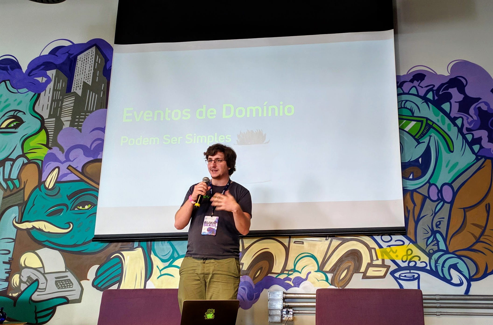

<p>
    <a href="https://2019.elixirbrasil.com/" rel="nofollow" class="image-link" title="Elixir Brasil 2019">
        
    </a>
</p>

Nos dias 25 e 26 de maio tive a honra de participar da segunda edição do evento [**#ElixirBrasil**](https://twitter.com/hashtag/ElixirBrasil), realizado pela [CodamosClub](https://twitter.com/CodamosClub), o [Elug SP](https://twitter.com/elug_sp) e o [Nubank](https://twitter.com/nubank) - que sediou o evento em seu lindo prédio em São Paulo/SP.

As palestras ocorreram durante os dois dias inteiros - foram 34 talks e 33 palestrantes para **mais de 400 participantes**, números impressionantes e de dar muito orgulho - principalmente se considerarmos o quão nova é a comunidade [Elixir](https://elixir-lang.org/). Haviam duas trilhas: uma iniciante e uma avançada onde foi possível transitar entre elas conforme a afinidade com cada assunto. [No site do evento](https://2019.elixirbrasil.com/) é possível encontrar toda a grade de palestras, informações sobre os palestrantes, patrocinadores e organizadores além do código de conduta.

Infelizmente as palestras não foram gravadas, mas nesse post - primeira parte de duas - vou resumir todas as **talks que vi** durante o **primeiro dia**.

---

## Abertura
A [Alda Rocha](https://twitter.com/mjcoffeeholick) e o [Guilherme de Maio](https://twitter.com/nirev) fizeram uma breve abertura do #**ElixirBrasil** desse ano. É incrível ver a diversidade do evento na organização, comunidades presentes e o  código de conduta sendo seguido. Vemos que essas ações se refletem no público também, que é muito diverso - com certeza o evento mais diverso que já participei. Cada mínimo detalhe foi pensado para o conforto de todos os participantes. Enfim, bora começar?

## Como uma empresa brasileira criou uma linguagem que é usada no mundo inteiro. O case da Plataformatec com o Elixir - [Hugo Baraúna](https://twitter.com/hugobarauna)

O Hugo, da [Plataformatec](http://plataformatec.com.br/), deu início às palestras com o seu keynote simultâneo para as duas trilhas. Ele veio mostrar como surgiu o Elixir, que problemas buscavam resolver e os frutos que colhem hoje.

### Parte 1 - Por que criar uma linguagem nova?
Em 2010, o pessoal da Plataformatec estava tentando lidar com o [Ruby on Rails](https://rubyonrails.org/) *multithread*, utilizando uma funcionalidade para `thread safety` que tinha sido recentemente lançada. Porém vários bugs e problemas foram aparecendo em aplicações, mostrando que não era tão fácil lidar com esse problema.

Mas, por que `thread safe` era tão importante? O *paper* [The free lunch is over](http://www.gotw.ca/publications/concurrency-ddj.htm) (O almoço grátis acabou), de 2005, expõe uma visão interessante sobre o tema. Cita a *Lei de Moore*, que diz que o "número de transistores dos processadores dobra a cada dois anos" - o que na prática significava que a velocidade dos CPUs basicamente dobrava também. Ou seja, para ter performance em um software era só esperar um pouco, atualizar o hardware e pronto, almoço grátis!

Porém, a partir dos anos 2000, esse cenário começou a mudar e a Lei de Moore já não mais funcionava. É importante ressaltar que **as CPUs não pararam de evoluir**, porém evoluíram de modo diferente, com *hyperthreading* e *multicore*. Ao invés de um processador ficando mais potente, mais processadores de mais ou menos mesma potência foram sendo adicionados.

Com essa mudança podemos entender que o modo como escrevemos softwares deve levar isso em conta, aproveitando-se de **concorrência** e **paralelização**.

O Hugo cita ainda a [Lei de Amdahl](https://pt.wikipedia.org/wiki/Lei_de_Amdahl), que diz que "quanto menos concorrente for seu código, menos velocidade ele ganha pelo aumento de núcleos do processador (*cores*)". E cita também o seguinte:

> "Provavelmente, o maior custo da concorrência é que concorrência é realmente difícil"
>
> Herb Sutter - tradução livre

Mas e se fosse fácil fazer concorrência?

### Parte 2 - A busca por outras tecnologias e por concorrência fácil

Concorrência deveria ser fácil, mas na prática não é bem por aí.
Segundo o Herb Sutter, é natural que a maioria dos desenvolvedores não saibam concorrência, da mesma forma que 15 anos atrás a maioria não sabia sobre orientação a objetos. Já fazem 10 anos desde o artigo *"The Free Lunch is Over"*, mas vemos que a maioria do código ainda é *"single-threaded"*, ou seja, não-concorrente.

O problema é o modelo de *threads* e *locks*, que são abstrações de baixo nível? E se tivéssemos uma abstração de mais alto nível, que facilitasse nossa vida como desenvolvedores de software? Por exemplo, isso ocorre com o gerenciamento de memória - não precisamos mais de `malloc`s e etc, pois a abstração do *garbage collector* lida com isso para a gente.

### Parte 3 - O desenvolvimento do Elixir

Lendo o livro [Seven Languages in Seven Weeks](https://pragprog.com/book/btlang/seven-languages-in-seven-weeks) (Sete linguagens em sete semanas), três linguagens chamaram a atenção do José Valim: [Haskell](https://www.haskell.org/), [Erlang](https://www.erlang.org/) e [Clojure](https://clojure.org/), tendo entre elas características funcionais, com distribuição e tolerância a falhas e com uma abordagem moderna, com polimorfismo e meta-programação. Porém nenhuma delas tinha as três coisas ao mesmo tempo e foi para atender a esses três pontos que o Elixir surgiu, criado pelo José Valim.


#### Por que a [Erlang Virtual Machine](https://en.wikipedia.org/wiki/BEAM_(Erlang_virtual_machine))?

Porque foi pensada desde o começo para concorrência, distribuição e tolerância a falhas. É uma máquina virtual (VM) que já tem mais de 30 anos de desenvolvimento, sendo bem testada no mercado, ou seja, que tem seu funcionamento garantido.

Em 2011 foi lançado o primeiro protótipo do Elixir. Porém esse "Elixir" tinha um modelo de "objetos", era muito lento e quebrava compatibilidade com a VM. Depois de vários altos e baixos no desenvolvimento, eles perceberam que o design da linguagem estava errado.
Então, redefiniram os direcionamentos do Elixir: **produtividade, extensibilidade e compatibilidade**. Foram meses de estudo, praticamente sem desenvolvimento ativo e esse novo caminho foi o momento *"Eureka!"*. Em 2012 decidiram investir e lançar o Elixir - foi em uma conversa entre a diretoria da Plataformatec que Valim os convenceu.

Após quase um ano e meio nessa jornada, veio um período de incertezas sobre o projeto, mas que contou com uma surpresa inesperada. O [Dave Thomas](https://twitter.com/pragdave), um dos escritores do famoso livro [The Pragmatic Programmer](https://www.amazon.com.br/dp/B003GCTQAE/ref=dp-kindle-redirect?_encoding=UTF8&btkr=1) (e também um dos fundadores da plataforma [Pragmatic Programmers](https://pragprog.com/)), resolveu escrever o primeiro livro sobre a linguagem Elixir e "evangelizar" sobre a mesma. O efeito foi extremamente positivo e o número de acessos no site do Elixir aumentou consideravelmente.

No ano seguinte veio o ponto de inflexão. [Joe Armstrong](https://en.wikipedia.org/wiki/Joe_Armstrong_(programmer)) (*in memoriam* - [#rememberingjoe](https://twitter.com/hashtag/rememberingjoe)), um dos criadores do Erlang, [fez um post elogiando a linguagem](https://joearms.github.io/published/2013-05-31-a-week-with-elixir.html). Ainda em 2013 a [O'Reilly](https://www.oreilly.com/) anunciou a criação de um livro sobre a linguagem.

Em 2014, tivemos a primeira [ElixirConf](https://elixirconf.com/2019) nos EUA, com cerca de 100 pessoas. O [Phoenix](https://phoenixframework.org/) também surgiu nessa época, o web-framework do Elixir. Por volta de 2015 surge o [Nerves](https://nerves-project.org/) para software embarcado (IoT) com Elixir.

Com a base web estabilizada, em 2016 a parte de ingestão e processamento de dados foi trabalhada na linguagem, com suporte a *streaming*, concorrência e *back pressure*. Para a Ptec, foi também quando conseguiram o primeiro cliente Elixir! A Gartner, provavelmente a maior empresa de pesquisa e aconselhamento em tecnologia para grandes corporações, citou o Elixir em seus relatórios.

Hoje em dia, temos milhares de bibliotecas, mais de 30 livros, mais de 15 conferências, mais de 200 meetups. Encontramos [vagas de trabalho](http://plataformatec.com.br/elixir-radar/jobs) em [empresas do mundo todo](https://elixir-companies.com/en).
A visão da Plataformatec é que o Elixir é **maior** do que eles.

### Parte 4 - Por que o Elixir tem crescido?

Na opinião do Hugo, são basicamente três fatores: ele crê que a tendência do futuro concorrente veio para ficar; o Elixir te permite pensar diferente e, por fim, possui ferramental para diferentes domínios. E ele explica o porquê:

#### O futuro é concorrente

O "futuro de 2005" é hoje e a Erlang VM foi projetada para concorrência. Não que seja impossível fazer concorrência com outras tecnologias, mas com Elixir é muito fácil. Concorrência é sobre muito mais do que paralelismo, que te ajuda a fazer software responsivo, distribuído, resiliente...
O Elixir/OTP suporta "nativamente" o [Manifesto Reativo](https://www.reactivemanifesto.org/pt-BR), pois é:
- **Reativo**: respondendo rapidamente aos usuários, com um tempo de resposta previsível.
- **Resiliente**: cada linha de processamento é isolado, com falhas isoladas e supervisores cuidando da saúde de outros processos.
- **Elástico**: com por exemplo 2 milhões de conexões simultâneas com nenhum _timeout_.
- **Orientado a Mensagens**: quando dois processos estão se comunicando, não é necessário saber se eles estão na mesma máquina ou se estão distribuídos, isso é transparente.


Além desses motivos, concorrência ajuda em _desenvolvimento_, não apenas em _produção_.

> "Tudo que você faz na sua máquina deveria usar todos os <u>cores</u>. Bootar sua aplicação, compilar código, resolver dependências, rodar os testes, etc. Até o seu relógio tem 2 <u>cores</u>. Concorrência não é mais a exceção, é a regra."
>
> **José Valim** em [_The fallacies of web application performance_](http://blog.plataformatec.com.br/2017/07/the-fallacies-of-web-application-performance/)

#### O Elixir te permite pensar diferente

Aplicações com UI rica e em tempo real estão aumentando a expectativa dos usuários; [IoT](https://pt.wikipedia.org/wiki/Internet_das_coisas) traz a necessidade de monitoramento real-time de múltiplos dispositivos. [Phoenix Channels](https://hexdocs.pm/phoenix/channels.html) e [Phoenix LiveView](https://dockyard.com/blog/2018/12/12/phoenix-liveview-interactive-real-time-apps-no-need-to-write-javascript) permitem funcionalidades real-time facilmente.

Também é possível conceber uma arquitetura de "Nanoserviços", ao invés do monolito concorrente. Explicando, o Elixir roda milhares ou milhões de processos "leves" na máquina virtual do Erlang, com alguns deles se comunicando entre si, se supervisionando... alguns na mesma máquina, outros em outra, sem problemas. É como se fosse um monolito distribuído. Para se aprofundar no assunto, leia os posts [Elixir in times of microservices](http://blog.plataformatec.com.br/2015/06/elixir-in-times-of-microservices/) e [Dawn of the Microlith - Monoservices with Elixir](http://tjheeta.github.io/2016/12/16/dawn-of-the-microlith-monoservices-microservices-with-elixir/).


#### Ferramental para diferentes domínios

O Elixir tem ferramental para diferentes domínios técnicos:
- **Phoenix** para aplicações web, APIs, backend para mobile e dispositivos IoT
- **GenStage, Flow e Brodway** para ingestão e processamento de dados
- **Nerves** para dispositivos embarcados
- e muitos outros, para streaming de mídia, etc.

### Conclusões

Para concluir, o Hugo deixou algumas reflexões.

> Concorrência é uma grande evolução na maneira como escrevemos software
>
> Herb Sutter - tradução livre

Ainda que alguém pense que:

> Entendi, concorrência é bom para fazer software reativo, com alta performance, escalável, distribuído, que não cai, etc. Mas minha app é muito simples, eu não preciso de tudo isso. Não preciso de concorrência.
>
> Alguém

este pode ser um pensamento muito simplista. Talvez **hoje** seja assim, mas não sabemos como será no **futuro**, quais serão os requisitos. Mas como sabemos que o **futuro é concorrente**,  ou seja, faz todo o sentido.

Como sair do nada para uma comunidade mundial? Segundo a Ptec, isso pode ser alcançado com visão; execução e persistência; e com a ajuda da comunidade open-source. Por fim, a foto abaixo mostra o número de colaboradores nas empresas criadoras das linguagens:


Confira os slides da apresentação [no SpeakerDeck](https://speakerdeck.com/plataformatec/o-case-da-plataformatec-com-o-elixir-como-uma-empresa-brasileira-criou-uma-linguagem-que-e-usada-no-mundo-inteiro-at-elixir-brasil-2019).


## Processamento paralelo de mensagens em Elixir - [Erich Rodrigues](https://www.linkedin.com/in/erich-rodrigues-ferrares-72673091)
Como o evento conta com duas trilhas, decidi seguir na trilha avançada, com essa talk do Erich Rodrigues sobre processamento de mensagens, que ele já esclarece serem **mensagens de texto**, mais especificamente da plataforma do *WhatsApp*. É uma talk sobre o case técnico de produto, como resolveram o problema que tiveram.

Ele é tech lead do *Squad* de Relacionamento com o Cliente na empresa [QueroEducação](https://quero.education/). Eles possuem um sistema chamado OperatorPAnel (OPA), usado para o relacionamento integrado com telefonia, WhatsApp, entre outros. No exemplo de uma faculdade, o sistema possui informações de todos os alunos e permite a interação como se estivéssemos no WhatsApp Web, porém totalmente integrado na plataforma, trazendo insights e os dados de cada aluno durante a interação.

Esse painel OPA foi totalmente desenvolvido em Elixir e Phoenix, lá por 2016, sendo uma aposta que ocorreu bem cedo em relação a linguagem, pois eles já tinham a visão de chegar no que de fato é a plataforma hoje, mostrando que foi uma decisão correta na época. Outra aposta que eles fizeram foi de usar o [Vue.JS](https://vuejs.org/) com [Nuxt](https://nuxtjs.org/). Eles usam o banco [PostgreSQL](https://www.postgresql.org/), além de [Redis](https://redis.io/) com a biblioteca [Nebulex](https://github.com/cabol/nebulex) para cache e [Algolia](https://www.algolia.com/) para busca. Eles conseguiram entrar no programa fechado da API Beta do WhatsApp, sendo uma das duas primeiras empresas do Brasil a testar o serviço - lá em 2017.


Eles recebem centenas de milhares de mensagens todos os dias, caindo até em problemas não pensados como Bots de WhatsApp, muitas mensagens de SPAM e delay nos serviços.
O Atendimento, para eles, precisa ser eficiente, eficaz e de alta qualidade.

Numa primeira abordagem para resolver o problema proposto, o Erich fez um sistema com tudo síncrono, usando HTTP. Ele mostrou o código que lida com o seguinte: mensagem chegando, processando a mensagem sincronamente, Vue.JS fazendo _polling_. Como resultado, o limite de conexões com o banco fica ok, e o limite de concorrência com o mesmo processo também fica ok. Como problemas, tempo entre a mensagem ser enviada até chegar no operador do sistema; bloqueio desnecessário no envio da mensagem; tempo de interação e desperdício de recursos.

Na real abordagem agora, com processamento paralelo das mensagens com Elixir, o Erich explica por cima como funcionam os Processos do Elixir: são leves, utilizam pouca memória, sem compartilhamento dessa memória, só funcionam por passagem de mensagens e são lidados pela VM do Erlang.
Um jeito bem simples de criar um processo é através da função [spawn](https://hexdocs.pm/elixir/Kernel.html#spawn/1):

```elixir
spawn fn -> 1 + 2 end
```

Temos também as [Tasks](https://hexdocs.pm/elixir/Task.html), com `async/1` e `await/2`:

```elixir
task = Task.async(fn -> do_some_work() end)
res = do_some_other_work()
res + Task.await(task)
```

E os [GenServers](https://hexdocs.pm/elixir/GenServer.html):

```elixir
defmodule Stack do
  use GenServer

  # Callbacks

  @impl true
  def init(stack) do
    {:ok, stack}
  end

  @impl true
  def handle_call(:pop, _from, [head | tail]) do
    {:reply, head, tail}
  end

  @impl true
  def handle_cast({:push, item}, state) do
    {:noreply, [item | state]}
  end
end

# Start the server
{:ok, pid} = GenServer.start_link(Stack, [:hello])

# This is the client
GenServer.call(pid, :pop)
#=> :hello

GenServer.cast(pid, {:push, :world})
#=> :ok

GenServer.call(pid, :pop)
#=> :world
```

Ele citou também o [Poolboy](https://github.com/devinus/poolboy), uma biblioteca Erlang para limitar a quantidade de processos simultâneos, para limitar por exemplo o acesso ao banco de dados com um processo por usuário. Inclusive, ele ressaltou que é a maneira utilizada pelo Ecto para interagir com o banco.

Os [Phoenix Channels](https://hexdocs.pm/phoenix/channels.html) tornam possível a comunicação entre milhões de processos, podendo ser usados por exemplo para notícias em tempo real, rastreamento, eventos em jogos multiplayer, sensores, chats... Esses *channels* (canais) conseguem fazer comunicação bidirecional, por exemplo entre o backend e o frontend, podendo substituir o *polling* da primeira abordagem.

Na segunda abordagem, o tempo entre a troca de mensagens é ok, não tem bloqueios desnecessários, o tempo de interação é ok, não há desperdício de recursos e ainda assim há limites de conexões e de processos de forma OK.

Foi bem legal ver os exemplos que ele mostrou e poder refletir sobre como estruturar uma aplicação nesses moldes. Muda um pouco a forma como estamos (ou pelo menos eu) acostumados a fazer software, mas não é nada de outro mundo.

**Nota:** *Até o momento da publicação desse post os slides da talk não foram publicados. Atualizarei o post quando tiver o link.*

## Eventos de domínio podem ser simples - [Bernardo Amorim](https://twitter.com/BernardoDCGA)



Ainda na trilha avançada, o Bernardo veio trazer o case da [Stone](https://www.stone.com.br/), empresa em que trabalha, sobre como foi o uso de [Event Sourcing](https://martinfowler.com/eaaDev/EventSourcing.html) por lá. Ele diz que se deparou com a _buzzword_ "Eventos" e foi estudar sobre, chegando à seguinte definição:

> "Evento é algo que aconteceu, um fato"

É uma informação que aconteceu no passado. Um conceito relativamente simples porém que, sem cuidado, pode ser usado de forma errada.

Para o Martin Fowler, sistemas *event-driven* consistem em sistemas que possuem **notificação por evento, transferência de estado por eventos, event sourcing, CQRS e event collaboration**.

Explicando *Event Sourcing*, basicamente o seu estado não é mais uma informação que você simplesmente pega do banco de dados, ele é inferido através da análise de todos os eventos que ocorreram anteriormente. Para dar um exemplo real, o próprio [git](https://git-scm.com/) é uma aplicação que utiliza o conceito de _event sourcing_. O seu código (estado) é a aplicação de todos os commits (eventos) e você pode navegar entre eles.

A jornada *Event-Driven* da Stone começou com a biblioteca [Commanded](https://github.com/commanded/commanded), que te dá algumas facilidades para construir um sistema desse tipo. O Bernardo mostrou alguns exemplos para criar uma conta de banco utilizando esses conceitos, que eles tentaram fazer na Stone. Ele inclusive citou alguns problemas que tiveram:

### Dificuldades

1. **Eventos são imutáveis** - *e você vai errar*. Você pode até querer editá-los no banco de dados e etc, mas não é assim que eventos deveriam ocorrer, vistos que eles são **fatos**.
1. **Consistência eventual** - o seu sistema não vai estar consistente a todo momento, cada parte processa os eventos e muda o estado em seu próprio tempo.
1. **Existem muitos conceitos** - como todos os citados, mais *aggregate*, etc etc...
1. **Treinamento** - barreira de entrada para novos desenvolvedores.

Resumindo, muita **complexidade acidental** foi criada no projeto. Assim, eles precisaram refletir e agir.

### Nem tudo precisa ser *Event Sourcing*

Dando um passo atrás, viram que nem tudo precisava dessa complexidade. Por exemplo, **máquinas de estado finitas**, podem ser representadas em tabelas no banco de dados, com cada estado sendo uma coluna dessa tabela. Assim, fica simples de gerenciar com o Ecto, criando migrations, etc.

Algumas coisas o deixam nostálgico:

### Saudades

1. **Linguagem de domínio** - eventos capturam uma mensagem poderosa sob o domínio da sua aplicação.
2. Muitos **efeitos são desacoplados**, por exemplo, o código de abertura de conta não precisa ter nenhuma lógica para enviar emails, essa lógica pode estar desacoplada e escutando o evento de nova abertura de conta.
3. **Processamento assíncrono** - não são mais necessárias tantas *queues*, podendo ser somente eventos.
4. **Auditoria facilitada** - você possui todos os eventos que ocorreram!

### Explorando alternativas

Nesse momento, o Bernardo fez uma live coding pra gente, explorando tudo o que ele passou de conhecimento na sua palestra. E assim ele fechou sua apresentação - um mergulho em eventos, com teoria e prática.

O código apresentado por ele na live coding e o os slides da apresentação estão no [GitHub](https://github.com/bamorim/evil_corp_elixir_brasil_2019).

## TOP: Criando seu próprio GenServer - [Geovane Fedrecheski](https://twitter.com/geonnave)

Nessa talk da trilha iniciante, o Geovane busca, através de live coding, responder a três perguntas: qual a diferença entre códigos sequenciais versus códigos concorrentes; como guardamos estado nos processos e, por último, se o [GenServer](https://hexdocs.pm/elixir/GenServer.html) pode ajudar.

Contextualizando, em Erlang (e Elixir) **tudo** é um **processo**. Ou seja, não precisamos nos preocupar com semáforos, *mutex*, etc. Porém, código concorrente é mais difícil de se fazer do que código sequencial.


Utilizando-nos da OTP (*Open Telecom Platform*), temos algumas facilidades para escrever código concorrente. Além disso, existem abstrações trazidas para a plataforma pelo próprio Elixir, como o *GenServer*.
Segundo a própria documentação, um *GenServer* é um processo como qualquer outro, que mantém estado, executa código de maneira assíncrona e assim por diante...

Assim, para nos ensinar sobre os processos e suas trocas de mensagens, o Geovane fez um *live coding*, mostrando os conceitos do `spawn` e do `GenServer` através de um exemplo prático.

Após o live coding, ele esclarece às três perguntas:
- Guardamos estado em loops e usamos `send` e `receive` para "nos comunicar com o loop".
- Devemos separar o código concorrente do sequencial em nossos sistemas.
- O GenServer abstrai a escovação de mensagens, permitindo-nos focar na lógica de negócio.

Confira os slides da apresentação no [SpeakerDeck](https://speakerdeck.com/geonnave/top-criando-seu-proprio-genserver).

## Talvez você não precise de um GenServer - [Ulisses Almeida](https://twitter.com/ulissesalmeida)

Para ter um comparativo sobre a talk anterior, quis voltar para a trilha avançada e ver essa palestra do Ulisses agora que estava entendendo um pouco melhor como funciona os GenServers.

Segundo ele, **um GenServer é um *processo* com um conjunto poderoso de ferramentas**. Útil para uma relação cliente-servidor, mantém estado, executa código síncrona e assincronamente, pode ser supervisionado e provê ferramentas de *tracing* e *error reporting*.

Existem alguns tipos de GenServers: `Agent`; `Task`; `Task.Supervisor`; `Supervisor` e `DynamicSupervisor`.

Fazendo um exemplo, o Ulisses mostrou como fazer uma calculadora com o uso de um GenServer e uma sem, chegando a conclusão após alguns benchmarks que o GenServer é cerca de 200 vezes mais lento e gasta quase 10 vezes mais recursos.

Segundo ele, a Erlang OTP provê hierarquia de processos, estratégias de reinício dos mesmos, concorrência e o GenServer tem um papel central nisso tudo.

Refletindo sobre os motivos para se utilizar GenServer, disponível na checklist da imagem abaixo, talvez a calculadora não foi um bom caso para o uso dessa funcionalidade.


#### Mas, eu não deveria estar usando essa funcionalidade da linguagem?

Por sua própria experiência, o Ulisses nunca escreveu um GenServer para código em produção em três anos trabalhando com a linguagem - inclusive disse que já apagou alguns que existiam para tirar gargalos da aplicação. E diz que não há vergonha em nunca precisar criar um GenServer.

#### O Ecossistema te dá cobertura!

Para uma **aplicação web**, que é acessada por usuários, devemos ser capazes de lidar com múltiplas conexões de usuários, outros processos podem mandar mensagens para essas conexões e devemos poder fechar essas conexões de maneira limpa e segura. Parece uma boa oportunidade de usar um GenServer, com base no checklist? Bem, parece, porém **Phoenix e Cowboy já lidam com isso para você**, então não é necessário fazer isso por conta própria.

Para a interação da aplicação com **banco de dados**, um banco de dados é uma comunicação externa; nós temos que prover um número limitado de conexões para muitos processos; essas conexões devem funcionar e devemos fechar essas conexões de maneira limpa e segura. Parece um outro bom caso para o GenServer? Pode até ser, mas o **Ecto já faz isso pra gente**.

Para a comunicação da aplicação com **outros serviços**, normalmente nos comunicamos pela rede; temos que ter um mecanismo para não derrubar serviços mais fracos; esse mecanismo tem que lidar com concorrência e também devem fechar de maneira limpa e segura. GenServer? Adivinha, o [Hackney](https://github.com/benoitc/hackney) e outras bibliotecas já fazem isso pra gente.

Nem tudo é armazenado em bancos de dados SQL, como **cache, sessão, presença de usuários**. Geralmente vemos implementações NoSQL para resolver esses problemas. Mas, esses dados são persistentes ou transitórios na sua aplicação? Será um bom caso pra GenServer?

**Talvez você precise uma abstração mais específica**, como por exemplo o [Cachex](https://github.com/whitfin/cachex) para cache. Talvez o Redis seja mais fácil de lidar do que alguns GenServers, que podem ter o risco de shutdown em deploys e etc. O ideal é discutir entre o time para encontrar a ferramenta certa para o problema.

Ou talvez ainda que queira usar para tarefas como serialização, mas seu ambiente não permita um GenServer global rodando, como no caso da plataforma Heroku.

Para **tarefas em background**, como emails, push-notifications, tarefas agendadas e fora do ciclo do usuário, precisamos de alguma forma de rodá-las. Pode parecer que finalmente tenhamos chegado num caso válido, porém, como lidamos com erros? Precisamos de algum tipo de persistência para esses eventos?
Talvez podemos usar algo como [RabbitMQ](https://www.rabbitmq.com/) ou Redis mesmo.

Após apresentar todos esses casos de uso, chegamos nas conclusões.

### Conclusões

GenServers são fundamentais. As bibliotecas e frameworks lidam com eles para a gente, então talvez não precisemos criar os nossos. É importante aprendê-los para saber fazer a configuração correta dessas ferramentas, bem como saber lidar com situações inesperadas e tudo o mais. O importante é sempre comparar e discutir com o time as ferramentas corretas. Não é vergonha nunca precisar de um *GenServer*. Lembre-se de que um GenServer utilizado em um local incorreto pode trazer mais problemas do que benefícios.

O Ulisses é autor do livro [Learn Functional Programming with Elixir - New Foundations for a New World](https://pragprog.com/book/cdc-elixir/learn-functional-programming-with-elixir) e disponibilizou um cupom de desconto de 20% para comprar o mesmo: `Elixir_Brazil_2019`. Para conferir os slides de sua talk, [clique aqui](https://speakerdeck.com/ulissesalmeida/you-aint-gonna-need-to-write-a-genserver).

Essa foi um talk bem divertida, o Ulisses é particularmente engraçado e foi bom pra pegar um ânimo pro resto do dia - ainda tinha muita coisa pra escrever!


## Conjuntos em 3 Atos - [Luciano Ramalho](https://twitter.com/ramalhoorg)

O Luciano Ramalho, da [ThoughtWorks](https://www.thoughtworks.com/pt), famoso pelo seu [livro de Python](https://www.oreilly.com/library/view/fluent-python/9781491946237/), preparou essa palestra a partir de outras que tinha feito para as linguagens Go e Python. Então essa é a versão Elixir. Ele busca explicar **porque** e **como** devemos usar [Conjuntos](https://pt.wikipedia.org/wiki/Conjunto).

### Porque conjuntos podem simplificar seu código
Para nos convencer disso, o Luciano propõe três casos de uso. O primeiro deles é "exibir item se todas as palavras da consulta aparecerem na descrição" aplicado a um buscador de emojis por palavras-chave.


Ele implementou em Elixir, a partir do arquivo [`UnicodeData.txt`](https://github.com/standupdev/rf/blob/master/elixir/UnicodeData.txt). É possível tomar uma abordagem sem conjuntos, "desconjuntada", que usa `substring`s e vários `if`s para fazer essa busca por emoji. Ele explica detalhadamente pra gente o algoritmo e faz reflexões sobre a maneira que ele funciona.


John Backus, um dos criadores da linguagem FORTRAN, levanta uma questão: Será que a programação pode ser liberada do [estilo von Neumann](https://pt.wikipedia.org/wiki/Arquitetura_de_von_Neumann)? Muitas linguagens estão apegadas ao fato de a CPU trabalhar com uma palavra de cada vez. Pensando no exemplo, podemos usar a teoria dos conjuntos da matemática, onde um conjunto está contido dentro de outro conjunto e tentar chegar a uma solução assim no código.

Assim, ele mostra sua solução em Elixir, que está disponível no [Github](https://github.com/standupdev/rf). Ela se baseia no [`MapSet`](https://hexdocs.pm/elixir/MapSet.html) da linguagem.

No segundo caso de uso para Conjuntos, a solução que ele chamou de Gimel é similar à primeira solução na funcionalidade, porém tem uma estratégia diferente para resolver e também tem um terminal interativo onde você pode ficar buscando por emojis. Nessa versão, o arquivo unicode é lido uma única vez, gerando dois índices que são mantidos na memória e usados para a busca. É a estratégia do "índice invertido". Essa solução também está no [GitHub](https://github.com/standupdev/gimel).

Para o terceiro caso de uso, dá o exemplo de uma Loja Online: "Destacar todos os produtos favoritados, exceto aqueles que já estão no carrinho de compras". É um problema trivial de se resolver com a teoria dos conjuntos, representando uma operação de diferença entre conjuntos.

### Conjuntos em várias linguagens

|Linguagem|Recurso|Nível|
|---------|-------|:---:|
|Elixir|**MapSet**: 14 métodos|😻|
|Ruby|**Set**: > 10 métodos e operadores|😻|
|Python|**set, frozenset**: > 10 métodos e operadores|😻|
|.Net(C# e etc.)|**ISet**: > 10 métodos; 2 implementações|😻|
|JavaScript (ES6)|**Set**: < 10 métodos|😿|
|Java|**Set** interface: < 10 métodos; 8 implementações|😿|
|Go|Faça você mesmo, ou escolha um dos N pacotes|😾|

A API do `MapSet` do Elixir é bastante rica. Com base na sugestão presente no livro ["The Go Programming Language"](https://www.gopl.io/), de Alan A. A. Donavan & Brian W. Kernighan - que é um dos melhores livros já lidos pelo Luciano, ele tenta implementar o seu próprio `UIntSet`, que utiliza os `bits` para fazer seus conjuntos. Ele explicou detalhadamente como foi feita sua solução utilizando `bits` e recursos do Elixir.

### Conclusões

Operações com conjuntos podem simplificar algoritmos dramaticamente. Elixir oferece uma implementação rica! O código do **MapSet** é um excelente exemplo de abstração de dados usando `structs` e `protocols`. A interface de `UIntSet` é quase a mesma de `MapSet` mas a implementação é mais simples, com operadores `Bitwise` para manipular inteiros como vetores de bits.

O código do `UIntSet` mostrado na apresentação está disponível [no GitHub](https://github.com/ramalho/uint_set). E os slides, que contém diversos exemplos e explicações que deixei de fora aqui, estão no [SpeakerDeck](https://speakerdeck.com/ramalho/elixir-conjuntos-em-3-atos).

## Elixir: o que pode dar errado? - [Guilherme de Maio](https://twitter.com/nirev)


O Guilherme - também conhecido como Nirev - é um dos organizadores do Meetup de Elixir aqui em São Paulo, foi um dos apresentadores do evento e veio falar sobre sua experiência com o ecossistema Elixir. O objetivo dessa talk foi a de fazer um contraponto aos benefícios do Elixir com problemas enfretados por ele e as equipes em que trabalhou.

Dando um pouco de contexto antes de fato citar o problema, mostrou algumas coisas que normalmente associamos à `BEAM`:

- Modelo de atores
- Processos isolados
- _Garbage Collector_ por Processo
- Super escalável, só escreve e funciona!

Porém essa é uma visão limitada que ele quer por à prova. Então, ele vai ensinar: *como quebrar sua app!*

### O caso da tonelada de átomos:

Podemos transformar um `JSON` em **átomos** da linguagem utilizando [Poison](https://github.com/devinus/poison):

```elixir
Poison.decode(body, keys: :atoms!)
```

Porém, nossa tabela de átomos tem um limite, configurável, mas ainda assim um limite e dependendo da nossa mensagem JSON, podemos explodir nossa aplicação! Você pode até pensar: então é só não fazer isso! Porém esse foi só um exemplo, e talvez você pode chegar nesse limite por conta de algumas coisas: nomes de módulos, nomes de nós, campos de `struct` e _"decode as atom"_.

### O caso do `Agent` linkado

```none
--------------   start_link   --------------------
| Processo 1 | -------------> | Processo Linkado |
--------------                --------------------
```

Caso seu processo 1 morra, o processo linkado morre também. Porém caso o término do processo 1 seja "normal", **o processo linkado continua vivo**! Esse é o comportamento padrão, está na documentação, porém pode ser uma armadilha caso você não se atente, com processos "zumbis" que podem explodir a quantidade máxima de processos, quebrando sua app.

### O caso da monitoração de Requests

A ideia era monitorar requests, subindo um `agent` que receberia os _breadcrumbs_ das chamadas dentro da aplicação no request caso ele falhasse, ou apenas morreria se o request ocorresse normalmente. Era criado um monitor para o processo e o `agent`.
Porém o `keep-alive` do Cowboy faz processos serem reutilizados sem morrerem, e o `plug` utilizado para subir o monitor era chamado continuamente, criando um novo `agent` por request e quebrando a aplicação eventualmente.

### O caso dos Reinícios Infinitos
Toda vez que um processo morria, um `Task Supervisor`, configurado com `restart: transient` subia uma `Error Reporter Task` que reportava erros para uma API externa, porém se a API externa estivesse indisponível, fazia com que essas tasks morressem e que o supervisor subisse novas `tasks` para reportar esses novos erros. Isso também gerava um monstro com mais erros explodindo e novas tasks subindo apenas para falhar novamente. Uma solução simples nesse caso foi o uso de `restart: temporary`.

### O caso do Message Router
Esse caso ocorreu em uma aplicação feita para um dispositivo de rastreamento  de veículos de uma frota. Essa aplicação se comunicava via TCP com uma API. E por sua vez, essa API também poderia enviar comandos para cada dispositivo. Na implementação feita pela equipe do Guilherme, existia um `GenServer` para cada dispositivo/veículo. As mensagens passavam por um `Message Router` que passavam as mensagens para a frente. Mesmo sem persistência dessas mensagens e sendo relativamente muito simples, o `Message Router` estava morrendo. Depois de uma longa inspeção, descobriram que o problema se devia ao funcionamento do _garbage collector_ e o fato de o `Message Router` utilizar pouca memória para seu funcionamento, apenas passando as mensagens para os `GenServer`s e não chegando a ativar o _garbage collector_, ficando eventualmente sem memória - irônico, né?

### O que fazer quando isso acontece (ou antes de acontecer!)

- **Introspecção**: a possibilidade de você se conectar a um nó e analisar o que está acontecendo nele. Algumas funções como `Process.list/0`, `Process.info/1`, `:sys.get_*` ou até mesmo módulos criados por você como `MeuModulo.minha_task()` podem ajudar! Também podemos utilizar o `:observer.start()` ou o [Wobserver](https://github.com/shinyscorpion/wobserver), uma interface web para o `observer` que não necessita que você se conecte ao nó. A biblioteca erlang [Recon](https://ferd.github.io/recon) já possui bastante helpers para ajudar na introspecção, como `:recon.bin_leak(3)` que roda o GC para todos os processos e mostra os que liberaram mais memória (talvez significando *memory leaks*)
- Coletar e analisar **métricas da VM**. Temos algumas bibliotecas para ajudar, como a [vmstats](https://github.com/ferd/vmstats), que manda métricas pro `statsd`; a [deadtrickster/prometheus.ex](https://github.com/deadtrickster/prometheus.ex) para mandar para o Prometheus ou ainda a [telemetry](https://github.com/beam-telemetry/telemetry), que é bem leve e você pode customizar como quiser.
- Ter **visibilidade** do que acontece na aplicação. Podemos fazer **agregação de logs**, usando por exemplo o [Graylog](https://www.graylog.org/) e ferramentas que coletam erros da sua aplicação, como o [Sentry](https://sentry.io/welcome/) ou o [Bugsnag](https://www.bugsnag.com/), dentre outras.

### Conclusão
Tem várias maneiras de quebrar sua aplicação Elixir, então não vá para produção sem visibilidade. Há um livro gratuito ["Stuff goes bad: Erlang in Anger"](https://www.erlang-in-anger.com/) sobre o que fazer quando as coisas derem errado em Erlang e como atuar, porém a recomendação do Guilherme é de que você leia de cabeça fria, você não vai querer fazer isso enquanto as coisas estão pegando fogo.

O Guilherme trouxe diversos casos de problemas que ele e seus colegas enfrentaram em produção e vários insights legais de como evitar que isso aconteça. Espero aprender com ele e não passar pelas mesmas tretas :)

[Os slides](https://speakerdeck.com/nirev/elixir-o-que-pode-dar-errado) contém algumas explicações melhores e também alguns snippets para quebrar sua aplicação 😈

## Keynote de encerramento do primeiro dia - [Edward Wible](https://www.linkedin.com/in/adamedwardwible/)

O Edward é co-fundador e CTO do Nubank e o keynote de encerramento do primeiro dia do evento foi com ele. Esse keynote foi no formato entrevista, onde o [Alexandre Cisneiros](https://twitter.com/Cisneiros), que trabalha no Nubank, foi o entrevistador. A ideia era fazer um apanhado de como foram esses 6 anos de Nubank. Tentei fazer o meu melhor para escrever sobre esse bate-papo mas confesso que foi bem difícil e alguns assuntos foram perdidos e muitos estão desconexos, sem uma linha de raciocínio lógica. De qualquer forma, consegui reunir algumas coisas interessantes e por isso resolvi postar :)

Segundo o Edward, todos os erros possíveis foram cometidos nesses 6 anos. Porém, ainda assim, contam hoje com mais de 8,5 milhões de clientes!

"Qual foi o maior desafio para escalar o Nubank?", indaga Alexandre. E assim descobrimos que o **mais estressante** mesmo foi o **lado humano**, com 8 engenheiros no início, sem gerentes, sem alguns papéis sendo desempenhados, ocorrendo bem no processo "hacking" mesmo. O que o Edward aprendeu a duras penas é que colocar pessoas técnicas como gerentes pode não ser a melhor coisa, e contou de um movimento que vem ocorrendo por lá agora onde muitos desses engenheiros estão voltando para o lado técnico.

**Tecnicamente** falando agora, o que foi difícil no movimento de escalar foi **o domínio**. Ocorreram alguns erros de modelagem que até hoje assombram o negócio. Com a escala que o Nubank conquistou, todos esses erros devem ser investigados para cobrir os casos, mesmo afetando pouquíssimos usuários. Chegar a 100% de automatização é muito difícil e alguns engenheiros têm que deixar de entregar algumas novas funcionalidades para poder analisar esses casos.
Ele comentou ainda que existe um Kafka na zona A do AWS em São Paulo e outro na zona C (já que a B nunca funcionou mesmo). Ele também comentou que ocorreram alguns erros de monitoria de serviços, que estão evoluindo hoje em dia.

Mesmo desde o começo, não quiseram fazer uma arquitetura "bagunçada" e depois evoluir quando o dinheiro viesse para a startup, algo que vemos por acontecer em outras empresas. Então, desde o começo buscaram montar algo sólido, com as soluções corretas para os problemas.

Ainda assim, alguns serviços cresceram muito, como o `Account` que na verdade estava representando 8 serviços do domínio. Eles  tiveram de ser divididos, o que é um processo difícil de se fazer enquanto se garante a disponibilidade do serviço para os clientes. Ele também citou que alguns casos de dependências circulares (um serviço que depende de outro que depende de novo do primeiro) acabaram levando a indisponibilidades parciais. Eles também sofreram um pouco com o RefluxDB, mas não consegui ouvir o porquê.

A decisão de usar tudo em uma conta só do AWS foi difícil e hoje em dia estão quebrando em diversas contas - a abordagem melhora a organização.

Uma coisa legal foi que eles não tinham medo de nada porque tinham "ignorância total" sobre a complexidade do que estavam fazendo. E citou que cartão de crédito é muito difícil, sendo que 6 anos depois de lançar o serviço, muito ainda está sendo desenvolvido.

Vários segmentos ainda não estavam automatizados quando eles tinham "apenas" 100 mil clientes. Por exemplo, o controle de _chargebacks_ era feito no Excel. Ainda hoje existem problemas de consistência e de domínio.

Para garantir performance e acesso aos dados, cada cliente do Nubank hoje em dia vive em um só *shard* dos bancos de dados.
A comunicação entre clientes em diferentes *shards* ocorre com um `router` global. Eles começaram a fazer essa migração quando estavam com cerca de 800 mil clientes e terminaram quando estavam com 2 milhões - número inclusive que é o tamanho máximo de cada um desses *shards*.

No desafio de pessoas na Engenharia, com a escala de hoje, existem mais oportunidades de ter pessoas especialistas em temas muito específicos. Existem times horizontais para apoiar os próprios colaboradores, com papéis de infraestutura, especialistas de _Redis_, _Kubernetes_, etc. Com a plataforma mais sofisticada, os desenvolvedores conseguem ter mais produtividade e entregar produtos mais rapidamente.

O Nubank tem cerca de 240 serviços, que é mais ou menos o número de pessoas na engenharia. A cultura é um grande desafio com a chegada constante de novos desenvolvedores. O *onboarding* hoje tem um processo de uma semana, mas em uma reflexão, o Edward comenta que talvez seria legal um processo de um mês...

Eles estão investindo em mais documentação escrita, mais ferramentas e menos em deixar o conhecimento como algo falado, facilitando o treinamento de novos engenheiros e descentralizando o conhecimento. Também estão fazendo *Requests for Comments* (RFCs) para avaliarem decisões técnicas que são impactantes, permitindo a outros times poder colaborar com as decisões.

Nesses anos, muitos desenvolvedores entraram querendo usar outras tecnologias além das já utilizadas, porém eles tentaram manter a consistência e disciplina de usar Clojure. Isso facilita em entender como outros serviços funcionam (basta ler o código) e foi uma decisão acertada segundo o Edward, com ótimos frutos. Não é uma decisão de "religião" a respeito da linguagem, mas puramente de consistência mesmo. Ainda assim usam algumas coisas em Scala, em Python, para tarefas específicas em ecossistemas já desenvolvidos nessas linguagens.

Na aplicação web, o frontend sofre mudanças constantes então eles não forçam essa consistência tão grande. Acabam usando também [React Native](https://facebook.github.io/react-native/) para algumas funcionalidades dos apps. O Nubank está tentando atender a todas as funcionalidades que os clientes pedem no app, que ainda está atrás quando comparado a outros bancos.
Ele sente falta dessa consistência no backoffice, os componentes ainda podem ser feitos de diversas maneiras diferentes.

Hoje possuem 4 ou 5 produtos no Nubank, sendo que antes era só o cartão de crédito. Sofreram com muitos problemas quanto a isso por algumas coisas "assumidas": por exemplo, assumir que o usuário possui cartão de crédito - não é mais sempre verdade - e agora contam com vários testes de regressão, etc. Foi difícil entender o que é específico sobre cartão de crédito e o que fazia sentido para outros produtos. Com a expansão internacional, tiveram que repensar ainda o que era específico para o Brasil e o que era geral.
**Foi uma decisão de focar exatamente no produto no começo** e hoje estão pagando o custo disso.

A resolução de incidentes no Nubank está cada vez maior e mais assertiva. No começo a plataforma era muito estável, com serviços de pé por 18 meses, realidade que foi mudando com a escala. Com algumas instabilidades, foram melhorando esse ferramental e cultura. Tudo agora fica dentro do [Kubernetes](https://kubernetes.io/pt/), o que facilitou algumas coisas.

Os times de desenvolvimento possuem métricas de negócio também. E eles tem até monitoramentos por ligações telefônicas (se der ruim, o telefone toca!), o que deixa os engenheiros menos exaustos por não terem que checar o Slack constantemente para saber se está tudo bem.

Para os próximos seis anos, ele prevê que algumas coisas vão mudar - porém cultura **não** é uma delas. Acredita que trabalhos remotos vão crescer e que vai haver um investimento massivo nisso. Isso vai mudar um pouco a maneira como trabalham, podendo ser eficientes ainda que não na mesma sala.

Isso foi tudo o que conseguir pegar do keynote - foram várias dicas em várias áreas, mas que pode ajudar muitos projetos. O Edward é uma pessoa bem lúcida e foi muito legal poder contar com esses insights - outras empresas e líderes talvez não seriam tão transparentes.

Com isso, chegamos ao fim do primeiro dia desse evento incrível - talvez o melhor que já fui. E ainda tem o segundo dia pra contar!

**Nota:** Em breve postarei o conteúdo do segundo dia e atualizarei o post.

---

> Para comentários, correções, ou qualquer outra coisa, entra em contato no [Twitter](https://twitter.com/ravanscafi)!