<p>
    <a href="https://2019.elixirbrasil.com/" rel="nofollow" class="image-link" title="Elixir Brasil 2019">
        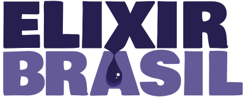
    </a>
</p>

No post anterior, falei sobre o [primeiro dia do evento](/2019-05-30-elixir-brasil-2019-primeiro-dia/). Hoje trago para vocês o segundo dia - que foi tão impressionante quanto o primeiro. Foi na mesma pegada do dia anterior, com dois keynotes e duas trilhas paralelas. É impossível estar em dois lugares ao mesmo tempo, senão tinha visto todas as talks. Foi o sentimento da galera do trampo que foi comigo também, de ficarmos indecisos sobre o que assistir visto a qualidade das talks e temas escolhidos.

---

## Lições aprendidas em um projeto Elixir / OTP - [Amanda Sposito](https://www.linkedin.com/in/amandasposito/)

Infelizmente, cheguei ~~muito~~ atrasado no evento e perdi o keynote da Amanda quase inteiro. Consegui ver o finalzinho com algumas dicas, que coloco aqui. Tentarei não cometer esse vacilo da próxima vez, principalmente com uma talk que queria tanto ver 😢

Quando cheguei, ela estava citando o artigo [Unit Tests in Elixir - Part 2](http://devonestes.herokuapp.com/unit-tests-in-elixir-part-2) do Devon C. Estes, porém não peguei o contexto do que ela estava falando. Também recomendou ver o [SORTID Elixir](https://www.youtube.com/watch?v=eldYot7uxUc), uma talk da Georgina McFadyen sobre os princípios `SOLID`, mas voltados para programação funcional e Elixir.

Em seguida, definiu que [Contexts](https://hexdocs.pm/phoenix/contexts.html), do Phoenix, definem limites entre diferentes módulos da aplicação - não tem mais aquele padrão `MVC`. Porém, esses contextos podem ficar maiores do que deveriam com o passar do tempo e com a interação entre eles. Uma dica então é evitar manter código ortogonal ao contexto, no contexto. Além disso, mantenha *queries* próximas ao seu *schema*. Uma exceção para essa regra, segundo a Amanda, são de *queries* que lidam com mais de um *schema*. Também recomendou o outro post do Devon, [A Proposal for Some New Rules for Phoenix Contexts](http://devonestes.herokuapp.com/a-proposal-for-context-rules).

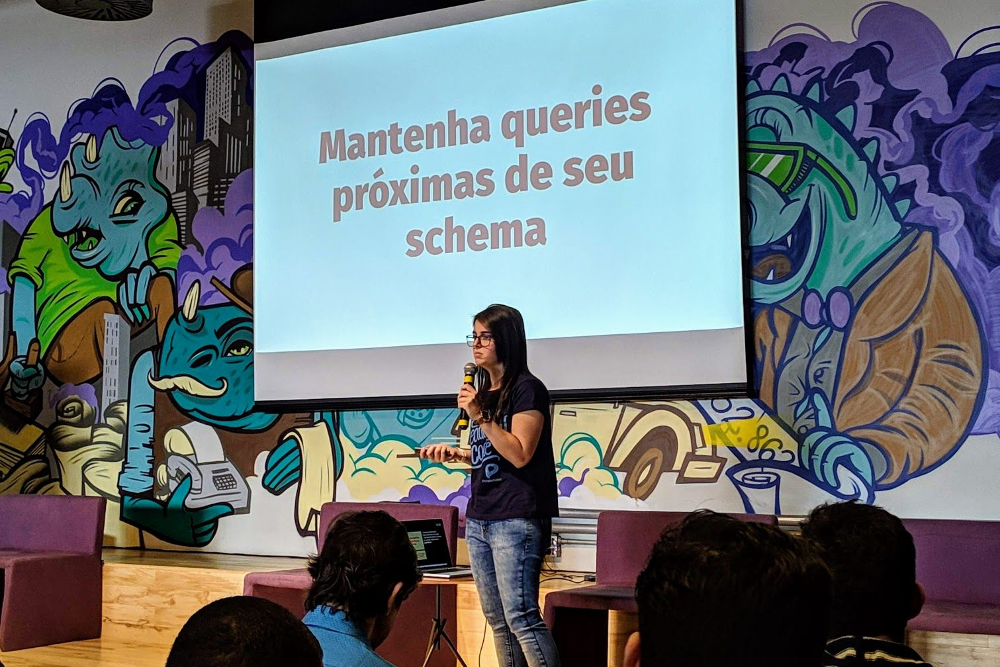

Sobre **Umbrella Projects**, a Amanda explicou que é uma maneira de organizar seu código, que vira tipo um monolito organizado. É necessário ter cuidado com dependências circulares, quando um app acessa o outro app que por sua vez acessa de novo o primeiro - enfim, vocês entenderam.

Essas foram as dicas que consegui pegar da talk. Os slides estão no [SpeakerDeck](https://speakerdeck.com/amandasposito/aprendizados-de-um-projeto-elixir-otp) e podem trazer mais insights sobre o que ela passou.

## Domain-Driven Design with Contexts - [Adam Tew](https://twitter.com/adamjtew)

Na trilha avançada, começamos com a talk do Adam, que trabalha na [Podium](https://www.podium.com/), e veio até o Brasil pra falar com a gente sobre _Domain-Driven Design_ (DDD), um tema que independe de uma linguagem específica mas que casa muito bem com Elixir.

### Modelagem
O **DDD** é primariamente utilizado para aplicações maiores e precisa de muita ponderação para modelar. Tem o objetivo de descobrir o que é o domínio. O [livro sobre DDD do Eric Evans](https://www.amazon.com.br/dp/B00794TAUG/ref=dp-kindle-redirect?_encoding=UTF8&btkr=1) é o que você pode ler para aprender sobre os conceitos do DDD.

No DDD, você precisa de um **domínio** para modelar. Um domínio é o problema que o seu cliente, ou a sua empresa, quer resolver. Você precisa de **especialistas de domínio** que entendam muito sobre o problema proposto. Use **mapeamento de contexto** para descoberta, coloque todos os envolvidos numa sala e peça para os mesmos escreverem tudo sobre o domínio em *post-its* e coloque numa parede, para que vocês definam as **entidades** (substantivos) e os **eventos** (verbos).

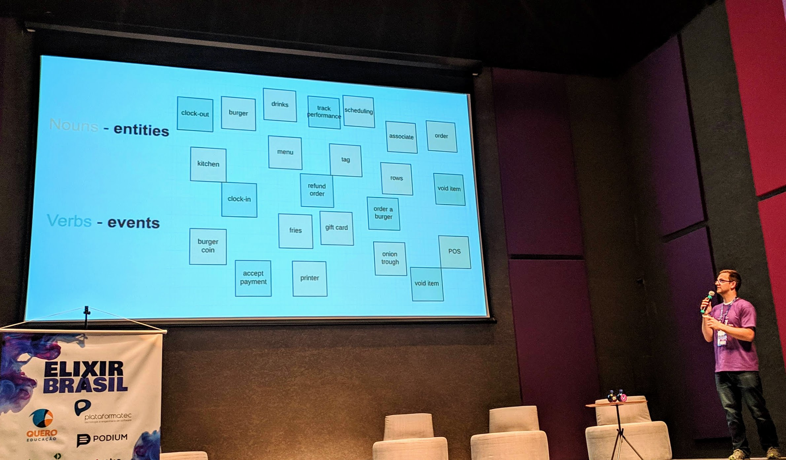

Agrupe todas as entidades que façam sentido. Seu **core domain** (domínio principal) é essencialmente o que é realmente importante para o negócio. Você tem também **support domains** (domínios de suporte), que apoiam o *core domain* a atingir seu objetivo.

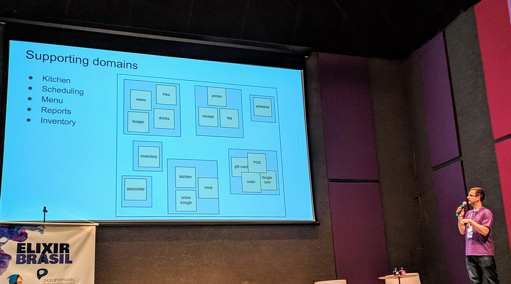

Outras maneiras de mapear seus domínios é através de *Domain Storytelling*, que tenta contar uma história sobre os atores e as ações entre eles, ou de *Event Storming*. É importante sempre utilizar uma **linguagem ubíqua** entre todos do time. Escreva em algum lugar uma lista de todas as palavras comuns utilizadas.

### Modularização
Após agrupar os domínios, é hora de fazer algo em relação a isso. Numa arquitetura de camadas (*Layered Architecture*), temos a `UserInterface` como ponto de entrada, se comunicando com as camadas abaixo: `Application`, `Domain` e `Infrastructure`. De `Application`, a comunicação é com `Domain` e `Infrastructure`. E assim por diante. As dependências fluem para as camadas abaixo.

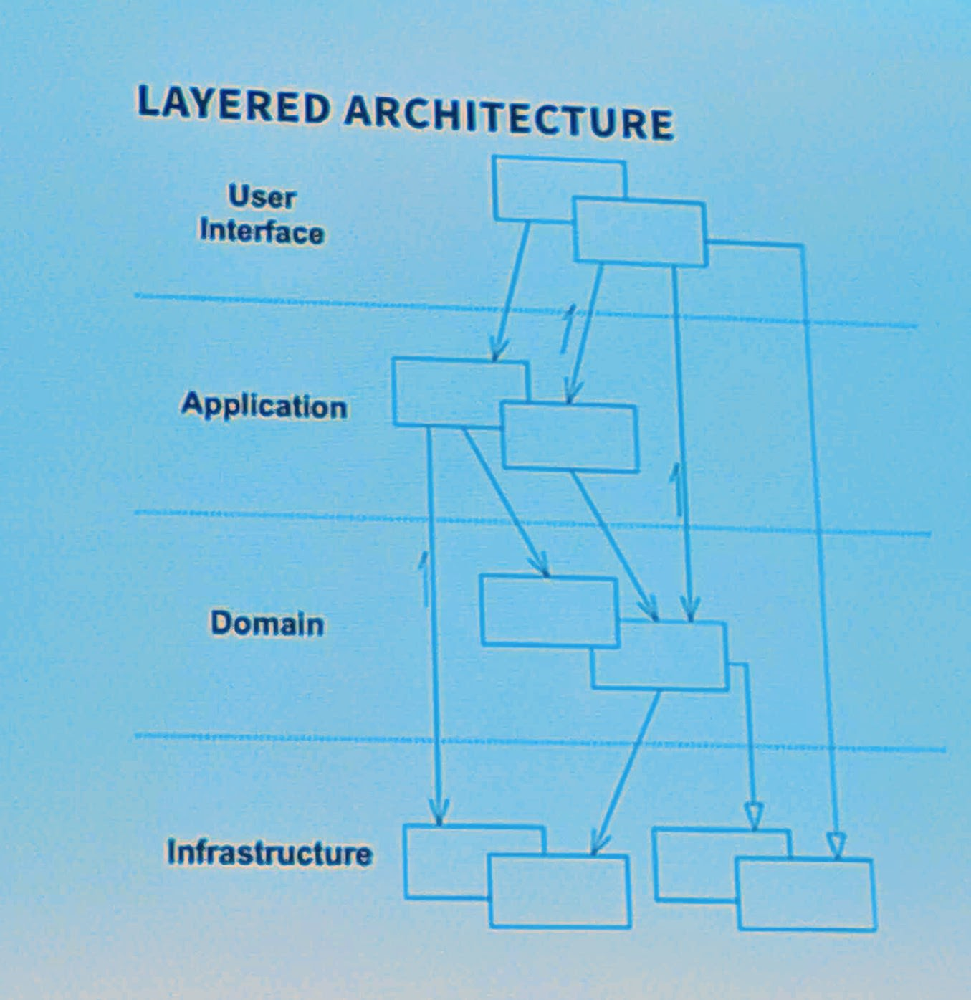

Um *bounded context* está tipicamente em um alto nível de granularidade e define uma área completa de funcionalidade dentro do seu sistema. Você deve abstrair o que provavelmente irá mudar no futuro, que é a lógica de negócio.

Para gerar um contexto, podemos testar os [geradores de código do Phoenix](https://hexdocs.pm/phoenix/Mix.Tasks.Phx.Gen.Html.html#content):

```bash
mix phx.gen.html Menu MenuItem menu_items name:string:unique quantity:integer
```

Um contexto deve dizer a **intenção** do que você quer fazer e não **como** você fez isso. E isso é algo muito difícil de se fazer segundo o Adam.

#### Assimilando Conhecimento
Prefira ciclos de desenvolvimento ágil. Você vai descobrir as coisas depois do que você acha que deveria descobrir. Junte os dados que devam estar juntos. Um **Aggregate** representa esses dados que deveriam estar juntos. O **Aggregate root** é o elemento principal. Prefira passar os **aggregates** pelo sistema, tendo todos os dados que você precisa diretamente.

#### Como compartilhar entre os diferentes contextos
Tem uma palestra do Andrew Hao, [Event-driven messaging](https://www.youtube.com/watch?v=5MBGDM8xSQg) que fala sobre como fazer mensageria em um sistema orientado a eventos.

Use os **eventos** do **mapa de contextos** com pub/sub. Crie um `EventBus` e dentro do contexto crie um módulo `EventHandler`, que vai receber eventos do `EventBus`.
Esse conceito é conhecido no DDD como camada **anti-corrupção**, que não polui um contexto com dados de outro contexto, se comunicando através de mensagens.

### Preocupações
O Adam expôs suas preocupações sobre o DDD, começando com o fato de que há toneladas de teoria sobre o tema, representando muito pra absorver e pensar sobre durante o aprendizado. Provavelmente, utilize DDD somente para grandes bases de códigos - e para essas grande bases, implemente em fases, peça por peça. Pode ser difícil de se aprender também pelo fato de os livros serem mais voltados para OO, precisando pensar em como ficaria com programação funcional.

### Conclusões
Priorize a **descoberta dos domínios**. Abstraia no sistema o que irá mudar no **negócio**. Escute os **especialistas de domínio**. Sempre consulte o **mapa de contextos**. O Adam também citou o livro [Functional and reactive domain modeling](https://www.manning.com/books/functional-and-reactive-domain-modeling) como uma referência da sua talk.


[Confira os slides da talk do Adam.](https://docs.google.com/presentation/d/1ano0faAXjj4GMw6bJDLeI1-RtX_DlDLLQAkjXnAEGdY/edit)


## A Divina Comédia de um Código Legado: indo do Inferno ao Paraíso com Elixir - [Juliana Helena](https://twitter.com/julianahelenaa5)


A Juliana veio de Belo Horizonte para nos contar do case que ela participou no trabalho, em um projeto que tinha código legado.

Assim, foi atrás de encontrar formas de se trabalhar com esse código. Citou o livro [Working Effectively with Legacy Code](https://www.amazon.com/Working-Effectively-Legacy-Michael-Feathers/dp/0131177052) (Trabalhando de forma efetiva com código legado). O autor define código legado simplesmente como **código sem testes**.
E diz que **código sem testes é código ruim**. Com testes conseguimos ter confiança de mudar o comportamento do nosso código. Sem testes não sabemos se nosso código está evoluindo ou regredindo com o passar do tempo.

> Código legado **também** é o código que você acabou de escrever.

É importante manter o **respeito** e entender o **contexto** do código duvidoso que você encontra, não dá pra saber porque aquele código está daquela forma.
Ok, mas você recebeu o problema: e agora, como lidar? A primeira coisa que você pode pensar é: vou reescrever tudo! Você tem duas opções: **refazer** ou **refatorar**, ambas com fatores a se considerar:

- **Refazer**: custo, prazo, manter o legado funcionando em paralelo
- **Refatorar**: começar com pequenas mudanças, ter qualidade em todo novo código e fazer um planejamento para pagar a dívida técnica frequentemente.

Você pode tentar convencer a equipe, evangelizando sobre qualidade de código, explicando sobre escalabilidade e menor custo de correção. Se tudo não funcionar: comece pequeno, mostre seus resultados e, em último caso, se não tiver jeito, mude de emprego.

Falando sobre o case, a Juliana nos explicou como era lá. Assim vamos para a parte 1, **o Inferno**.

### Inferno
Existiam equipes em São Paulo e Belo Horizonte. Várias aplicações antigas e difíceis de escalar. Não havia cultura focada em qualidade de código. Existiam falhas de comunicação e falta de processos (para apagar os incêndios por exemplo). O conhecimento era centralizado em algumas pessoas e não havia muita documentação.

Em resumo:
- Era uma rede de aplicações dependentes e sem testes ou informações precisas sobre o funcionamento.
- Não havia **segurança** para realizar alterações - o que era um pouco suavizado pelo conhecimento da galera.

Porém chegou uma notícia de reestruturação das equipes na empresa e todos os sistemas legados ficaram sob responsabilidade das equipes de BH, que não tinham conhecimento de tudo, já que ele era centralizado em outras equipes. As pessoas com maior conhecimento acabaram indo para outros times. Ela deu algumas sugestões de leitura, como o livro já citado [Working Effectively with Legacy Code](https://www.amazon.com/Working-Effectively-Legacy-Michael-Feathers/dp/0131177052), além do [Refactoring](https://www.amazon.com/Refactoring-Improving-Existing-Addison-Wesley-Signature/dp/0134757599) e o [Clean Code](https://www.amazon.com/Clean-Code-Handbook-Software-Craftsmanship-ebook/dp/B001GSTOAM).

### Purgatório
Para fazer a migração, três **pilares** foram definidos, sendo eles: transferir conhecimento de código não documentado; conseguir manter o funcionamento das aplicações e reestruturar os times.

Houve um processo **pré migração**, que envolveu a definição de uma **equipe de migração**, a divisão dos projetos entre as pessoas; a criação de documentação e aprendizado sobre projeto. Foi necessário entender os processos: quando dava um problema, rodavam um script e tentavam aprender o que acontecia. Além disso, haviam reuniões para compartilhamento de conhecimento e para esclarecimento de dúvidas.

Assim, com tudo definido, ocorreu o processo de migração. Em seguida, ocorreu o processo **pós migração**, com a criação de *squads* e algumas pessoas ajudantes voltando para seus *squads* normais. Foi necessário manter estável o funcionamento dos legados e assim se deu o começo do processo de reestruturação, com a criação de novas aplicações.

#### Por que o Elixir?
Segundo o líder técnico da Juliana, a escolha do Elixir foi para resolver problemas de concorrência e também por ser funcional. Além disso, já existiam alguns cases de sucesso da empresa em Elixir e por isso também já existia um background da equipe.

Assim nasceu o **AppPay**, com qualidade, testes, escalável, desacoplado e seguindo boas práticas.

#### Próximos passos
Evoluir novas aplicações, manter os legados **estáveis** com o mínimo de intervenção possível, até que a maior parte dos legados morra, tendo um processo bem estruturado, qualidade, código escaláveis e eles cheguem no:

### Paraíso
Para se manter no Paraíso, ela diz que é muito importante manter uma boa **comunicação**. Também fazer **1x1 com o gestor/líder técnico** para ter feedbacks precisos e mentoria. Focar em **documentação** é essencial, ela cita inclusive o exemplo do [Swagger](https://petstore.swagger.io/) para documentar APIs. Uma boa prática é a de **code review** (com cuidado na comunicação). É preciso ter foco em **qualidade de código**, com testes e usando inclusive *linters*. São necessários **processos bem definidos**, com cerimônias bem feitas, tarefas bem escritas, prioridades estabelecidas e respeitadas. **Acessibilidade** é algo legal de se pensar desde o início, não sendo necessário esperar surgir uma demanda pra isso.

### Considerações finais
Não existe bala de prata, depende do projeto e tipo de gestão. Tente criar uma cultura de foco em qualidade, que vai evoluindo junto com o time. **Incentive sua comunidade local**, com palestras, espaço físico/coffee breaks, mentoria e open source. **Incentive mulheres, pessoas negras, pessoas LGBTQI+, pessoas trans e pessoas com  deficiência** no seu time, empresa e comunidade. É importante que as empresas/RHs invistam em formação e busca ativa. Também é muito importante deixar as pessoas falarem, respeitar o espaço de fala de cada um.
A Juliana [criou um texto](https://bit.ly/culturadediversidade) sobre como criar uma cultura de diversidade em sua empresa, vale a pena ler!

Para conferir os slides da apresentação, [clique aqui](https://speakerdeck.com/julianahelena5/a-divina-comedia-de-um-codigo-legado-indo-do-inferno-ao-paraiso-com-elixir).


## Primeiros passos com Nerves - Elixir based IoT - [Donato Viana](https://twitter.com/donatoaz)

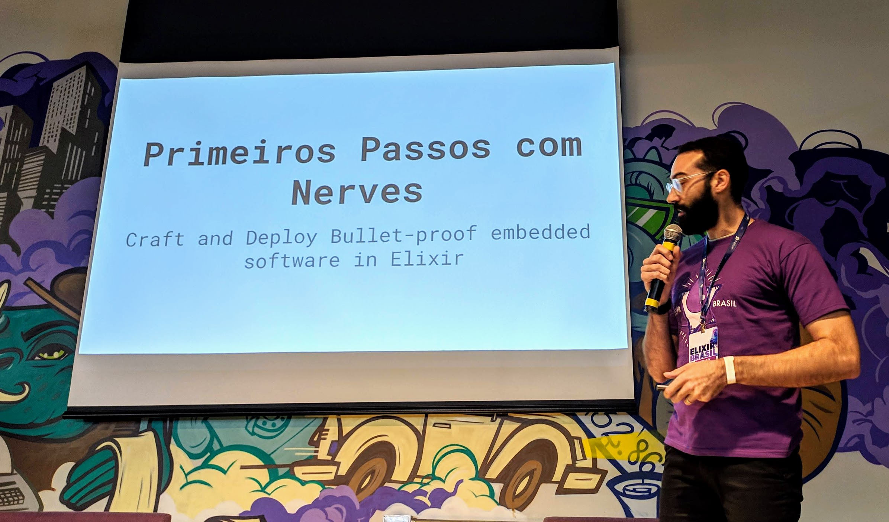

Resolvi voltar do almoço e ir para a trilha iniciante, para ver a talk do Donato, que tive oportunidade de conhecer no pós evento do dia anterior. Fiquei interessado para conhecer o Nerves, mesmo sem nunca ter mexido com o IoT. Ele começa sua talk definindo que Linux embarcado significa que é otimizado e customizado para dispositivos embarcados. Alguns aspectos importantes de dispositivos embarcados: temos recursos limitados (em certos aspectos), há um *overhead* de desenvolvimento - *cross compiling*, *flashing*, etc. e precisamos pensar em atualizações em campo, no dispositivo, que está distante de nós.

### Nerves
É uma plataforma, um framework, um conjunto de ferramentas e um *toolchain* para fazer Elixir Embarcado. Mas, com isso, surge a pergunta: "por que Elixir Embarcado?" - e a resposta é: Por que não? Foi pra isso que a BEAM foi criada, para telecomunicações altamente disponíveis. O mundo real é concorrente: coisas acontecem ao mesmo tempo ou em algum tempo não previsível.

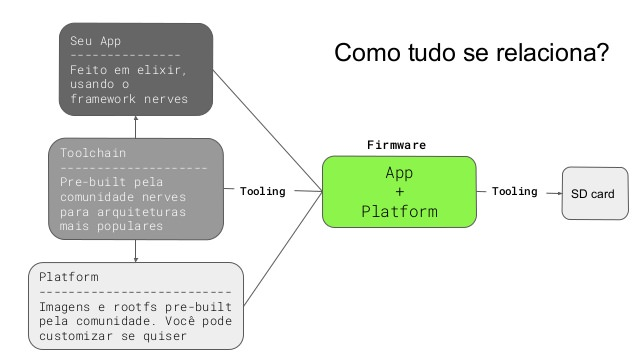

Um **toolchain** é um conjunto de ferramentas para compilar para diversas arquiteturas. **Plataformas** são imagens customizadas, feitas pela comunidade para rodar nos dispositivos. O Fluxo de desenvolvimento, basicamente é: faz o código, compila e empacota o firmware, em seguida o transfere para o dispositivo, testa, corrige bugs e repete.

Entre os pontos fortes estão o **boot rápido**, de segundos; o **tamanho reduzido** (menos de 100mb); a estratégia de **update com imagem inteira**; a estratégia de **fallback com partições A/B** - somente alterando a versão caso funcione; a **robustez ante a perda de energia** (o sistema de arquivos é somente leitura) e **atualizações OTA** (*Over The Air*, igual você provavelmente atualiza seu Android).

> "O Nerves está fazendo para desenvolvimento embarcado e Elixir o que o Rails fez pelo desenvolvimento web e pelo Ruby."
>
> Arto Bendiken

Em seguida o Donato fez um *live coding* mostrando rapidamente como é a cara do framework e como desenvolver algo para o [Raspberry PI](https://www.raspberrypi.org/) dele - no caso, piscar um LED, que ele disse ser o "Hello World" do mundo IoT. Os vídeos da apresentação estão disponíveis no YouTube:

1. [Elixir Nerves - blinky example](https://www.youtube.com/watch?v=PniEVXOYd3g)
2. [Elixir Nerves OTA using uploader script](https://www.youtube.com/watch?v=F-mYpVabptw)
3. [Elixir Nerves ssh and show log](https://www.youtube.com/watch?v=QM9rnAsl95A)

Em seguida, o Donato mostrou pra gente um projeto IoT incrível chamado [Farmbot](https://farm.bot/), vale a pena ver o [vídeo no YouTube](https://www.youtube.com/watch?v=uNkADHZStDE) ou conferir o site.

Os slides da talk estão disponíveis no [SlideShare](https://www.slideshare.net/DonatoAzevedo/primeiros-passos-com-nerves-elixir-para-dispositivos-embarcados).


## Testando no mundo Elixir - [Rafael Rocha](https://twitter.com/RocRafael)

Quando começamos uma estória de usuário, vemos a descrição, os critérios de aceite e começamos a desenvolver. Mas... estamos trazendo as especificações para o código? E quão confiante você fica com a sua entrega? Então, **por que testar**?

Segundo o Rafael, testar ajuda a ter **confiança** sobre suas entregas, ajuda a **organizar** os pensamentos, mantém os **custos baixos** e traz mais **qualidade** para o produto.

### Tipos de teste

Um Teste de **Aceitação** expressa um cenário, é de ponta a ponta, garante mais a qualidade externa e é mais próximo da camada de apresentação - porém é lento. Um Teste de **Integração** fica entre os Testes de **Aceitação** e os Testes **Unitários**. Um Teste **Unitário** testa o comportamento de uma única unidade do sistema.

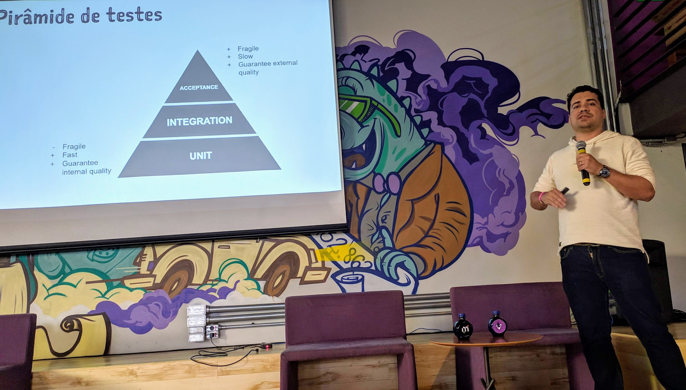

O Rafael trouxe um exemplo para exercitar testes, mostrando conceitos e implementações. Ele usou uma estratégia de "cebola", de testar em camadas, de fora pra dentro. Para poder entender as camadas, você precisa fazer uma reflexão sobre quais elas são, ajudando na compreensão do problema. Ele mostrou de forma bem rápida como seria o formato de cada um dos testes e o tipo de segurança que aquele teste traz. Ele também ensinou um pouco sobre os **Dublês** de teste, para evitar tocar sistemas externos.

Trouxe ainda o conceito de `Doctests`, explicando que é uma ferramenta para garantir que a nossa documentação esteja válida. Basicamente, você coloca no *docblock* um exemplo de como funcionaria aquela função e pode rodar esse exemplo como código, para ver se o comportamento da função está correto.

O código encontra-se [disponível no GitHub](https://github.com/rafaelrochasilva/greenbox). Um outro recurso legal é o post [Starting with Elixir, the Study Guide](http://blog.plataformatec.com.br/2018/11/starting-with-elixir-the-study-guide/), guia de estudos sobre Elixir escrito pelo próprio Rafael.

Nos slides, você pode conferir toda a talk, incluindo o código e os testes feitos. @todo

## Mantendo a Sanidade Testando Estado - [Andrew Rosa](https://twitter.com/_andrewhr)

De volta a trilha avançada, temos agora a talk do Andrew, falando sobre como manter a sanidade testando estado, com o conceito de **testes baseado em propriedades**. E para isso, ele utiliza a ferramenta [PropEr](https://jeffkreeftmeijer.com/mix-proper/) com seu código Elixir.

Um simples teste pode ser:

```elixir
test "sorts a list" do
	assert Enum.sort([3, 1, 2]) == [1, 2, 3]
end
```

Esse é um teste onde você informa a lista a ser ordenada. Já, em um **teste de entrada**, você não define uma entrada específica como o exemplo acima (`[3, 1, 2]`), mas pede algumas listas aleatórias para testar o seu código. Você tem alguns geradores que pode usar para gerar dados para testar seu sistema. E assim, você roda os seus testes e verifica se os mesmo estão funcionando.

Caso um erro seja encontrado, acontece um **shrinking**, que tenta encontrar um caso mínimo que quebre o teste, sendo mais fácil de encontrar a razão do problema que levou seu código a estar errado.

O Andrew mostrou bem didaticamente como fazer vários testes baseados em propriedades com exemplo "reais". Confira depois nos slides.

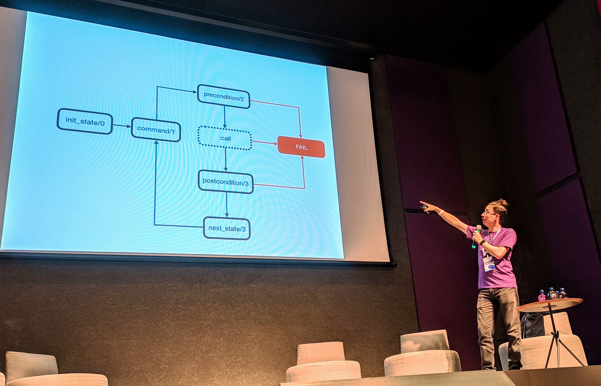

Para ele e sua equipe, o legal é que como muitos testes são gerados, vários *edge cases* são encontrados sem que eles tenham que ficar pensando sobre eles. Porém, como são muitos testes a serem rodados, eles demoram! É necessário saber qual o **retorno de investimento** daquele teste, você não precisa fazer por exemplo para um *CRUD*, mas pode pegar partes sensíveis de seu sistema e submetê-las a testes baseados em propriedades.

@todo slides

## Stand-Up - Em busca do elixir do desenvolvimento - [Rodrigo "pokemaobr" Cardoso](https://twitter.com/pokemaobr)

O grande pokemao fez um stand-up na hora do intervalo, levantando risadas da plateia com piadas sobre Elixir e programação.

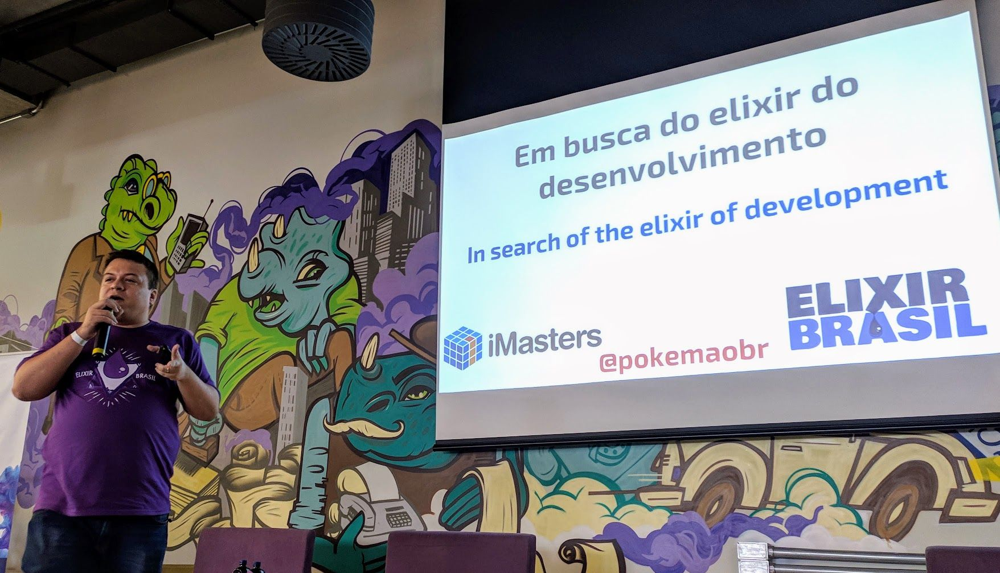

## Livestream de Elixir para aumentar a comunidade - [Philip Sampaio](https://twitter.com/philipsampaio)

Agora na trilha iniciante, temos o Philip falando sobre *Live Streaming*. Mas, o que é *Live Streaming*? Geralmente pensamos em jogos quando falamos sobre live streaming e provavelmente 98% dos streams são de jogos. É fascinante pensar que assistir outros jogadores, ao vivo, é legal.

No entanto, algumas pessoas, como a [Suz Hinton](https://www.twitch.tv/noopkat) fazem streaming de código e utilizam o Twitch pra isso. Ela fala sobre JavaScript/Nodejs, bem como Open Source, acessibilidade e IoT. Ela consegue explicar algo complexo pra alguém, prestar atenção no chat e elaborar um raciocínio complexo enquanto isso - e isso fascinou o Philip.

No final de 2018, o José Valim - criador do Elixir - começou a fazer o mesmo! Eventualmente ele fazia lives mostrando como resolver problemas do Advent of Code @todo e foi bem legal pra mostrar como resolver com Elixir alguns desses problemas. E pro Philip isso foi incrível, pois ele tinha muita curiosidade em saber como o pessoal do Open Source codava - e descobriu que não era tão diferente assim 😉. A ideia veio do irmão do Valim, professor que achava que isso poderia ajudar a comunidade.

 Ajuda a entender o fluxo de trabalho da outra pessoa, pega alguns truques que aquela pessoa faz... É muito útil para aprender uma nova tecnologia, então pra Elixir é ótimo poder contar com esse tipo de conteúdo. Para os _streamers_ em si também existem vantagens, pois ajudam a se comunicar de forma mais eficaz, aprende a dividir a atenção entre o stream e a plateia e também resolve problemas em conjunto com outras pessoas.

 E por que você deveria fazer ou participar das lives? Um dos medos do Philip era: "e se não aparecer ninguém?". Ele percebeu que divulgar nas redes sociais era de grande ajuda e o importante é ajudar pelo menos uma pessoa.

 E se eu travar ou errar na frente das pessoas? Acontece e é normal, o dia-a-dia da programação é assim.

 Com live streams você vai ajudar a comunidade a crescer, você vai melhorar muito suas habilidades e também você vai se divertir.

 O Philip começou com a ideia inicial de dedicar tempo à biblioteca `Floki` @todo que ele criou, um *parser* de `HTML` feito em Elixir. Mas ele também fala sobre outros assuntos, como Live View, Ecto Elixir básico.

 OBS Studio para fazer broadcast.
 Faz o stream da tela, possibilita configurar Cenas Ricas, disponibiliza várias configurações para mic/câmera e é totalmente Open Source.

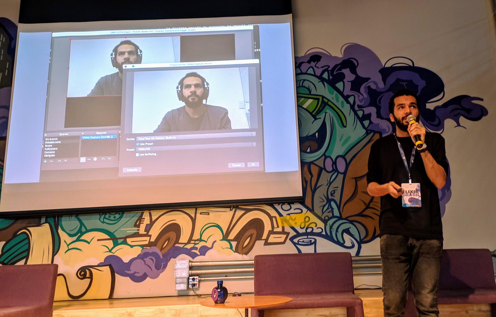

Caso você não tenha câmera, você pode usar seu celular e configurar para usar como uma webcam.

O Philip dá algumas recomendações para quem está a fim de começar: experimentar algumas configurações do OBS, procurar no youtube. antes das lives, faça uma agenda de tópicos a serem falados nas lives; configure o setup com antecedência; desabilite as notificações do sistema operacional; tenha cuidado com o histórico de comandos do seu terminal; tenha cuidado com segredos em geral; converse com as pessoas do chat - interagir é o mais legal das lives.

Ele mostrou também algumas pessoas que estão fazendo streaming de código

[marcobrunobr](https://www.twitch.tv/marcobrunobr) (js, frontend, react)

[anizark](https://www.twitch.tv/anizark) (elixir, programação funcional, exercícios do livro "learn funcional programming with elixir)

[jessitronica](https://www.twitch.tv/jessitronica) (ruby, aws, pair programming)

[José Valim](https://www.twitch.tv/josevalim)

Como conclusão, o Philip diz que acredita que live streaming podem ser artefatos muito poderosos para fazer a comunidade Elixir crescer no Brasil.

Confira os slides no [SpeakerDeck](https://speakerdeck.com/philss/streaming-de-codigo-elixir-para-aumentar-a-comunidade).

## Mesa redonda com streamers de Elixir - [Philip Sampaio](https://twitter.com/philipsampaio), [Ulisses Almeida](https://twitter.com/ulissesalmeida) e [Geovane Fedrecheski](https://twitter.com/geonnave)


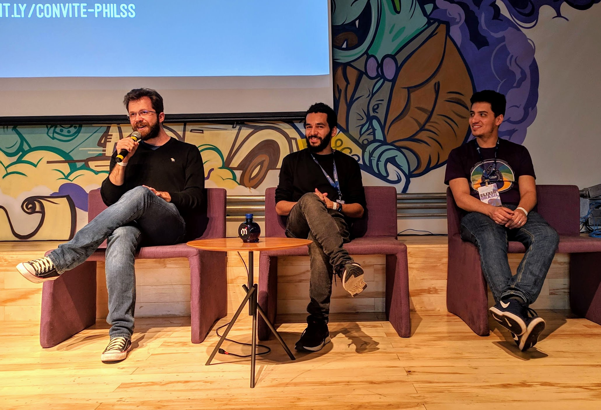

diferença vídeo e streaming - stream é mais simples, não necessita de edição e se errar está ok, pode ser uma forma de começar.

ideia para começar é pegar um assunto bem basicão e tentando ir evoluindo isso ao longo do tempo, percebendo acertos e erros.

tempo de live: entre uma hora e uma hora e meia.
tempo de vídeos: o que funciona são coisas curtas, até uns cinco minutos.
plataforma:


José Valim tem um [curso legal na Pluralsight](https://www.pluralsight.com/courses/meet-elixir) (em inglês) sobre Elixir, Phoenix Nathan alguma coisa e vídeos sobre problemas reais sendo resolvidos usando elixir. ele erra várias vezes e comete erros simples - gente como a gente!

Eles compartilharam a experiência de cada um responderam diversas perguntas da plateia. Algumas delas eu compilei aqui :)


## Lightning Talks

Para começar as talks relâmpago, o [Felipe Orlando](https://br.linkedin.com/in/felipeorlando) começou falando sobre como é o processo seletivo dentro das empresas e como conseguir um trampo em Elixir.
O que todo dev elixir tem que ter?
Qual a empresa do seus sonhos, entra na página de vagas e vê quais são os requisitos dessa empresa. Sejam curiosos, pesquisem, estudem, não tenham medo de conhecer coisas novas e nem medo de errar - inclusive nos testes práticos de empresas. Participe sempre de eventos, networking e aprendizado.
Em termos de conhecimento técnico, precisa saber um pouco de estrutura de dados, algoritmos e coloque o estudo em prática fazendo pequenas aplicações em casa, sem medo de dar certo/errado. TDD é muito importante, é o que vai garantir que a sua aplicação é confiável. Entender o ecossistema do Elixir é importante, fazer testes, ter CI, ter linters, ter uma documentação boa do código feito. Clean code é muito importante, código fácil de entender por outras pessoas. Inglês é primordial, ter o conhecimento que permita que você consuma conteúdo na internet e aumente seus conhecimentos.
Empresa boa é empresa que responde - se ela não te respondeu, talvez ela não era tão boa. Empresa boa valoriza diversidade e inclusão.

Honestamente, não consegui acompanhar direito as outras talks relâmpagos, pois acabei fazendo uma também. Falei sobre o [Exercism](https://exercism.io/), uma plataforma opensource para prática de código e mentoria para todos - um lugar legal pra aprender Elixir e Programação Funcional!

menção tecnogueto


## BEAM architecture handbook - [Andrea Leopardi](https://twitter.com/whatyouhide)

Andrea, um dos core commiters do Elixir já há três anos.
Ele usa Elixir no trabalho por um ano. Nessa talk, ele quer dar bastante dicas sobre quando você for fazer sua aplicação em Elixir, em como funciona a BEAM. Começando a partir de um único nó e crescendo para vários. Essa talk também se aplica a Erlang, ele diz.

Arquitetura de um único nó

Ele começa com a menor unidade de computação: processo. é uma unidade de isolamento e concorrência (não unidades de separação de código).

Por exemplo, um "aceitador de TCP" que distribui processos para "conexões TCP". Esse é um bom caso de uso para processos, caso uma conexão caia, ele está isolado e os outros continuam.

@todo foto tcp

Por exemplo agora, você tem sua conexão, e um "connection handler", como ele se relaciona com a sua "session"? É só um tanto de dados e talvez não deveria estar em um processo separado. Você pode usar uma data estruture dentro do handler.

O problema de salvar estado dentro de processos

> **Qualquer** processo seu irá *morrer* em **qualquer** dado momento e **todo** o estado deles será *perdido*.

`Flush` o estado do processo constantemente, faça o estado ser remontável (sendo praticamente um cache do estado de verdade ou do cálculo dele) e mantenha isso em mente, que os processos vão morrer.

Evite **impor** arquitetura de processos.

connection data struct -> process
											 -> gen_stage
											 -> get_statem (machines)

A ideia de separar estado dos dados é uma dica que ele dá.
Outra dica é prestar atenção à **MailBox** dos processos, pra não ficar sem memória.

No exemplo de consumo de mensagens abaixo, é possível cair facilmente no problema citado, pois alguns tipos de mensagens não são consumidas e vão parar na **MailBox**. É algo pra ter em mente.

```elixir
receive do
    :some_message ->
       # ...
    :other_message ->
       # ...
```

Guia de uso de **Árvores de Supervisão**:

whiteboard design: desenhe a árvore de supervisão num quadro branco
@todo foto whiteboard

strategies: `one_for_one`, `one_for_all`, `rest_for_one`. monte árvores de supervisão aninhadas, utilize-se disso. por exemplo, uma árvore de supervisão que tem como filhos, tanto o `cache` como três `workers`. Nenhuma das estratégias funciona bem nesse caso, pois a eventual falha de um desses filhos vai reiniciar coisas de forma errada. Para resolver, o ideal era ter um supervisor dos três `workers`, ficando com o `cache` como irmão. Assim, você pode ter uma estratégia para o supervisor principal (`rest_for_one`) e outra para o supervisor de `workers` (`one_for_one`). Todos os processos deveriam ser supervisionados. Sempre dê nome para os seus supervisores, para ficar mais fácil de debugar em sistemas em produção.

**Teste árvores de supervisão**. Uma forma de fazer isso é com Chaos Monkey. O repositório  ajuda fazendo property based testing (@todo lembra da  talk) para montar um modelo da sua árvore de supervisão

`Connection Handling` - trabalhamos com serviços externos, fora da nossa rede. Geralmente utilizamos processos para lidarmos com isso.

```none
<Seu App> -> Redis Connection -> Redis (de verdade)
															/\ falha de rede, o que fazer?
```

Colocar um Connection Manager, que é responsável por lidar com a lógica de reconexão (não deveria ser por exemplo a responsabilidade de um supervisor). Em algum ponto sua conexão vai cair e você deve fazer a aplicação com isso em mente, se preparando para os possíveis erros.

need redis? -> nope -> async init; handle :error tuples
\/ yep
sync init; raise on errors

É raro que você precise de conexões externas o tempo inteiro para funcionar, então podemos usar a abordagem de estar indisponível por um tempo.

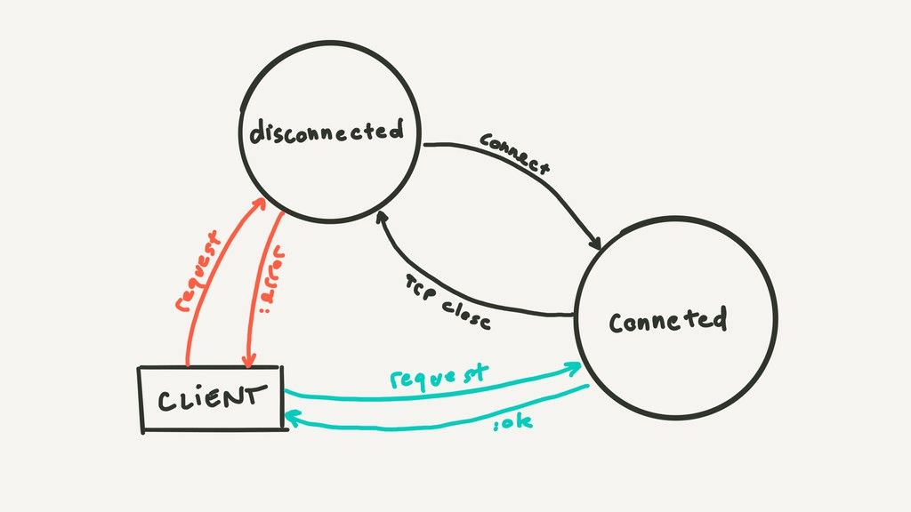

Tente reconectar a serviços externos, mas não a cada X segundos ou instantaneamente. use uma estratégia "backoff", que tenta em tempo exponencial e também randomizado um pouco (um pouco de tempo a mais ou a menos).

Processos gargalo: são processos que todo o seu sistema depende e que atrasam tudo caso fiquem lentos. Por exemplo, chamadas bloqueantes para o Cache. Então seu cache vai ser um gargalo.

Com uma tabela `ETS` pode ajudar a resolver esse problema. @todo imagem.

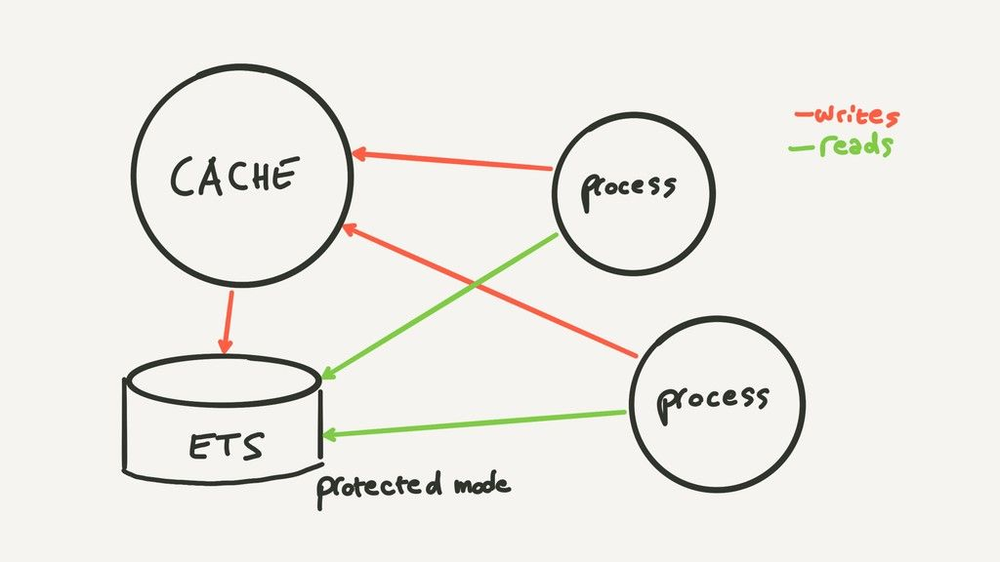

`Pools` de conexões também pode ser uma solução para esses gargalos, onde através de uma rotação, vo
`checkout pools` (lidam com a conexão) vs `name based pools` (registrados com nomes, vc pede conexão por nome) com `registry`, toma cuidado e processa os nomes.

**Error Handling**: lide com todos os erros **esperados**. Se algum erro pode acontecer, ele com certeza vai. Ele odeia o "Let it crash" que é bastante falado, porque talvez não é entendido como deveria ser entendido. Ele diz que você deve tratar os erros e não usar essa frase como desculpa para lidar com os mesmos. Dê `crash` apenas em erros inesperados ou irrecuperáveis.

### Arquitetura de muitos nós

Frequentemente ele ouve que o `BEAM` "resolve sistemas distribuidos" e a reação dele é NÃO! Pra ele, o BEAM é apenas um bom conjunto de ferramentas! Como por exemplo, `send/2`, `Process.monitor/1`, `Node.monitor/2` e  registro `:global` de processos.

> to beam or not to beam

Por exemplo para *Data Storage*, devo usar RDBMS (como o Postgres) ou uma solução BEAM (como o Riak)?

Pense em interoperabilidade, recursos funcionais e análise de dados. Replicação é difícil. Se você tem uma solução

A abordagem Phoenix é por exemplo usar mais de uma solução, como `pg2` + `Redis pub/sub`.

**Application failover**: se minha aplicação falhar, essa outra aplicação de pé, que estava parada, assume.

**Hot-code upgrades**: não tão utilizados, conflita com a abordagem de contêineres Docker. Ele diz para nos questionarmos: "Eu realmente preciso disso?" - na opinião dele, geralmente não precisamos.

**Requests**: nós frontend, nós backend. Existem 3 tipos de requisições: `no máximo uma vez`, `pelo menos uma vez` e `exatamente uma vez`.
No máximo uma vez não tem muito o que fazer.
Idempotência para requesta que podem acontecer pelo menos uma vez. Se chamar mais de uma vez, você lida com isso (por exemplo salvar no banco de dados mais de uma vez). Exatamente uma vez é o tipo mais caro de requests, porque você tem que garantir que eles vão sempre funcionar (por exemplo transações)

> "Use a ferramenta certa para o trabalho" - Capitão Óbvio

Não tente usar o BEAM pra tudo. Você pode usar muitas outras ferramentas e tecnologias mas, se usar, tente seguir essas dicas.

Aprenda sobre **Sistemas distribuídos**. A arquitetura BEAM é **boa**, leve isso com você.


### Recursos
"Designing for scalability with Erlang/OTP"

http://ferd.ca

"Distributed system for fun and profit"

Confira os slides (lindos demais, desenhados a mão!) da talk do Andrea [no SpeakerDeck](https://speakerdeck.com/whatyouhide/beam-architecture-handbook).
