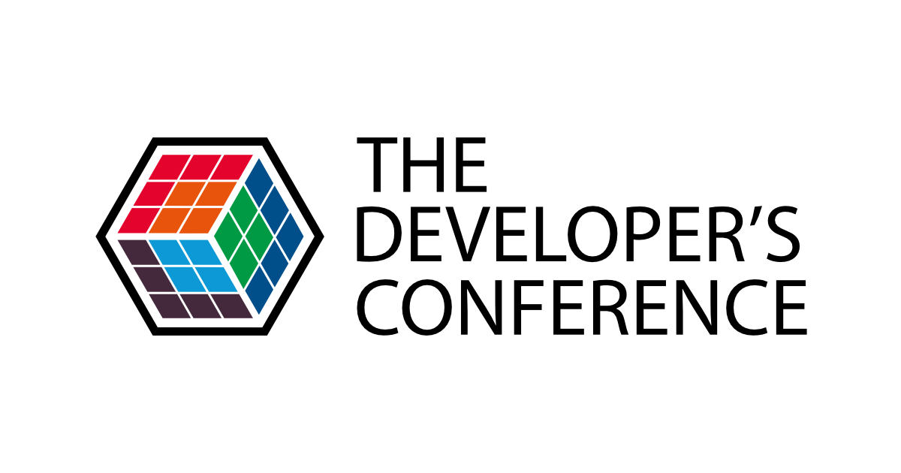
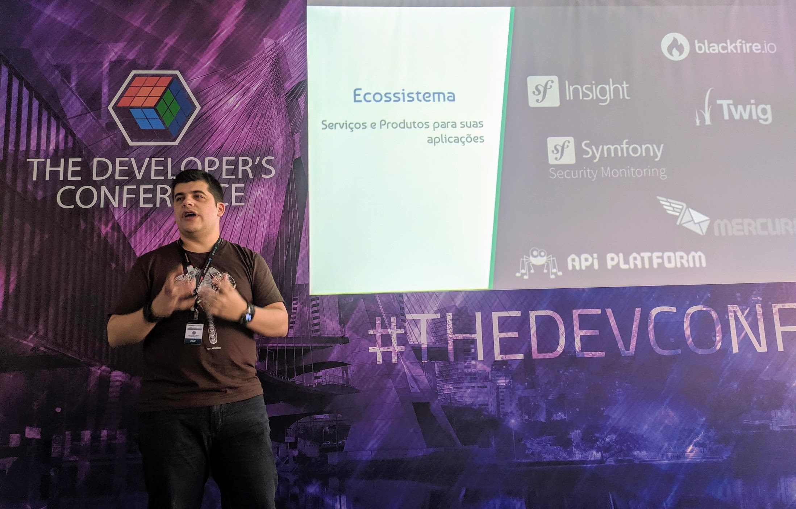
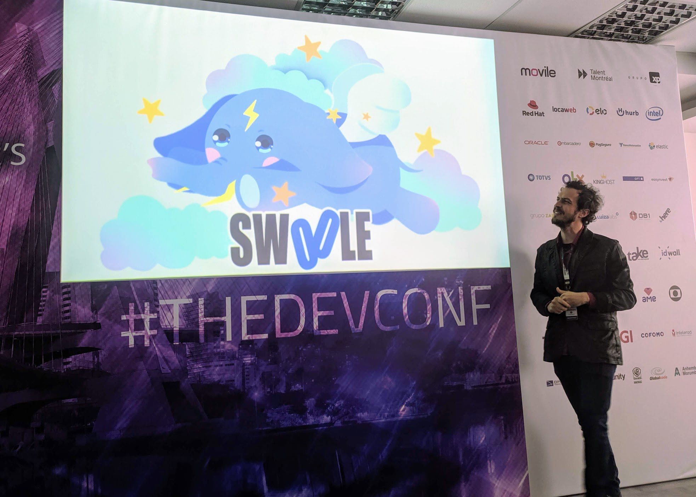
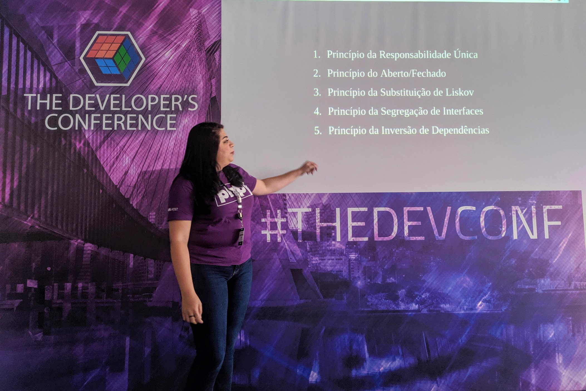

Como já ocorre há muitos anos,
[a trilha PHP está presente](http://www.thedevelopersconference.com.br/tdc/2019/saopaulo/trilha-php)
aqui no [#TheDevConf](https://twitter.com/hashtag/TheDevConf). Já tive o prazer
de palestrar nesse evento e também de coordenar a trilha no ano passado. Esse
ano, a coordenação está por conta da
[Marcela Godoy](https://twitter.com/magodoy88), do
[Daniel Gimenes](https://twitter.com/danizord) e do
[Thiago Rodrigues](https://twitter.com/xthiago). Todos os coordenadores desse
ano são evangelistas do [PHPSP](https://phpsp.org.br/) e também do
[PHPSP Campinas](https://twitter.com/phpspcampinas) (Campinas em peso aqui!).

## Symfony - sua aplicação em fortes alicerces - [Anderson Casimiro](https://twitter.com/duodraco)

O Anderson Casimiro, conhecido como Duodraco, foi um dos fundadores do PHPSP e
veio falar sobre o Symfony, um framework extremamente robusto. O Symfony começou
com o Fabien Potencier, em 2005 na SensioLabs, tendo seu primeiro lançamento
em 2007. A ideia era construir um framework com todas as boas práticas
possíveis. Em 2011 e 2012, temos o lançamento do Symfony 2, já em cima do PHP
5.3, com muitas evoluções em relação as versões anteriores. O Symfony 3.0 surgiu
em 2015, tendo como LTS a versão 2.8. Em 2017/2018 temos o lançamento da versão
4 e a adoção da versão 3.4 como versão LTS.

> Symfony é um conjunto de Componentes PHP, um framework para Aplicações Web,
> uma filosofia e uma Comunidade - tudo trabalhando junto em harmonia.

O framework é uma base de código que construímos algo em cima, com abstrações de
banco de dados, uma estrutura definida e outras coisas. O Symfony é dividido em
**componentes** desacoplados e reutilizáveis, te dando o mínimo para começar e
sendo possível adicionar os componentes que forem relevantes para a sua
aplicação. Componentes do Symfony são utilizados em grandes projetos como o
Drupal e phpBB, além de ser a base de muitas coisas de outro framework, o
Laravel.

A Comunidade do Symfony conta com mais de 600 mil desenvolvedores em mais de 120
países. E a filosofia abraça e promove o profissionalismo, boas práticas,
padronização e interoperabilidade.

### Como começar um novo projeto Symfony

PHP 7.1+, Git, Composer e o [Symfony Client](https://symfony.com/download), que
é opcional. Utilizando o Symfony client, podemos rodar alguns comandos para
incluir os componentes do framework, como também é possível com o Composer, mas
ainda mais prático.

O Symfony Flex é um "plugin" que configura novos pacotes compatíveis, com
"receitas" prontas que podemos escolher.

Utilizando por exemplo o maker, podemos gerar um código inicial para nossas
entidades ou outras partes do sistema. Hoje em dia o Doctrine não é mais
instalado com o Symfony, sendo necessário incluí-lo para acesso ao banco de
dados. O Doctrine abstrai muito como interagimos com o banco de dados, vale a
pena conferir o projeto também.

Com o comando `symfony serve`, sumidos um servidor local para desenvolvimento,
já com suporte a HTTP/2 e HTTPS, com um certificado local já configurado, o que
é muito prático.

No site [Symfony Recipes Server](https://flex.symfony.com), temos acesso a
diversas receitas prontas, algumas oficiais do Symfony e outras criadas pela
comunidade.

### Componentes

Um conjunto desacoplado e reutilizável - não precisamos do framework para
utilizá-los. Para acesso a sua "pequeeena" lista de componentes,
[confira no site](https://symfony.com/components). Temos abstrações para
chamadas HTTP, para Cache, para configuração de variáveis de ambiente, para
Mensageria e até mesmo para configurar o Webpack!

### Ecossistema

Existem serviços e produtos do ecossistema Symfony que podemos utilizar em
nossas aplicações. Blackfire, SF Insight, Twig, Symfony Security Monitoring,
Mercure, API Platform.



Contamos também com o lançamento do Symfony Cloud, que é uma Plataforma como um
Serviço (PaaS), para fazer deploy de aplicações Symfony e deixar toda a
infraestrutura gerenciada por esse serviço.

Para aprender sobre Symfony e seu ecossistema, contamos ainda com o
[SymfonyCasts](https://symfonycasts.com/) e
[SensioLabs University](https://university.sensiolabs.com/). Existe até a
[certificação Symfony](https://certification.symfony.com/). Temos os eventos
[Symfony Live](https://live.symfony.com/), de menor porte e na língua do país
que ocorre o evento e a SymfonyCon, que é o maior evento de Symfony do mundo.
Esse ano a SymfonyCon vai ocorrer de
[21 a 23 de novembro em Amsterdam](https://amsterdam2019.symfony.com/).

### Conclusões

Como o próximo passo após essa talk, o Duodraco comenta sobre a possibilidade
ajudarmos no GitHub do framework, ou com tradução, ou espalhando conteúdos como
esse pela comunidade. Caso queira falar mais sobre Symfony, é possível entrar no
[Slack do PHPSP](https://bit.ly/vemproslackphpsp) ou no
[grupo brasileiro do Telegram](https://t.me/SymfonyBrasil).

## Microserviços com PHP e Swoole - [Hector Vido Silva](https://www.linkedin.com/in/hector-vido-silva-08b15a155/)

O Hector veio trazer um conteúdo muito legal, de microserviços com PHP e com
[Swoole](https://www.swoole.co.uk/). De quebra, o
[Openshift](https://www.openshift.com/) e o [OKD](https://www.okd.io/).

O Openshift é uma Plataforma como um Serviço (PaaS) que utiliza contêineres -
para isolamento de aplicação - orquestrados através do Kubernetes. Os
programadores não precisam se preocupar com o ambiente, apenas com a aplicação.
Ele possui ferramentas para englobar todo o ciclo de vida do desenvolvimento
contínuo.

Sobre as **vantagens do microserviços**, o Hector comenta sobre termos agora
**partes menores** do nosso sistema, mais fáceis de entender e manter; esses
serviços são **livres**, com cada parte independente; temos **baixo
acoplamento**, onde cada parte pode ser escrita por uma equipe diferente e até
mesmo em outra linguagem; microserviços quase que nativamente são
**escaláveis**.

Já o **Swoole**, é uma **extensão** pequena e simples do PHP. Ele é
**assícrono**, bem parecido com o conceito do Node.js e é **rápido**, bem
rápido.



O Hector tem uma didática impressionante e fez uma live pra gente, comparando
uma aplicação com e sem Swoole se conectando a um banco de dados MySQL. Mesmo
com um teste relativamente simples, os ganhos de performance são incríveis. Os
códigos utilizados,
[com o Swoole](https://github.com/hector-vido/php-swoole-mysql) e
[sem o Swoole](https://github.com/hector-vido/php-mysql) estão no GitHub do
Hector.

## Princípios SOLID: Conversa de gente grande - [Mariana Gomes](https://twitter.com/mmariana_gomes)

A Mariana veio trazer uma talk bem importante pra nós desenvolvedores, sobre
SOLID, uma maneira de organizar nosso código e reduzir a complexidade do mesmo,
deixando mais simples de se trabalhar nessa aplicação, principalmente em equipe,
quando não necessariamente damos manutenção em um código nosso.



Temos benefícios de classes definidas e com escopo pequeno, com pouca
responsabilidade, facilitando o reaproveitamento. Poucas dependências para
facilitar o uso.

### Princípio de Responsabilidade Única

O _Single Responsibility Principle_ representa o **S** do SOLID e constata:
**uma classe deve ter uma única responsabilidade**.

### Princípio do Aberto e Fechado

Esse princípio representa o **O** do SOLID (Open-Closed Principle). Ele diz que
**as entidades do sistema devem estar abertas para extensão mas fechadas para
modificação.**

### Princípio de Substituição de Liskov

O **L** do SOLID vem _Liskov Substitution Principle_, princípio que prega

### Princípio de Segregação de Interface

Já o **I** do SOLID vem pelo _Interface Segregation Principle_. O Cliente não
deve ser forçado a implementar métodos que não usa

### Princípio de Inversão de Dependências

**D**

### Conclusões

Dificuldade para testar, código sem estrutura, código duplicado, fragilidade do
código que quebra facilmente após algumas mudanças.

## Ecossistema PHP - O presente, o passado e o futuro da linguagem back-end mais utilizada na web - [Rodrigo Wanderley de Melo Cardoso](https://twitter.com/pokemaobr)

O pokemaobr começou sua palestra com seu famoso standup de PHP. Depois de muita
risada, começamos sua talk sobre o ecossistema PHP. Dando um pouco de contexto,
ele mostrou que a linguagem PHP é uma das mais populares de todas, entre as top
10, segundo o estudo do StackOverflow de 2018. Em 2019 vemos o PHP subindo ainda
mais na pesquisa. O uso diminui um pouco, em contrapartida e ela também aparece
como uma linguagem mais odiada. Segundo o Ranking da RedMonk, o PHP aparece em
quarto lugar. NO W3Tech, vemos o PHP com quase 80% do backend da web.

### Personal Home Page Tools

Scripts CGI, C, Open Source, substituia o PERL

### PHP FI

Variáveis estilo PERL Interpretação automática de variáveis vindas de
formulários Sintaxe de HTML embutida

### FI 2.0

Princípio de tag `<?` 3 Tipos de variáveis (long int, double, string) Princípio
de função

### De 1998 a 2000, temos o PHP 3

Zeev e Andi Ecommerce num projeto de faculdade

Reescrita da linguagem Hypertext Preprocessor "Orientação a objetos" Múltiplos
bancos de dados Windows 95, 98, NT e Macintosh 10% da Web nessa época

PEAR e PECL

- Reutilização de bibliotecas e extensões
- Primeiro "repositório de dependências"
- Gerenciador de dependências

2000 a 2004 PHP 4, Zend Engine (performance), suporte a diversos servidores web,
sessões HTTP. Diversas extensões, suporte a ainda mais banco de dados, diretivas
do PHP.ini

### Era dos Fóruns

- vBulletin (2000)
- phpBB (2000)
- Simple Machine Forums (2001)
- Invision Power Boards (2002) iMasters, Clube do Hardware, Liga Magic, Tibia.

### Era dos CMS

- Drupal (2002)
- Moodle (2002)
- Wordpress (2003)
- Joomla (2005)

Flickr, Wikipedia, iStockphoto, Mailchimp, Facebook, Source Forge.

### Por que somos o patinho feio da Web?

Moldamos as hospedagens, todas se adaptaram ao PHP.

### PHP 5.0 (2004-2015)

- Zend Engine 2.0
- SPL

  5.1, PDO, compressão de PNG na GB date_timezone_set()

### Era dos frameworks

- CakePHP
- Symfony
- CodeIgniter
- ZendFramework

  5.2 -> zip archive, JSON, geração de chave DSA na `openssl_pkey_new()`.

Doctrive - ORM - DBAL,

### Era dos E-commerces

- Magento (2008)
- PrestaShop (2008)
- OpenCart (2010)
- Woocommerce

### PHP 5.3

- Namespaces
- Phar
- Lambda functions e closures

Laravel,

### PHP 5.4

Sintaxe simples para Array, traits, servidor php embutido

### Composer / Packagist

Um novo gerenciador de dependências, fácil configuração com JSON, comandos
simples.

### Padronização de tudo

- PHP-FIG
- PSRs,
- Autoload, código, etc.

### PHP the right way

Guia de boas práticas da linguagem, traduzido para vários idiomas (inclusive em
BR)

PHP 5.5

- Generators e Coroutines
- Password hashing

PHP 5.6

- Aceita uploads acima de 2gb, melhorias de performance

PHP6 - Unicode? Versão que morreu

### Facebook, Hack e HHVM

Tipagem estática, maior performance, conflitos com o core.

### PHP 7.0

Reescrita da linguagem, aumento significativo de performance, unicode
implementado, classes anônimas, agrupamento de use, scalar type hints.

### Mudanças nas releases

Uma nova versão ou sub-versão a cada ano, 2 anos de suporte ativo, alguns anos
de segurança

### PHP é só pra Web?

Emulador de Gameboy em 2016 pelo bob, PHP-GUI,

### PHP 7.1

Catching de múltiplos tipos de exceção, iterables

7.2 argon, etc

PHP 7.3 `json_encode` e `json_decode`, `is_countable`, melhoria de heredoc e now
doc .

PHP-ML, algoritmos de machine-learning, treinamento, extração, classificação,
regressão. Rede neural em PHP do Bob.

GraphQL em PHP Webassembly Blockchain

PHPlata Ethereum Client em PHP

Mobile: Zend on The Go Mobile (phonegap + apigility) - não levar tão a sério

Serveless, Kubeless, chatbots (botman, dialogflow)

### O que está por vir?

Propriedades tipadas, preloading

8: JIT, otimização

### Conclusões

Cada vez mais o PHP está indo para um bom caminho. Por que temos vergonha do
PHP? A web está acabando? O que estamos fazendo em PHP? Como estamos recebendo
novas pessoas devs PHP?

O que estamos mostrando pro mundo?

Segundo o Pokemaobr, precisamos focar em artigos e conteúdo de temas relevantes,
como machine learning e etc, e talvez menos em corrigir algumas coisas antigas
da linguagem.

## PHP Legado: The good, the bad and the ugly - [Vanderson Lopes](https://twitter.com/vanderson139)

O Vanderson veio falar sobre código legal sem perder a sanidade mental. Ele é
programador PHP há 8 anos - que ele diz ser o tempo que trabalha com sistema
legado também. Aprendeu a trabalhar com eles focando na satisfação dos clientes.

### The Bad

Falhas de segurança, ausência de padrão de projeto, dificuldade de manutenção,
desafios para implementar certas demandas, saúde mental comprometida.

Testes? Não existem. Uma equipe de homologação fazem testes manuais no sistema
antes de repassarem pro cliente

### The Ugly

O Vanderson mostrou vários exemplos

### The Good

Oportunidade de arquitetar um projeto inovador, liberdade para criar.

Case de substituir o armazenamento local por cloud. Implementar um
`StreamWrapper` para manipular o fluxo dados para arquivos. Usou o Amazon
StreamWrapper, que permite usar o protocolo `s3://` no seu código que já existe.
Por exemplo

```php
file_put_contents('s3://bucket/key', 'Hello world!')
```

É possível criar seu próprio _StreamWrapper_, utilizando a função
`stream_wrapper_register` passando uma classe para lidar com isso.

Ele também deu um exemplo onde um cliente tinha um sistema legado e queria
colocar um framework, no caso o Laravel, na frente dele para modernizar.

## Revolucionando as APIs Web, muito prazer GraphQL! - [Guilherme Pacheco](https://twitter.com/gpacheccos)

O Guilherme, que veio do interior do Paraná, resolveu trazer essa talk sobre
GraphQL, trazendo o conteúdo teórico para embasar a próxima palestra, do Alefe.
Uma curiosidade é que ele é formado em Ciências Contábeis e é graduando no nosso
de desenvolvimento.

### O que é GraphQL?

O GraphQL é algo novo, mas é uma especificação desenvolvida pelo Facebook em
2012 e que se tornou _open source_ em 2015. Trata-se de uma _Query Language_,
que visa resolver alguns problemas comumente encontrados em APIs REST.

Algumas grandes empresas como o Facebook, GitHub, Pinterest, Intuit, Coursera e
Shopify utilizam GraphQL.

GraphQL não é um Banco de Dados, não tem relação nenhuma com um banco e nem
precisa de um para funcionar e também **não** é um banco de dados.

### GraphQL vs REST

Versionamento, under-fetching, over-fetching.

O GraphQL busca resolver isso permitindo que o próprio cliente monte a _query_
com os dados que ele precisa.

Um exemplo que o Guilherme trouxe foi a tabela do brasileirão, onde podemos
pedir exatamente os dados que precisamos para montá-la, sem dados a mais ou a
menos.

@todo foto comparativo

## Implementando GraphQL com PHP - [Alefe Souza](https://twitter.com/alefesouza)

O Alefe, que programa com PHP já há uns 6 anos, veio complementar a talk do
Guilherme, pegando a teoria que ele trouxe e tentando mostrar na prática.

No GraphQL, a ideia é trabalhar mesmo com um único endpoint.

Os conceitos básicos são os **tipos**, as **queries** e as **mutations**.
**Tipos** definem que dados temos disponíveis e os formatos deles (`int`,
`string`, `objetos`, etc.). **Queries** são a forma de recuperar esses dados, é
como pedimos eles. Por fim, as **mutations** são a maneira de criar e atualizar
dados.

Funciona em diversas linguagens, tanto no backend (incluindo PHP) e no frontend.

Para começar a utilizar uma implementação GraphQL para o PHP, podemos utilizar
por exemplo o pacote `webonyx/graphql-php`:

```php
composer require webonyx/graphql-php
```

Assim, o Alefe já partiu para a prática, nos mostrando um exemplo de código que
pode ser [encontrado em seu GitHub](https://bit.ly/talk-graphql-php).

Para o Laravel por exemplo, podemos utilizar o `rebing/graphql-laravel`:

```php
composer require rebing/graphql-laravel
```

Foi bem legal ver como é simples iniciar o desenvolvimento de uma API GraphQL e
como os tipos ajudam na definição dessa API, facilitando o entendimento dos
usuários.

## Segurança além do óbvio - [Vinícius Campitelli](https://twitter.com/vcampitelli)

O Vinícius quis trazer um conteúdo de segurança, além do óbvio, em 25 minutos.
Segundo ele, o PHP permite que façamos muitas coisas que não são consideradas
boas práticas, o que devemos nos atentar.

### OWASP Top Ten

[owasp.org](https://www.owasp.org/index.php/Main_Page) é o óbvio

### Gerenciamento de Sessão

Saindo do que o Vinícius considerou óbvio, ele começa falando sobre as sessões
do PHP.

Regere o ID da sessão no login e logout para mitigar um ataque de _Session
Fixation_.

```
if ($user = $this->loginFrom($_POST)) {
    session_start();
    session_regenerate_id(true); // true para apagar a sessão antiga
}
```

> Antes de mais nada... **Utilize HTTPS**

Com o Let's Encrypt podemos ter certificados SSL gratuitos. acme.sh

@todo foto config PHP

Referências - Paragon IE - The Fast Track to Safe and Secure PHP Sessions Manual
PHP - Securing Session INI Settings

### Validação de entradas

**Nunca confie em entradas do usuário!**

> "Mas eu estou validando no frontend!"
>
> Alguém antes de ter sua aplicação invadida

Você **pode** utilizar filtros de XSS na entrada

- HTML Purifier
- boku/anti-xss

Mas **deve** tratar a saída. Se usar uma ferramenta de _templating_, verifique
sua própria função

Valide os dados de entrada de acordo com o que você espera para aquele campo
(_data type_) Por exemplo, um **nome de pessoa** pode ter apenas letras,
espaços, números, hífen e apóstrofo (_não esqueça dos acentos!_).

Crie uma camada em seu _framework_ que irá validar todos os dados da requisição
antes de chegar à camada de negócio. Se um campo não possuir um _data type_
estipulado, remova-o da requisição.

### Armazenamento e políticas de senhas

Não limite os caracteres permitidos, não coloque um tamanho máximo, o tamanho
mínimo pode variar de acordo com as necessidades de sua aplicação - de acordo
com o NIST SP800-132, 10 caracteres é o desejável, crie mecanismos de
complexidade - exemplo 1 caractere maiúsculo, 1 minúsculo, etc.

Para armazenar a senha, aplique um algoritmo de _hash_ para transformá-la em um
texto com tamanho fixo. Utilize um _salt_ específico para aquela senha.
Criptografe o hash gerado para garantir que você possa recriptografar todas as
senhas caso haja vazamento do banco de dados.

Se possível, use a libsodium. Uma biblioteca segura, moderna e fácil de usar. O
PHP foi a primeira linguagem a ter embutida essa biblioteca.

Cuidado com a verificação da senha, que pode levar certo tempo e pode permitir
um ataque no seu sistema de descobrir se o usuário existe ou não.

### Pontos de atenção

- Proteger uma aplicação Web não é algo trivial
- Existem muitos outros ataques e técnicas de defesas além dessas
- Avalie o que faz sentido para seu sistema
- Quando possível, utilize técnicas de defesa em camadas

vcampitelli.github.io

Confira os slides da apresentação do Vinícius no
[site dele](https://viniciuscampitelli.com/slides-seguranca-alem-obvio-php/#/).

## Arquitetando sistemas PHP utilizando boas práticas de engenharia de software - [Eduardo Cesar Borsato de Oliveira](https://twitter.com/Eduardo_Cesar1)

O Eduardo

Arquitetura de Software está muito atrelado a negócio. A única certeza que temos
sobre software é que software muda.

Como exemplo, a API REST que o Wordpress agora disponibiliza, permitindo que o
ele apenas gerencie a criação e edição de conteúdo, mas que deixe esses dados
serem acessados de outras aplicações, fazendo até outras interfaces. Foi uma
análise de negócio que dirigiu a uma implementação.

Livro DDD do Eric Evans aborda vários pontos que faz com que sua aplicação seja
mais relevante do ponto de vista do negócio. Aborda Linguagens Ubíquas,
Arquitetura em Camadas, Contextos Delimitados, Camadas Anti-Corrupção.

### Entendendo arquitetura de software de dentro pra fora

Os frameworks que utilizamos no dia a dia implementam diversos padrões descritos
pelo GoF.

**Padrão** é uma coisa que a galera da computação gosta muito. Martin Fowler
também cataloga muitos padrões arquiteturais. Seja para representação,
armazenamento, comunicação entre dados.

Existem muitas **Arquitetura em Camadas**: MVC, MVVM, etc.

> A criação de camadas é uma das técnicas mais que os projetistas de software
> usam para quebrar em pedaços um sistema complexo de software.

Apresentação, Negócio, Persistência.

### Meios de comunicação

Tratam-se de protocolos, sejam eles síncronos ou assíncronos. Isso é comum em
todas as aplicações, receber uma entrada, transformar em dados que sua aplicação
entenda e devolver uma determinada saída.

_Web Applications_/APIs podem ser feitas em modelos de camadas. Um modelo em
camada comum utilizado é o MVC (_Model View Controller_).

### Manipulação de dados

Precisamos sempre pensar em como lidar com os dados que temos em nossos
sistemas. Acabamos nos utilizando muito de ORM's, com os padrões _Active Record_
e _Data Mapper_. Em um modelo _Active Record_, as entidades se auto-gerenciam,
se salvando em banco de dados, se "filtrando" e buscando no banco de dados. Um
exemplo de ORM que implanta o padrão é o Eloquent.

Já no _Data Mapper_, as responsabilidades são mais segregadas, onde as
responsabilidades de interação com o banco de dados são extraídas para uma
diferente classe _Mapper_. Um exemplo de ORM que implementa o padrão é o
Doctrine.

Web APIs podem adotar algum modelo arquitetural em camadas, mas o principal
ponto é na exposição de um serviço, que pode ser feita via RPC, REST, etc.

Quando falamos de REST, existem vários níveis de maturidade, definidas pelo RMM

@todo RMM imagem

E se minha aplicação precisar ser assíncrona?

### Mensagerias

Temos Filas, ponto-a-ponto, uma escreve outra lê Tópicos, agora tem escritos
ouvindo e recebendo msg, mais de uma aplicação consumindo a mensagem.

O RabbitMQ por exemplo possui esses recursos e dá para se trabalhar no PHP.

Ratchet, Swoole, Mercure

### Autenticação e Autorização

Sessão, Tokens, JWT, OAuth.

### Logs

De um ponto de vista de negócio, eles são muito úteis para resolução de
incidentes.

Monolog, KLogger, etc.

### Testes

Testes: Controlar fragilidade e sensibilidade do código a mudanças. Garantir
qualidade do código: testes.

### Gerencie suas dependências

Composer

### The Twelve-Factor App

Manifesto de boas práticas para entrega da software.

## PHP as a Service - [Paulo Victor Gomes](https://twitter.com/_pvgomes)

Pra fechar a trilha PHP no #TheDevConf, temos o Paulo Victor, falando sobre
Serverless. Serverless ainda utiliza servidores, mas você não deve se preocupar
sobre gerenciar essas máquinas.

### Benefícios

Não precisamos gerenciar o servidor, é fácil e eficiente para escalar nossa
lógica. Feito com Alta Disponibilidade e Tolerância a Falhas. Outros serviços da
plataforma são facilmente integráveis. Pagamos conforme o uso.

@todo imagem como funciona o serverless

### Provedores de Infraestrutura Serverless

AWS Lambda, Azure Functions, IBM OpenWhisk, Google Cloud Functions, Spotinst...

O AWS Lambda é o mais utilizado e foi o que o Paulo utilizou em seus exemplos.

@todo exemplo de aplicação

Para nossas funções lambda, podemos definir o nome, qual linguagem iremos
utilizar, o tempo máximo de execução e máximo de memória.

Um exemplo simples é o Slack Lambda pvgomes/slack-lambda

Ele mostrou como foi essa implementação, que foi utilizando a linguagem Python,
mas com exemplos bem simples de entender. Outro ponto também foi como foi feito
o deploy desses arquivos. Você pode até mesmo subir um arquivo zip com todos
esse código.

Existem outras formas de subir, como por exemplo com o utilitário agnóstico
[Serverless](https://serverless.com) e ou o
[SAM - AWS Serverless Application Model](https://aws.amazon.com/serverless/sam),
no SAM você consegue entender melhor o que está acontecendo nas suas Lambdas.

Serverless + AWS Lambda

### E o PHP?

O legal do PHP é que, no PHP, **cada requisição é um processo**. Por conta
disso, já desenvolvemos nesse paradigma. O AWS Lambda, infelizmente, não suporta
PHP. Mas existem formas de rodar isso. Como o Paulo diz, **é gambiarra**, mas
isso não é um problema. Em 2018 a Amazon criou uma API chamada _Amazon Lambda
Layers_, que permite criar nossos próprios _Runtimes_ para rodar o PHP.

É um processo um pouco custoso, então podemos utilizar o poder da comunidade
para isso. Temos o [brefphp/bref](https://github.com/brefphp/bref).

É possível utilizar `sam local` para simular o Lambda e entender melhor o que
acontece.

### Bref com Symfony

É possível utilizar com um Framework. @todo

A partir da versão 0.5.0, é integrada com o serverless, facilitando o processo
de deploy das lambdas.

pvgomes.com/videos

@todo ;lg (link github) ;lt (link twitter) no alfred text expansion
