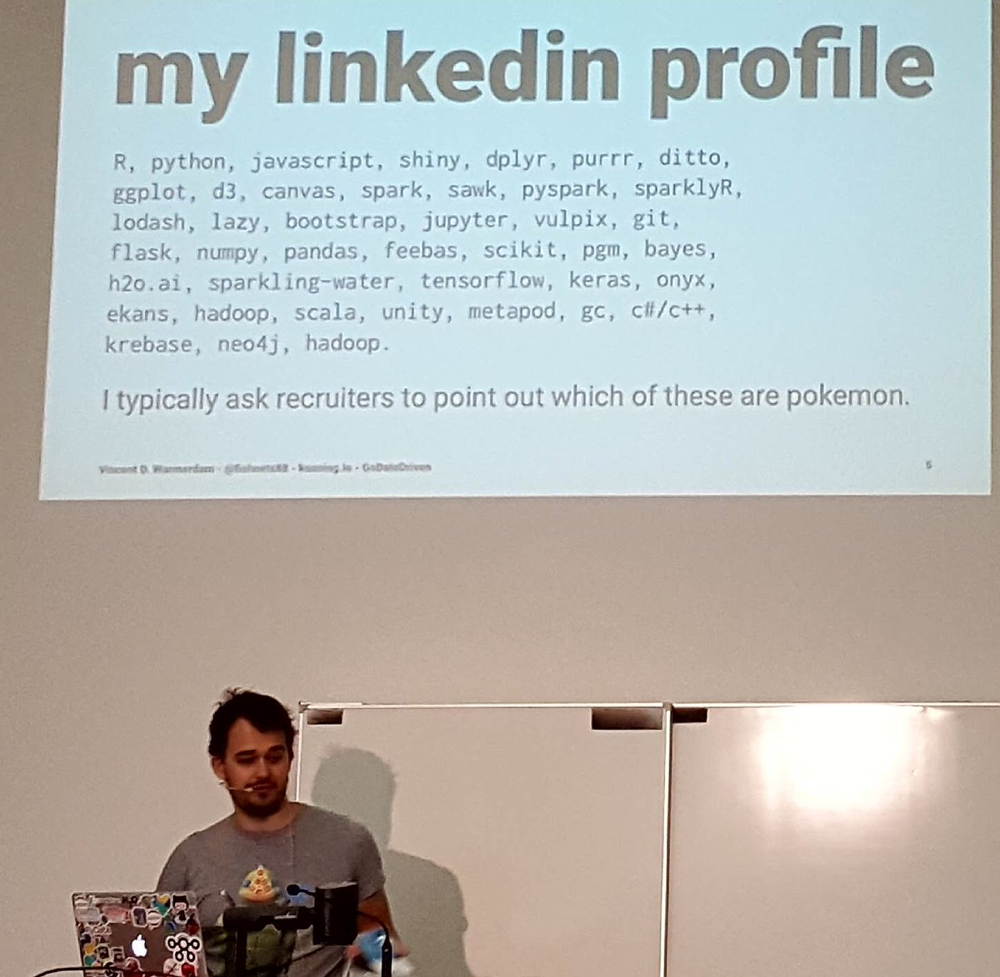
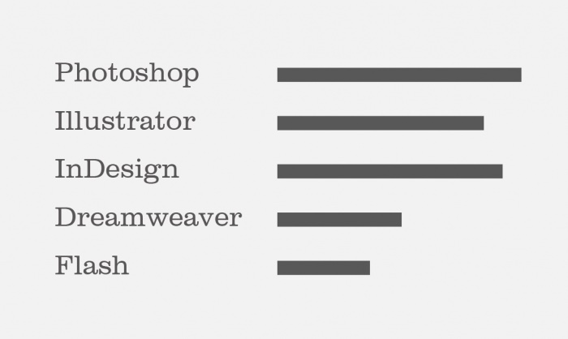

Recentemente, deixei meu emprego na
[Leroy Merlin](https://www.leroymerlin.com.br). Mesmo sendo uma empresa que eu
ame e onde trabalhei e cresci por seis anos, resolvi que era hora de perseguir
um sonho antigo: ter a experiência de viver fora do Brasil.

Para poder correr atrás isso, tive que atualizar meu currículo que estava parado
há todo esse tempo. Eu não sei como é pra vocês, mas pra mim, atualizar o
currículo não é nada fácil. Lembrar as experiências profissionais que tive,
encaixar num espaço relativamente pequeno e, ao mesmo tempo, tentar mostrar ao
máximo a relevância do trabalho que desempenhei...

Por sorte, dessa vez eu já estava mais preparado. Como avaliei centenas de
candidatos ao longo desses anos pra ajudar no crescimento da minha equipe lá na
Leroy, já tinha mais ou menos na cabeça o que eu considerava essencial num
currículo e também já havia anotado alguns erros comuns que os candidatos
acabavam cometendo. Não que eu tenha algum curso de RH ou seja especialista no
assunto, muito pelo contrário, mas sabia o que eu mesmo buscava quando abria um
CV.

Então, como fazer um currículo certeiro? **Como expor corretamente quem você
é**, o que faz e muito mais informações para um desconhecido **em uma ou duas
páginas**?

Eu adoraria ter essa resposta também, hahaha. Mas não é uma ciência exata. O que
decidi fazer foi citar algumas situações que encontrei revisando CVs de
desenvolvedores e dar algumas dicas em cima disso. Espero que seja de alguma
utilidade.

Então, para começar, vamos pensar um pouco sobre essa pergunta: **pra que
enviamos um currículo?**

## Objetivo

Refletindo um pouco, defini um objetivo quando enviamos um CV:

> Mostrar claramente nossas habilidades e experiências de forma a permitir que
> quem analisa o currículo consiga extrair todas as informações que precisa
> nessa etapa inicial.

Então temos que mostrar informações **para alguém** analisar. Não sabemos como a
pessoa que vai nos avaliar está no dia, como está seu nível de concentração,
quantos outros afazeres tem, quantos currículos recebeu, por quantas vagas está
responsável, qual o prazo dessas vagas e nem nada do tipo. Não sabemos nem o
quanto dessas informações ela entende também. **Podemos ter sua atenção somente
por poucos segundos** e queremos aproveitar cada momento para mostrar nosso
potencial. Pode parecer um pouco exagerado, mas, independente de tudo isso, uma
coisa é certa: **não queremos dificultar a vida da pessoa responsável pela
vaga.**

Infelizmente, **alguns candidatos são eliminados logo ao ter o currículo
analisado** e muitas vezes, não é nem por falta de habilidade ou experiência dos
mesmos, mas meramente **porque não sabem vender seu peixe**. Os motivos
principais? Não se destacam, apresentam informações incorretas ou não
relevantes, mostram os dados de forma confusa, demonstram pouco ou nenhum
interesse na vaga ou empresa.

Que tal vermos alguns desses erros e nos certificarmos de que nosso CV não
apresenta nenhum deles?

## Erros mais comuns

### Informações no Currículo

Pode parecer brincadeira, mas já abri um currículo em que a pessoa se chamava
<mark>Rafel</mark>, achei um pouco incomum, voltei pro email e era
<mark>Rafael</mark> mesmo. O Rafael conseguiu errar o próprio nome no CV. Também
já vi **várias** vezes links errados para perfis, por exemplo, recebi muitos
links para o LinkedIn como `https://www.linkedin.com/feed`. Telefones errados ou
sem DDD também rolavam.

**No cabeçalho**, não se esqueça de pelo menos **informar a cidade atual**.
Mesmo se você morar em outra cidade e a vaga for presencial, diga que está
disponível para relocação. É melhor que não falar nada e deixar a pessoa
tentando adivinhar pelo DDD ou caçando em alguma rede social.

Caso queira colocar o endereço, não se preocupe em preencher ele completo com
complemento, CEP, etc., seu CV não é o cadastro de colaborador da empresa. Mais
tarde você terá a oportunidade de informar todos esses dados caso seja aprovado.

Lembre-se de informar métodos de contato como telefone e também seu endereço de
email. Mesmo se você enviar seu CV por email, ele pode, por exemplo, ser
impresso ou baixado para a máquina da pessoa e seu email original pode ser
perdido, então colocar o endereço de email não faz mal. Se a pessoa recrutadora
gostar do seu CV e quiser te contatar, deixe isso bem prático para ela.

Uma coisa que já aconteceu comigo quando recrutava e foi chato, foi receber
currículo desatualizado. Avaliando o CV de um determinado candidato parecia que
ele estava numa empresa mas, ao abrir o LinkedIn, já faziam 2 anos que estava
trabalhando em outra empresa. Não sei se foi um equívoco na hora de escolher o
arquivo correto, mas foi bem estranho. Todo o trabalho que eu já desprendi
avaliando o candidato teve que ser refeito.

Também já vi vários candidatos que não possuíam ou não informavam o LinkedIn.
Confesso que antigamente eu não gostava dessa rede, parecia desnecessária pra
mim. Mas essa foi uma visão que mudou muito quando passei a estar mais próximo
do recrutamento de pessoas. É uma forma padronizada de avaliar candidatos e
ajuda muito, também é um chat comum que dá pra conversar em tempo real,
diferente do email. Mantenha o seu LinkedIn atualizado e pareado com o seu CV.

### Experiências

Ordene sempre suas experiências em ordem cronológica reversa, isto é, das mais
recentes até as mais antigas. Informe o local onde trabalha(ou) e o que você faz
ou fez lá. Já recebi experiências assim: _**Programador Backend (2019-2020)**_,
sem citar a empresa nem um resumo do que foi feito ou quais tecnologias foram
usadas. Assim fica difícil de avaliar a relevância ou a experiência real do
candidato.

Ao invés de algo muito simplista e incompleto como o exemplo abaixo:

```
Experiências
• Programador Web (2017-2019)
• Programador Full Stack na Empresa Tal (2019-2020)
• Programador Full Stack em Outra Empresa
```

Siga as dicas e procure fazer algo assim:

```
Experiências

• Programador Backend Sênior em Outra Empresa (abr/2020 - atual)
Responsável pelo microserviço de pagamentos da plataforma B2B. Serviço desenvolvido
em Python e framework próprio da empresa. Evolução da qualidade do mesmo,
melhorando a cobertura testes automatizados e observabilidade da plataforma
com Grafana. Exercendo também papel de liderança técnica de três estagiários
da equipe.

• Programador Full Stack na Empresa Tal (jul/2019 - mar/2020)
Desenvolvimento do portal de administração do blog da empresa. Criação de um CMS
utilizando AngularJS e d3.js no frontend e Python com o framework Django, com o
uso de PostgreSQL. Entrega do software na plataforma da Digital Ocean,
utilizando Docker e Ansible.

• Programador Web - Freelancer (jan/2017- jun/2019)
Criação de sites institucionais em WordPress e e-commerces com WooCommerce para
microempreendedores da cidade. Desenvolvimento de estratégia digital e criação
de design para esses sites utilizando Photoshop.
```

Entre esses dois exemplos fictícios, o segundo deixa evidente para quem está
recrutando as experiências do candidato, muito além das tecnologias. Também
mostra o momento atual, como está se dando a evolução da pessoa. Na hora de
montar um CV, **tão importante quanto ter vivido essas experiências é saber
mostrá-las.**

### Tecnologias

Tome cuidado com a "sopa de letrinhas" para não ficar muito confuso. Por
exemplo, para pessoas não técnicas é um pouco mais fácil ler _**Construção de
APIs REST e GraphQL**_ ou somente _**REST, GraphQL**_? Agora multiplica esse
cenário em várias vezes. Lembre-se também de esclarecer algumas coisas, se citar
um framework, diga de qual linguagem é esse framework, a pessoa não tem a
obrigação de saber ou conhecer todos (nem a gente conhece, oras).



Também **não faça gráficos/infográficos** com porcentagem de quanto você sabe de
cada habilidade. Isso é extremamente subjetivo e pode mais revelar suas
fraquezas do que suas habilidades. O que seria saber <mark>90%</mark> de
<mark>JavaScript</mark> por exemplo? Será que mesmo o
[Brendan Eich](https://en.wikipedia.org/wiki/Brendan_Eich), criador do
JavaScript, poderia colocar <mark>100%</mark> no gráfico dele de JS? Ao mesmo
tempo, ao ver que você tem, por exemplo, <mark>20%</mark> em <mark>CSS</mark>,
isso acaba denunciando uma "fraqueza". De novo, tudo subjetivo ainda por cima. A
pessoa avaliando pode e vai interpretar de maneira diferente da sua.



O ideal, na minha opinião, é listar suas habilidades de forma clara, colocando
em primeiro lugar o que você mais domina e quer trabalhar e ir citando o resto
conforme achar melhor, vendo a relevância de cada coisa (mais sobre isso
depois).

[Esse artigo aqui](https://bluegg.co.uk/blog/death-to-the-infographic-cv), em
inglês, apresenta mais argumentos caso queira se aprofundar no tema dos
infográficos.

### Formações

Ao listar sua(s) formação(ões), explique se já concluiu o curso. Caso ainda
esteja cursando, se possível, coloque a data de término esperada. As vezes a
pessoa que está recrutando só precisa saber se o curso já foi concluído,
principalmente quando o campus é em outra cidade ou algo do tipo. Pode ser para
saber se tem algo relacionado a estágio/etc. pendente também. Não é para julgar
seu tempo de graduação nem nada. E ah, também informe onde se deu cada formação,
já recebi CVs que só falavam o título do curso de graduação.

Isso também vale para outros tipos de cursos e treinamentos. Se possível,
informe a carga horária nesses casos.

### Evite currículos genéricos

Customize seu currículo conforme a vaga. Ressalte experiências relevantes,
trabalhe com os seus dados para exibí-los da melhor forma possível pra essa
empresa. Vai se inscrever pra uma vaga e a empresa usa a tecnologia X ou Y? E
você tem experiência com isso? Então isso tem que estar destacado nesse CV,
deixe bem claro que você tem qualificações importantes. Está estudando uma
tecnologia que eles usam mas que você não tem confiança de colocar no CV?
Demonstre interesse, diga que está estudando e que quer uma oportunidade de
trabalhar com isso. Uma atitude assim é muito melhor que não dizer nada e deixar
o recrutador sem saber.

Enviando um currículo genérico, ou seja, igual para todas as empresas, você
perde um pouco do potencial que você teria de se destacar. É como ter
habilidades de venda, você tem que conhecer seu público para poder vender pra
ele. Quanto mais você conhecer sobre a empresa, mais fácil de se relacionar com
ela durante o processo seletivo.

Acho importante frisar que em momento algum recomendo mentir sobre alguma
habilidade, inventar informações só pra dar um _match_ na vaga. Esse tipo de
atitude pode ser extremamente nocivo para todos — empresa e candidato. A ideia
aqui é somente saber organizar as suas informações de modo a deixá-las mais
fáceis de entender e respondendo perguntas que os recrutadores estão se fazendo
ao abrir seu CV.

### Quantidade de informações e tamanho do CV

No começo da minha carreira eu não tinha tanta coisa para preencher meu CV,
então coloquei experiências acadêmicas como uma iniciação científica que fiz,
meus trabalhos para a empresa júnior do meu curso e até mesmo uma extensão que
eu fiz pro Google Chrome na época. Hoje em dia essas informações não constam
mais no meu CV, bem como algumas experiências profissionais mesmo, mas com
tecnologias que já não quero mais trabalhar. Foi um luxo que pude me dar, mas
que você deverá que ponderar para seu próprio caso.

Isso também é válido para as tecnologias que você conhece. Por exemplo, aprendi
`C`, `Java`, entre várias outras coisas na faculdade. Mas no caso das vagas que
estava procurando, não fazia muita diferença ter isso ali, então optei por tirar
essas informações. Ao escrever qualquer coisa no seu CV, pondere o quanto de
informação é importante. É difícil, mas encontre o limite entre pouca coisa
escrita, que pode parecer falta de experiência (ou até mesmo de dedicação) ou
confundir o recrutador, deixando coisas importantes escondidas no meio de outras
menos relevantes. Evitando um CV genérico já ajuda muito nisso.

Enfim, eu diria pra manter o CV entre 1 e 2 páginas no máximo, se possível.
Porém, quando estava escrevendo o meu recentemente, percebi que tentar deixar em
duas páginas estava sendo uma missão impossível, com muita coisa que considerava
importante ficando de fora ou ficando tudo muito espremido e visualmente
cansativo. Assim, acabei deixando com três páginas, mas para não manter um
espaço em branco grande no final e nem pra deixar com experiências muito antigas
que já não queria ali, coloquei alguns links para contato e algumas palestras
que eu tinha feito. Também deixei um aviso: _(experiências anteriores disponível
no LinkedIn)_

Não sabia se ia ser legal fazer assim, mas segui a intuição nesse caso, coletei
vários feedbacks de amigos e bem, quando fui aceito na empresa que estava
fazendo o processo seletivo atualmente, recebi elogios pelo CV e fiquei contente
por isso. Como já disse antes, **não é uma ciência exata**, é questão de
comunicação e de conseguir se destacar da concorrência.

## Enviando seu CV

### Envio do email

Não é super chato quando você abre o LinkedIn e vê algo do tipo _"Olá, vi seu
perfil e acho que essa oportunidade de **Desenvolvedor(a) Ruby on Rails Pleno**
é perfeita pra você!"_, sendo que no seu perfil sei lá, você trabalha com
Machine Learning com Python? Pois é, a inversa também é verdadeira.

Conheça pelo menos um pouco da empresa que você está se aplicando. Pode ser
difícil fazer isso quando você está se aplicando para muitas vagas, mas
acredite, faz toda a diferença. Aproveite o corpo do email para se apresentar.
Deixe humano, mostre que você realmente está enviando o email para aquela
empresa.

<p style="color:#ff6347"><strong>Não tem coisa pior que receber algum email do tipo:</strong></p>

```
De: Fulano de Tal <fulanodetal@email.com)
Para: <destinatário oculto>
Cco: <você@suaempresa.com>
Assunto: CURRICULUM VITAE FULANO DE TAL

Prezado(s),

Segue meu Curriculum Vitae para apreciação.

Att,
Fulano de Tal
```

Já dá pra saber de cara que é um email genérico, enviado para trocentas
empresas, provavelmente numa lista de recrutadores que pegou na internet. As
vezes nem é com cópia oculta e você vê lá: _**enviado para <você> e mais 49
contatos**_. É um tiro no escuro muito grande e suas chances diminuem muito
assim. Por trabalhar numa empresa grande, eu recebia emails dos mais diversos
tipos de perfis, para vagas nada relacionadas com as que eu de fato estava
ajudando ou até mesmo nem relacionadas a tecnologia.

<p style="color:#039a03"><strong>Agora vejamos a diferença nesse outro exemplo:</strong></p>

```
De: Fulano de Tal <fulanodetal@email.com)
Para: <você@suaempresa.com>
Assunto: Vaga Pessoa Desenvolvedora Full Stack

Olá Ciclana, tudo bem?
Vi no LinkedIn o anúncio da vaga e imediatamente pensei em me aplicar.

A SuaEmpresa sempre foi referência pra mim, já vi palestras do Beltrano (...)
e desde então venho estudando as tecnologias X e Y para poder fazer participar
desse processo. Sinto que estou pronto e gostaria de uma oportunidade.

Espero que possa avaliar meu CV e, caso tenha alguma dúvida, não hesite em
entrar em contato!

Obrigado desde já,
Fulano de Tal
```

Desde que seja verdadeiro, um email assim é muito mais assertivo e aumenta suas
chances de passar para as próximas etapas. Existem pessoas que até gravam
pequenos vídeos de apresentação. É uma forma de chamar a atenção da pessoa
recrutadora e algo não tão habitual. Demonstrar interesse autêntico é outro
nível.

Um detalhe importante: se na descrição da vaga estiver escrito algo como:
<mark>Envie um email para \<xxx> com o assunto "Vaga Pessoa Desenvolvedora Full
Stack"</mark> certifique-se de enviar **exatamente o assunto pedido**. Tenha
certeza que copiou certinho e que não tem erros de digitação e etc. Isso é
importante porque, dependendo das **regras de segurança da empres**a, emails com
anexo poderiam ir direto para **spam**, então certos filtros são criados por
assunto e etc. Isso acontecia comigo quando estava recrutando, emails fora do
padrão iam parar num limbo no meio de spams e demoravam muito mais para serem
vistos. Eu também criava marcadores e tinha que marcar manualmente esses emails.

Nota: Essa pode ser uma dica não totalmente aplicável se você está enviando o CV
através de alguma plataforma, mas caso existam campos para apresentação e tudo o
mais, não se esqueça de mostrar seu interesse.

Uma coisa que, na minha opinião, você **nunca** deve fazer é buscar o nome da
pessoa que está recrutando na internet e seguir em outras redes sociais e enviar
mensagens para avisar que se candidatou. Acontecia comigo, eu divulgava vagas no
GitHub e LinkedIn, de repente apareciam pessoas me seguindo e enviando mensagens
no inbox do Instagram falando que tinham enviado o currículo. Dá pra entender a
empolgação e querer se destacar dos outros candidatos, mas esse é um jeito
errado e invasivo. Se for pra adicionar no LinkedIn, uma rede profissional feita
para esse fim, é outra história. Mas num perfil pessoal não, não é legal.

### Endereços de email personalizados

Cuidado com endereços de emails customizados para um domínio próprio (por
exemplo `hello@ravan.me`) porque dependendo de onde esse email está hospedado, a
resposta do recrutador pode não chegar. Infelizmente, isso acontece mais vezes
do que vocês imaginam, inclusive aconteceu quando tentei contatar alguns
candidatos, tive que recorrer a outros meios — algo que nem todo recrutador
fará. O que pode acontecer também é de o recrutador nunca chegar a receber o
email de aplicação da vaga, porque seu servidor fica em um país do outro lado do
mundo, ou o IP foi banido do Gmail ou etc. Na dúvida, não arrisque.

Isso também vale de certa forma para emails pouco utilizados, se você demorar
dias pra ver e responder, pode perder a vaga.

Use um endereço que você tem a certeza que está recebendo emails e também que
você vá ver em um tempo hábil. Além disso, seja super responsivo, comunicação é
essencial e isso vai mostrar que você tem interesse real na vaga.

### Formato do currículo

**Sempre envie seu currículo como `.pdf`**. Demonstra muito mais
profissionalismo do que enviar um `.doc`/`.docx` por exemplo. Fora que de
repente a pessoa pode tentar abrir o CV pelo celular e não ter um app capaz de
ler `.doc`s. **Não caia na tentação** de fazer um CV como imagem, que pode ser
potencialmente mais bonito e que pode ser incorporado no corpo dos emails. A
imagem pode ser compactada pelo servidor de emails e perder qualidade. Mas, mais
importante que isso, a pessoa recrutadora não vai conseguir clicar ou até mesmo
copiar nenhuma informação do CV. Currículos como sites também são problemáticos,
**as vezes os CVs precisam ser impressos, ou inputados em alguma plataforma** e
ao enviar somente seu site, pode dar um problemão pra quem está recrutando. Se
realmente quiser fazer isso, encaminhe o site e/ou o CV como imagem, mas não se
esqueça do `.pdf` anexo. Lembra da história de facilitar a vida do recrutador?
Isso vale para tudo.

## Outras dicas

- Peça para seus amigos e até mesmo esses recrutadores aleatórios do LinkedIn
  para avaliar seu currículo, por que não? Peça feedback, veja onde pode
  melhorar. Aproveite e veja os currículos deles também, pode ser que ajude na
  construção/atualização do seu.
- Se quiser se destacar um pouco mais, evite usar templates prontos de CV,
  provavelmente o recrutador já viu aquele template muitas e muitas vezes.
- Caso você vá fazer um CV para trabalhar remotamente para outros países,
  coloque a timezone que você trabalha (nada muito complexo, pode ser só
  <mark>Timezone: GMT-3</mark> por exemplo).

## Leituras interessantes (em inglês)

- [Why the founder of Rails automatically rejects 80% of Software Engineer applicants](https://medium.com/@christophelimpalair/why-the-founder-of-rails-automatically-rejects-80-of-software-engineer-applicants-4e2a4d255f58)

- [5 Tips I Use To Land Remote Software Developer Jobs](https://dev.to/colinmtech/5-tips-i-use-to-land-remote-software-developer-jobs-ogd?utm_source=digest_mailer&utm_medium=email&utm_campaign=digest_email)

- [I've reviewed tens of thousands of job applications _(...)_. Here are some of my tips _(...)_](https://twitter.com/spencerfry/status/1126499910310821888)

## Conclusões

Claro que erros acontecem e o candidato não deve ser taxado como desinteressado
ou agindo de má-fé, mas evitar esses erros aumenta nossas chances de
contratação. As experiências e habilidades do candidato sem dúvidas serão
analisadas com mais profundidade em entrevistas e testes posteriores — mas é
necessário chegar lá primeiro.

Assim, confira os dados do seu currículo várias vezes, como se estivesse
preenchendo a declaração de imposto de renda, hahaha. De preferência, faça uma
pausa de pelo menos meia hora entre escrever e revisar, isso ajuda você a
desligar um pouco e voltar com novos olhos para a tarefa.

Peça a opinião de colegas, recrutadores, quem puder ajudar é válido. Depois
disso, conheça a empresa que está se candidatando, adapte seu CV, faça uma boa
apresentação e mantenha-se comunicativo.

**PS:** pensei em deixar meu currículo aqui no final para uma possível
comparação mas sou um pouco tímido pra isso, hahaha. Tentei deixar os exemplos
claros e talvez tenha até escrito um pouco demais. Caso você queira ajuda com o
seu CV, entre em contato e tentarei ajudar da melhor forma que souber :)
